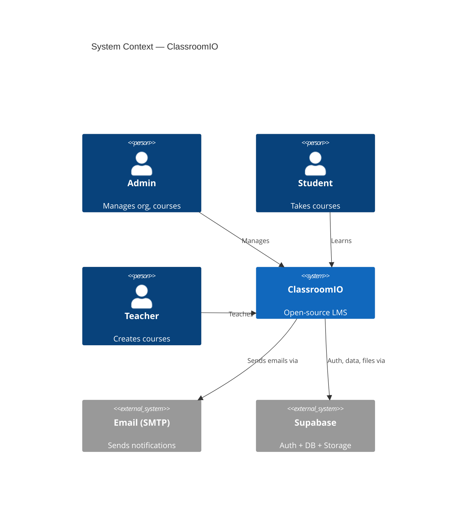

# Skill: c4-model

Generate or update the C4 architecture model (Layers 1–3) for ClassroomIO.
Outputs Mermaid C4 diagrams to `docs/c4/`.

## When to use

Run `/c4-model` when you want to create or refresh architecture documentation.

## Steps

### 1. Run AST Extraction

First, install ts-morph if needed and run the extraction script:

```bash
cd /workspaces/classroomio
pnpm add -D ts-morph --filter @cio/dashboard 2>/dev/null || true
npx ts-node --project apps/api/tsconfig.json .claude/skills/c4-model/extract.ts
```

If ts-node is unavailable, use:
```bash
node --loader ts-node/esm .claude/skills/c4-model/extract.ts
```

This produces:
- `docs/c4/components-dashboard.json`
- `docs/c4/components-api.json`

### 2. Extract Database Schema

Run this to extract the DB schema from the running Supabase instance:

```bash
docker exec -i $(docker ps --filter "name=supabase_db" -q | head -1) \
  psql -U postgres -d postgres -c "
SELECT
  t.table_name,
  array_agg(c.column_name || ':' || c.data_type ORDER BY c.ordinal_position) AS columns,
  array_agg(DISTINCT kcu.column_name || '->' || ccu.table_name || '.' || ccu.column_name)
    FILTER (WHERE kcu.column_name IS NOT NULL) AS foreign_keys
FROM information_schema.tables t
JOIN information_schema.columns c ON c.table_name = t.table_name AND c.table_schema = t.table_schema
LEFT JOIN information_schema.table_constraints tc
  ON tc.table_name = t.table_name AND tc.constraint_type = 'FOREIGN KEY' AND tc.table_schema = t.table_schema
LEFT JOIN information_schema.key_column_usage kcu
  ON kcu.constraint_name = tc.constraint_name AND kcu.table_schema = t.table_schema
LEFT JOIN information_schema.referential_constraints rc
  ON rc.constraint_name = tc.constraint_name
LEFT JOIN information_schema.constraint_column_usage ccu
  ON ccu.constraint_name = rc.unique_constraint_name
WHERE t.table_schema = 'public' AND t.table_type = 'BASE TABLE'
GROUP BY t.table_name
ORDER BY t.table_name;
" 2>/dev/null
```

Write the output as a token-efficient markdown table to `docs/c4/database.md`.

### 3. Generate L1 — System Context

Read `@.claude/skills/c4-model/references/c4-conventions.md` for conventions.

Create `docs/c4/l1-context.md` with a Mermaid C4Context diagram showing:
- **Users**: Admin, Student, Teacher
- **System**: ClassroomIO
- **External systems**: Email (SMTP), Supabase Auth, Storage

Example structure:
```

```

### 4. Generate L2 — Containers

Create `docs/c4/l2-containers.md` with a Mermaid C4Container diagram showing:

Containers:
- **Dashboard** (SvelteKit, port 5173) — UI for admin/teacher/student
- **API** (Hono/Node.js, port 3002) — REST API
- **Website** (SvelteKit, port 5174) — Marketing site
- **Docs** (Fumadocs/React, port 3000) — Documentation
- **Supabase** (PostgreSQL + Auth + Storage, port 54321) — Data layer
- **Redis** (Redis, port 6379) — Caching/rate limiting

### 5. Generate L3 — Dashboard Components

Read `docs/c4/components-dashboard.json`.

Create `docs/c4/l3-dashboard.md` with a Mermaid C4Component diagram.

Map JSON components to C4 Component nodes:
- key → alias (sanitize slashes to underscores)
- label → display name
- relationships → `Rel()` directives

Only show relationships that exist in the JSON. Keep it concise — omit leaf components with 0 relationships if there are >20 components total.

### 6. Generate L3 — API Components

Read `docs/c4/components-api.json`.

Create `docs/c4/l3-api.md` with a Mermaid C4Component diagram using the same approach.

### 7. Verify

- Check all 5 output files exist in `docs/c4/`
- Confirm no diagram has hardcoded component names — all L3 components must come from the JSON
- Confirm database.md has a concise format (table name, columns, FK references)

## Output Files

| File | Description |
|------|-------------|
| `docs/c4/l1-context.md` | L1 System Context |
| `docs/c4/l2-containers.md` | L2 Containers |
| `docs/c4/l3-dashboard.md` | L3 Dashboard components |
| `docs/c4/l3-api.md` | L3 API components |
| `docs/c4/database.md` | DB schema |

## References

- @.claude/skills/c4-model/references/c4-conventions.md
- C4 model: https://c4model.com/
- Mermaid C4: https://mermaid.js.org/syntax/c4.html
