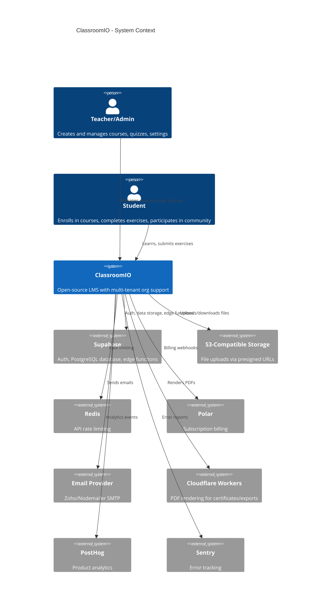
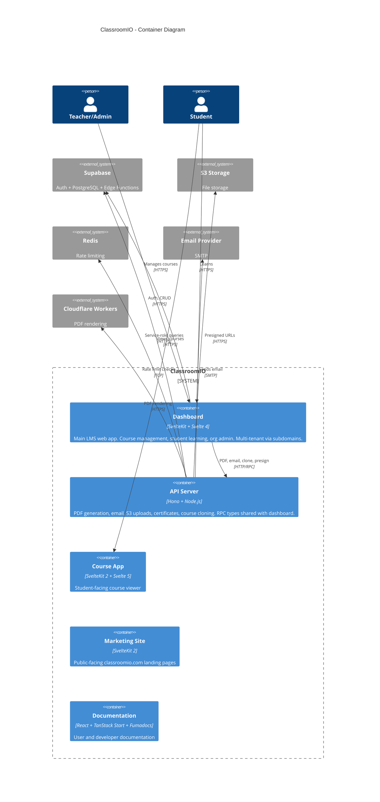

# C4 Architecture Model

Generate or update C4 model diagrams (Layers 1-3) for ClassroomIO. Outputs Mermaid C4 diagrams to `docs/c4/`.

## When to use

Invoke this skill when asked to generate, update, or review the C4 architecture diagrams for ClassroomIO.

## Prerequisites

- Node.js and pnpm installed (monorepo dev environment)
- `ts-morph` installed as a root dev dependency (`pnpm add -w -D ts-morph` if missing)
- For database schema: Supabase running locally (`supabase start`)

## Step 1: Extract component data

Run the AST extraction script to produce structured JSON from the source code:

```bash
node .claude/skills/c4-model/extract-components.mjs
```

This outputs `docs/c4/extracted-components.json` (gitignored) containing:
- Per-app components grouped by directory structure
- Cross-component relationships (import counts)
- Svelte file counts per component (metadata only -- ts-morph cannot parse `.svelte` files)
- Path alias resolution from each app's `tsconfig.json`

### Configuring component depth

Edit `APP_CONFIGS` in `extract-components.mjs` to adjust `componentDepth` per app. If any component has >50 files, the script warns and depth should be increased.

Current defaults:
- **Dashboard**: depth 5 (handles deeply nested `src/lib/components/Feature/components/Sub/` structure)
- **API**: depth 2 (flat `src/routes/`, `src/utils/` structure)

## Step 2: Extract database schema (optional)

If Supabase is running locally:

```bash
bash .claude/skills/c4-model/extract-database.sh
```

Outputs `docs/c4/database.md` with tables, columns, foreign keys, and enums in a token-efficient format.

## Step 3: Generate Mermaid C4 diagrams

Read `docs/c4/extracted-components.json` and `docs/c4/database.md`, then generate the following Mermaid diagram files. Refer to `references/c4-conventions.md` for syntax.

### Layer 1: System Context (`docs/c4/L1-system-context.md`)

Shows ClassroomIO as a single system box with external actors and systems.

**Layout strategy**: Actors at top, ClassroomIO in middle, external systems at bottom. Use `Rel_D` for the top-to-bottom flow. Group external systems by function (data, comms, infra, observability) and use `$c4ShapeInRow="4"` to keep them in two rows.



### Layer 2: Container (`docs/c4/L2-container.md`)

Shows the internal containers of ClassroomIO.

**Layout strategy**: Actors at top -> containers in middle -> external systems at bottom. Within the system boundary, declare `dashboard` and `api` first (most connected), then secondary apps. Use `Rel_D` for vertical flow, `Rel_R` for lateral (dashboard -> api).



### Layer 3: Component diagrams

Generate L3 diagrams for Dashboard (split into two sub-diagrams) and API. Derive all components and relationships from `extracted-components.json`.

#### Generating L3 diagrams from extraction data

For each app in the JSON:

1. **Group components into logical boundaries** based on top-level directory:
   - Dashboard: `lib/components/*`, `lib/utils/*`, `routes/*`, `mail/*`
   - API: `routes/*`, `services/*`, `utils/*`, `middlewares/*`, `config/*`, `constants/*`, `types/*`

2. **Create a Component node** for each entry in the `components` object:
   - Alias: snake_case of the component key (replace `/` with `_`)
   - Label: last segment(s) of the key, human-readable
   - Technology: infer from path (`svelte` for component dirs with svelteFiles > 0, `ts` otherwise)
   - Description: summarize from exports list and file counts

3. **Create Rel edges** from the `relationships` array:
   - Only include relationships with `importCount >= 2` to reduce noise (raise to 3+ if still cluttered)
   - Use **directional variants** (`Rel_D`, `Rel_R`, `Rel_L`) instead of plain `Rel()`:
     - `Rel_D`: routes/pages -> components, components -> services/utils, services -> external systems
     - `Rel_R`: peer-to-peer within the same boundary (e.g., one service -> another service)
     - `Rel_L`: reverse/feedback flows (rare)
   - Label with the import count

4. **Apply layout hints** per `references/c4-conventions.md`:
   - Tune `UpdateLayoutConfig` per diagram size
   - Use `UpdateRelStyle` with offsets when two edges share source+target proximity

#### Dashboard split strategy

The Dashboard has 190+ extracted components. To keep diagrams readable, split into two sub-diagrams:

**Sub-diagram A: UI + Routes** (`docs/c4/L3-dashboard-ui.md`)
- Boundaries: Routes, UI Components
- Include utility/service stubs only as external `Component_Ext` references where needed
- Aim for ~15-20 components, ~10-15 relationships
- Flow: Routes (top) -> UI Components (bottom), with lateral `Rel_R` between sibling components

**Sub-diagram B: Services + Data** (`docs/c4/L3-dashboard-services.md`)
- Boundaries: Services, Utilities, Stores, Types, Mail
- Include route/component stubs only as external references where needed
- Aim for ~15-20 components, ~10-15 relationships
- Flow: Services (top) -> Utilities/Stores (middle) -> External Systems (bottom)

Each sub-diagram should start with a comment referencing the other:
```
%% See also: L3-dashboard-services.md for the Services + Data layer
```

#### Declaration order within boundaries

Declare components in **descending order of connectivity** (most relationships first). This places hub nodes centrally in the rendered layout, reducing edge crossings.

To determine connectivity: count how many times a component appears as `source` or `target` in the relationships array.

#### Output files

- `docs/c4/L3-dashboard-ui.md` - Dashboard Layer 3: UI + Routes
- `docs/c4/L3-dashboard-services.md` - Dashboard Layer 3: Services + Data
- `docs/c4/L3-api-components.md` - API Layer 3

#### L3 rules

- Components MUST be derived from the extracted JSON, never hardcoded.
- Skip components with only 1 file and no relationships (noise).
- Group into `Container_Boundary` blocks by top-level directory.
- Include external system references where components interact with Supabase, S3, etc. (infer from exports/file names like `supabase.ts`, `s3.ts`, `redis.ts`).
- **Max ~20 components per diagram.** If there are more, aggregate smaller components or increase the `importCount` threshold.
- **Max ~15 relationships per diagram.** If there are more, raise the `importCount` threshold or drop the weakest edges.
- Always use directional `Rel_D`/`Rel_R`/`Rel_L` instead of plain `Rel()`.
- Use `UpdateRelStyle` offsets when two relationships share similar source/target positions and their labels would overlap.

## Output structure

After running the skill, `docs/c4/` should contain:

```
docs/c4/
  extracted-components.json      (gitignored, intermediate data)
  database.md                    (DB schema reference)
  L1-system-context.md           (Layer 1 Mermaid diagram)
  L2-container.md                (Layer 2 Mermaid diagram)
  L3-dashboard-ui.md             (Layer 3 Dashboard: UI + Routes)
  L3-dashboard-services.md       (Layer 3 Dashboard: Services + Data)
  L3-api-components.md           (Layer 3 API)
```

All `.md` files contain Mermaid code blocks that can be rendered by any Mermaid-compatible viewer (GitHub, VS Code, etc.). Diagrams use directional relationships and tuned layout configs to minimize line crossings.

Delete any stale files from previous runs (e.g., `L3-dashboard-components.md`) that no longer match this output structure.
