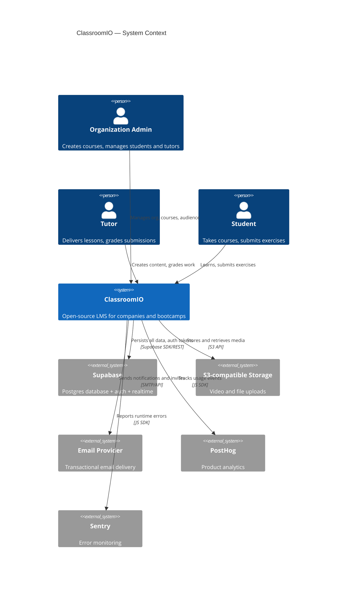
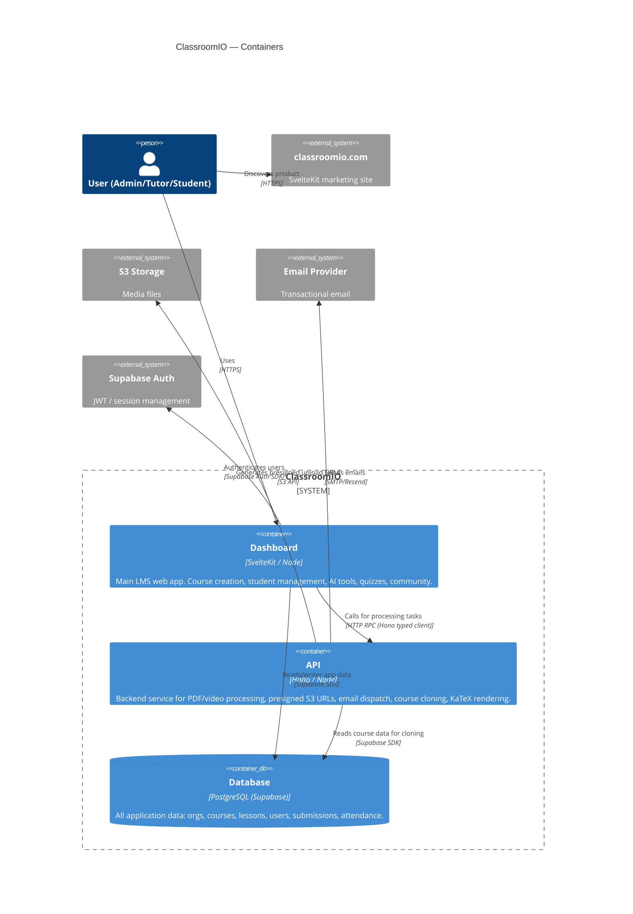

# C4 Model Generator

Generate or refresh C4 architecture diagrams (Layers 1–3) for ClassroomIO and write them to `docs/c4/`. Layer 3 component diagrams for the Dashboard and API containers are derived from AST extraction — never hardcoded.

---

## When to run

- User asks to "generate", "update", or "refresh" the C4 model / architecture diagrams
- Significant new feature areas have been added to `apps/dashboard` or `apps/api`
- User asks for `--db` or database schema alongside the diagrams

---

## Execution steps

### Step 1 — Install extractor dependencies

```bash
cd .claude/skills/c4-model
pnpm install --ignore-workspace
cd -
```

If `pnpm` is unavailable: `npm install --prefix .claude/skills/c4-model`.

### Step 2 — Run AST extraction

```bash
cd .claude/skills/c4-model && node_modules/.bin/tsx extract.ts 2>&1
```

The script writes `docs/c4/components.json` and emits the same JSON to stdout. Read `docs/c4/components.json` to access the structured output:

```
{
  "dashboard": {
    "components": [{ "key": "lib/utils/services", "label": "Services", "tsFiles": 12, "svelteFiles": 0 }, ...],
    "relationships": [{ "from": "routes/org", "to": "lib/utils/services", "weight": 34 }, ...],
    "warnings": []
  },
  "api": { ... }
}
```

If any `warnings` are present (component with >50 files), note them and consider whether the diagrams still accurately represent the structure.

### Step 3 — Generate Layer 1: System Context

Create `docs/c4/layer1-context.md`:

```markdown
# C4 Layer 1 — System Context


```

### Step 4 — Generate Layer 2: Containers

Create `docs/c4/layer2-containers.md`:

```markdown
# C4 Layer 2 — Containers


```

### Step 5 — Generate Layer 3: Dashboard Components

Read the `dashboard` section of `docs/c4/components.json`. Map each component `key` to a `Component()` element. Use `relationships` (sorted by weight descending) to add `Rel()` calls — include only relationships with `weight >= 2` to avoid clutter. Use the component `label` as the display name, and infer a short technology/responsibility description from the key path.

**Key → Description mapping heuristics** (apply to unknown keys):
- `routes/*` → "SvelteKit route handler + page components"
- `lib/components/*` → "Svelte UI component"
- `lib/utils/services/*` → "Supabase data-fetching service"
- `lib/utils/store` → "Svelte writable store (global state)"
- `lib/utils/functions` → "Pure utility functions"
- `lib/utils/constants` → "App-wide constants and enums"
- `lib/utils/types` → "TypeScript type definitions"
- `lib/utils/translations` → "i18n translation files"

Group components into logical boundaries:
- `Container_Boundary(routes_b, "Routes")` → all `routes/*` components
- `Container_Boundary(lib_b, "Lib")` → all `lib/*` components

Create `docs/c4/layer3-dashboard.md`.

### Step 6 — Generate Layer 3: API Components

Read the `api` section of `docs/c4/components.json`. Same approach — map keys to `Component()` elements, include relationships with `weight >= 1`.

**Key → Description mapping heuristics**:
- `routes/*` → "Hono route handler"
- `services/*` → "Business logic / Supabase queries"
- `utils/*` → "Utility helpers"
- `middlewares` → "Hono middleware (auth, rate limiting)"
- `config` → "Environment config"
- `types/*` → "TypeScript types"
- `constants` → "API constants"

Create `docs/c4/layer3-api.md`.

### Step 7 (optional) — Extract database schema

Only run if the user requested `--db` or mentions database/schema. Requires `supabase start` to be running.

```bash
# 1. Find the supabase DB container
DB_CONTAINER=$(docker ps --filter "name=supabase_db" --format "{{.Names}}" | head -1)
echo "Container: $DB_CONTAINER"
```

```bash
# 2. Extract table list with column summaries
docker exec "$DB_CONTAINER" psql -U postgres -d postgres -t -A -F'|' -c "
SELECT
  t.table_name,
  string_agg(
    c.column_name || ' ' || c.data_type ||
    CASE WHEN c.is_nullable = 'NO' THEN ' NN' ELSE '' END ||
    CASE WHEN c.column_default IS NOT NULL THEN ' DEFAULT' ELSE '' END,
    ', ' ORDER BY c.ordinal_position
  ) AS cols
FROM information_schema.tables t
JOIN information_schema.columns c
  ON t.table_name = c.table_name AND t.table_schema = c.table_schema
WHERE t.table_schema = 'public'
  AND t.table_type = 'BASE TABLE'
GROUP BY t.table_name
ORDER BY t.table_name;
"
```

```bash
# 3. Extract foreign key relationships
docker exec "$DB_CONTAINER" psql -U postgres -d postgres -t -A -F'|' -c "
SELECT
  tc.table_name,
  kcu.column_name,
  ccu.table_name AS ref_table,
  ccu.column_name AS ref_column
FROM information_schema.table_constraints tc
JOIN information_schema.key_column_usage kcu
  ON tc.constraint_name = kcu.constraint_name AND tc.table_schema = kcu.table_schema
JOIN information_schema.referential_constraints rc
  ON tc.constraint_name = rc.constraint_name
JOIN information_schema.constraint_column_usage ccu
  ON ccu.constraint_name = rc.unique_constraint_name AND ccu.table_schema = rc.unique_constraint_schema
WHERE tc.constraint_type = 'FOREIGN KEY' AND tc.table_schema = 'public'
ORDER BY tc.table_name, kcu.column_name;
"
```

Write the output to `docs/c4/database.md` in this token-efficient format:

```markdown
# Database Schema (public schema)

## Tables

### table_name
col1 type [NN] [DEFAULT], col2 type, ...

### ...

## Foreign Keys
table.column → ref_table.ref_column
...
```

---

## Output files

| File | Content |
|------|---------|
| `docs/c4/layer1-context.md` | System Context diagram (Mermaid C4Context) |
| `docs/c4/layer2-containers.md` | Container diagram (Mermaid C4Container) |
| `docs/c4/layer3-dashboard.md` | Dashboard Component diagram (Mermaid C4Component, from AST) |
| `docs/c4/layer3-api.md` | API Component diagram (Mermaid C4Component, from AST) |
| `docs/c4/database.md` | DB schema reference (optional, requires `--db`) |
| `docs/c4/components.json` | Raw AST extraction output (gitignored) |

## Notes

- `components.json` is gitignored — it's an intermediate artifact.
- Layer 1 and Layer 2 are stable; regenerate only if major external systems change.
- Layer 3 must always be regenerated from the extraction script — never hardcoded.
- The diagrams are optimized for AI context consumption (concise labels, key relationships only).
