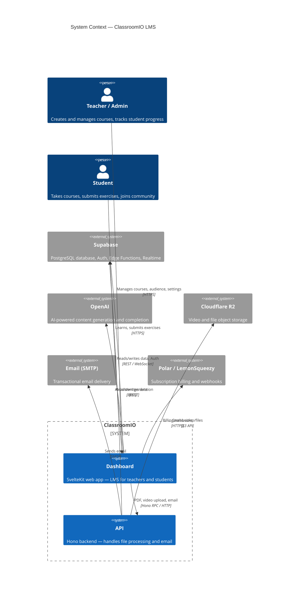

# Skill: C4 Architecture Diagrams

Generate or update C4 model diagrams (Layers 1–3) for the ClassroomIO monorepo.
Output Mermaid diagrams to `docs/c4/`. Consult the reference files in
`.claude/skills/c4-model/references/` for C4 conventions and Mermaid C4 syntax.

---

## Step 1 — Install extraction dependencies (once)

Check whether the skill's node_modules exist. If `.claude/skills/c4-model/node_modules`
does not exist or is empty, install them first:

```bash
cd .claude/skills/c4-model && npm install --silent && cd -
```

---

## Step 2 — Run AST extraction

Run the extraction script from the monorepo root. It parses TS/JS source files
in `apps/dashboard` and `apps/api` using ts-morph, groups them into components
by directory depth, and maps cross-directory imports as relationships.

```bash
node .claude/skills/c4-model/node_modules/.bin/tsx \
  .claude/skills/c4-model/extract.ts
```

This writes two JSON files (gitignored):
- `docs/c4/dashboard-components.json`
- `docs/c4/api-components.json`

**If warnings appear** ("component X has >50 files"): re-run with a larger depth,
e.g. `--dashboard-depth=5`. Validate the output before proceeding.

**Default depths:** dashboard=4 path segments from app root, api=3.

---

## Step 3 — Extract database schema (optional — requires `supabase start`)

```bash
bash .claude/skills/c4-model/db-schema.sh
```

This writes `docs/c4/database.md`.

If Supabase is not running, skip this step and note it in the output.

---

## Step 4 — Write Layer 1: System Context (`docs/c4/layer1-context.md`)

Write the file with this exact Mermaid diagram:

````markdown
# C4 Layer 1 — System Context


````

---

## Step 5 — Write Layer 2: Containers (`docs/c4/layer2-containers.md`)

Write the file with this exact Mermaid diagram:

````markdown
# C4 Layer 2 — Containers

```mermaid
C4Container
  title Container diagram — ClassroomIO

  Person(teacher, "Teacher / Admin", "")
  Person(student, "Student", "")

  System_Boundary(classroomio, "ClassroomIO") {
    Container(dashboard, "Dashboard", "SvelteKit / Vite — port 5173",
      "Main LMS web app: org management, student learning, course editor")
    Container(api, "API", "Hono / Node.js — port 3002",
      "PDF/video processing, presigned uploads, email sending")
    Container(marketing, "Marketing Site", "SvelteKit — port 5174",
      "Public-facing landing page and blog")
  }

  System_Boundary(infra, "Infrastructure") {
    ContainerDb(supabase_db, "PostgreSQL", "Supabase / PostgreSQL 15",
      "All application data: courses, users, orgs, exercises")
    Container(supabase_auth, "Supabase Auth", "GoTrue",
      "JWT-based authentication and user management")
    Container(supabase_edge, "Edge Functions", "Deno",
      "Server-side logic deployed at the edge")
    ContainerDb(r2, "Cloudflare R2", "S3-compatible object store",
      "Video files and course attachments")
  }

  System_Ext(openai, "OpenAI", "LLM API")
  System_Ext(smtp, "SMTP", "Email delivery")
  System_Ext(billing, "Polar / LemonSqueezy", "Billing")

  Rel(teacher, dashboard, "Uses", "HTTPS")
  Rel(student, dashboard, "Uses", "HTTPS")
  Rel(teacher, marketing, "Reads", "HTTPS")

  Rel(dashboard, supabase_db, "CRUD data", "REST (PostgREST)")
  Rel(dashboard, supabase_auth, "Auth / session", "JWT")
  Rel(dashboard, api, "RPC calls", "Hono RPC / HTTP")
  Rel(dashboard, openai, "Completion requests", "REST")
  Rel(dashboard, billing, "Webhook events", "HTTPS")

  Rel(api, supabase_db, "Reads data", "REST")
  Rel(api, r2, "Upload/presign", "S3 API")
  Rel(api, smtp, "Send email", "SMTP")
  Rel(supabase_edge, supabase_db, "Reads/writes", "SQL")

  UpdateLayoutConfig($c4ShapeInRow="3", $c4BoundaryInRow="2")
```
````

---

## Step 6 — Generate Layer 3: API Components (`docs/c4/layer3-api.md`)

Read `docs/c4/api-components.json`.

**Mapping rules:**
1. Each `components[]` entry with `files.length > 0` OR `svelteFileCount > 0` becomes a `Component()`.
2. Use `component.key` as the basis for the alias (replace `/` with `_`, strip `src_`).
3. Use `component.label` as the display name.
4. Infer technology from the key:
   - `routes/*` → "Hono Route Handler"
   - `services` → "TypeScript Service"
   - `utils` → "TypeScript Utility"
   - `types` → "TypeScript Types"
   - `middlewares` → "Hono Middleware"
5. Derive a one-line description from what the files do (read key names; e.g. `routes/course` contains `clone.ts`, `katex.ts`, `lesson.ts`, `presign.ts`).
6. For `relationships[]`: only include relationships with `count >= 2` to reduce noise.
   Show direction: from → to.
7. Add external systems that the API actually calls (Supabase, Cloudflare R2, SMTP).

````markdown
# C4 Layer 3 — API Components

```mermaid
C4Component
  title Component diagram — API (Hono / Node.js)
  ...generated content...
```
````

---

## Step 7 — Generate Layer 3: Dashboard Components (`docs/c4/layer3-dashboard.md`)

Read `docs/c4/dashboard-components.json`.

**Mapping rules:**
1. Skip these keys entirely (not architecturally meaningful):
   - `_root`, any key containing `mock`, any key starting with `.svelte-kit`
2. Group by top-level directory after `src/`:
   - `src/routes/*` → boundary "Routes"
   - `src/lib/components/*` → boundary "UI Components"
   - `src/lib/utils/*` → boundary "Utilities"
   - `src/lib/utils/services` or `src/lib/services` → boundary "Services"
   - Other `src/lib/*` → boundary "Lib"
3. Alias convention: `src/routes/org` → `routes_org`, `src/lib/utils/store` → `utils_store`.
4. Technology:
   - Routes with .svelte files → "SvelteKit Route"
   - `src/routes/api/*` → "SvelteKit Server Route"
   - `src/lib/utils/store` → "Svelte Store"
   - `src/lib/utils/services` → "Supabase Service"
   - `src/lib/components/*` → "Svelte Component"
   - `src/lib/utils/functions` → "Helper Functions"
   - `src/lib/utils/types` → "TypeScript Types"
   - `src/lib/utils/translations` → "i18n (sveltekit-i18n)"
5. For relationships with `count >= 3`, filtering out any involving mock/`.svelte-kit` keys:
   draw arrows between components.
6. To keep the diagram readable: if there are more than 20 components, merge
   shallow subtrees — e.g. combine all `src/lib/components/<Domain>` into a
   single "UI Components" component rather than one per domain.
   Likewise, merge all `src/routes/api/<sub>` into "API Routes".
7. Add external systems: Supabase (for service calls), OpenAI, API container.

Write to `docs/c4/layer3-dashboard.md` wrapped in a fenced mermaid block.

---

## Step 8 — Write index (`docs/c4/README.md`)

Write a short index file listing all generated diagrams with a one-line description
of each. Include the date generated and note which files are gitignored.

---

## Output checklist

- [ ] `docs/c4/layer1-context.md` — System Context
- [ ] `docs/c4/layer2-containers.md` — Containers
- [ ] `docs/c4/layer3-api.md` — API Components (AST-derived)
- [ ] `docs/c4/layer3-dashboard.md` — Dashboard Components (AST-derived)
- [ ] `docs/c4/database.md` — DB Schema (if Supabase running)
- [ ] `docs/c4/README.md` — Index

## Notes

- Diagrams are for **AI context consumption** — keep labels and descriptions concise.
- L1/L2 diagrams are semi-stable; regenerate only when the architecture changes.
- L3 diagrams should be regenerated whenever the codebase structure changes significantly.
- JSON output files (`*-components.json`) are gitignored — they are intermediate artifacts.
