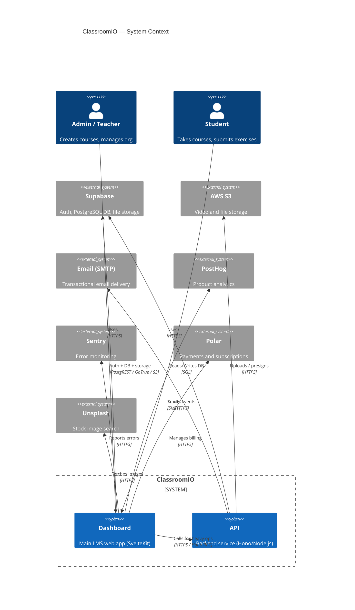
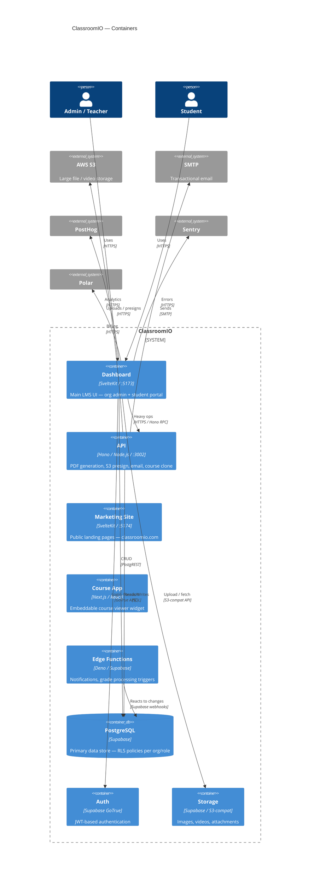
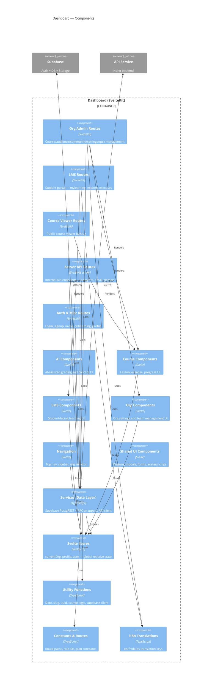
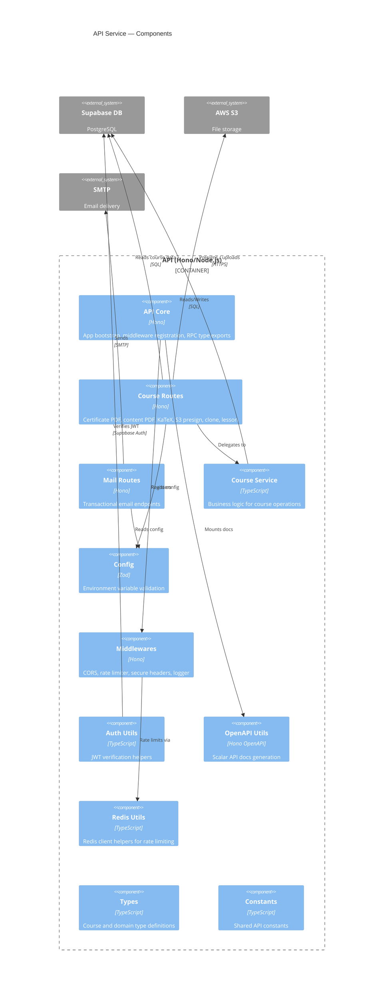

# C4 Model Skill

Generates or updates C4 architecture diagrams (Layers 1–3) for ClassroomIO and optionally extracts the database schema. All output goes to `docs/c4/`.

## Invocation

```
/c4-model           → Full run: extract AST + generate all diagrams
/c4-model db        → Database schema extraction only
/c4-model diagrams  → Regenerate diagrams from existing components.json (skip extract)
```

## References

Before running, read:
- `.claude/skills/c4-model/references/c4-conventions.md` — C4 abstraction rules and ClassroomIO-specific decisions
- `.claude/skills/c4-model/references/mermaid-c4-syntax.md` — Mermaid C4 syntax cheatsheet

---

## Step 1 — Install script dependencies (first run or after package.json changes)

```bash
cd .claude/skills/c4-model && pnpm install --ignore-workspace
```

## Step 2 — Run AST extraction (skip if invoked with `diagrams` argument)

```bash
cd .claude/skills/c4-model && pnpm exec tsx extract.ts
```

This writes `docs/c4/components.json`. Read the file and check the console output:
- If any component has >50 files, the depth is too shallow. Edit `APPS[n].depth` in `extract.ts` and re-run.
- Report how many components were found per app.

## Step 3 — Generate Layer 1: System Context

Write `docs/c4/L1-context.md` with this content:

````markdown
# L1: System Context


````

## Step 4 — Generate Layer 2: Container Diagram

Write `docs/c4/L2-containers.md`:

````markdown
# L2: Container Diagram


````

## Step 5 — Generate Layer 3: Dashboard Component Diagram

Read `docs/c4/components.json` → `dashboard.components`. Apply these rules:

**Grouping into C4 components:**

Map component keys to logical C4 components as follows. If the JSON has components not listed below, include them using their label.

| Component key prefix | C4 Component label | Tech |
|---------------------|--------------------|------|
| `routes/org` | Org Admin Routes | SvelteKit routes |
| `routes/lms` | LMS Routes | SvelteKit routes |
| `routes/course` | Course Viewer Routes | SvelteKit routes |
| `routes/api` | Server API Routes | SvelteKit server endpoints |
| `routes/` (other) | Auth & Misc Routes | SvelteKit routes |
| `lib/components/AI` | AI Components | Svelte |
| `lib/components/Course` | Course Components | Svelte |
| `lib/components/LMS` | LMS Components | Svelte |
| `lib/components/Org` | Org Components | Svelte |
| `lib/components/Navigation` | Navigation | Svelte |
| `lib/components/` (other UI) | Shared UI Components | Svelte |
| `lib/utils/services` | Services (Data Layer) | TypeScript |
| `lib/utils/store` | Svelte Stores | Svelte/TS |
| `lib/utils/functions` | Utility Functions | TypeScript |
| `lib/utils/constants` | Constants & Routes | TypeScript |
| `lib/utils/types` | Types | TypeScript |
| `lib/utils/translations` | i18n Translations | TypeScript |

Derive relationships by aggregating `relationships` arrays from the JSON components within each group.

Write `docs/c4/L3-dashboard.md`:

````markdown
# L3: Dashboard Components

> Derived from AST extraction — do not edit manually.
> Re-generate with `/c4-model diagrams`.


````

**After writing:** Refine the `Rel()` lines using the actual `relationships` data from `components.json` — remove relationships that have no evidence in the AST, and add any cross-group relationships the AST reveals but the template doesn't show.

## Step 6 — Generate Layer 3: API Component Diagram

Read `docs/c4/components.json` → `api.components`.

Write `docs/c4/L3-api.md` using `C4Component` with a `Container_Boundary` for the API. For each component key in the JSON, create one `Component(...)` entry. Use `label` from the JSON as the component label.

Derive `Rel()` entries from the `relationships` field in the JSON — only include cross-component relationships within the API boundary plus `Rel` to/from external systems (Supabase, S3, email).

Mark `app` (the Hono app entry point), `index` (server entry), and `rpc-types` as the "API Core" component.

````markdown
# L3: API Components

> Derived from AST extraction — do not edit manually.
> Re-generate with `/c4-model diagrams`.


````

**After writing:** Replace the hardcoded `Rel()` lines with those derived from `components.json` `relationships` fields, keeping only cross-component edges. Add any missing components found in the JSON.

## Step 7 (Optional) — Extract database schema

Only run if invoked with `db` argument or if `docs/c4/database.md` does not exist and Supabase is running locally.

```bash
cd .claude/skills/c4-model && pnpm exec tsx db-schema.ts
```

If the Supabase container is not running, skip this step and note it in the output.

## Step 8 — Write index

Write or update `docs/c4/README.md`:

```markdown
# C4 Architecture — ClassroomIO

Auto-generated by the `/c4-model` Claude Code skill.

| File | Layer | Description |
|------|-------|-------------|
| [L1-context.md](L1-context.md) | 1 — System Context | Actors and external systems |
| [L2-containers.md](L2-containers.md) | 2 — Containers | Deployable units |
| [L3-dashboard.md](L3-dashboard.md) | 3 — Dashboard | Dashboard component breakdown |
| [L3-api.md](L3-api.md) | 3 — API | API service component breakdown |
| [database.md](database.md) | DB Schema | Table/column/FK reference |

## Regenerating

```bash
/c4-model           # full regeneration
/c4-model diagrams  # skip AST re-extraction
/c4-model db        # database schema only
```
```

## Output summary

Report to the user:
- Files written to `docs/c4/`
- Component counts per app (from JSON)
- Any depth warnings
- Whether database schema was extracted
