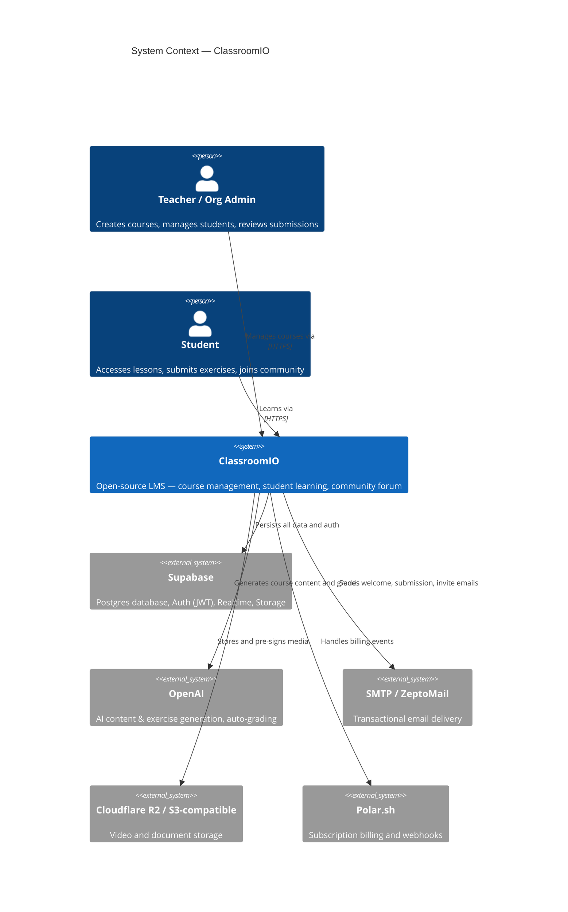
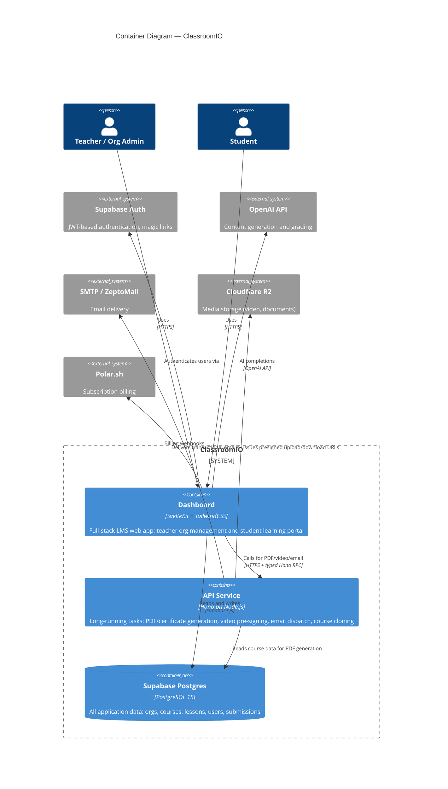

# Skill: C4 Architecture Diagrams

Generate or update the C4 model (Layers 1–3) for ClassroomIO.
All output files go to `docs/c4/`. Read `.claude/skills/c4-model/references/` for C4 conventions and Mermaid syntax before generating anything.

---

## Step 1 — Install extraction dependencies (first run only)

```bash
npm install --prefix .claude/skills/c4-model
```

## Step 2 — Run AST extraction

```bash
.claude/skills/c4-model/node_modules/.bin/tsx .claude/skills/c4-model/extract.ts
```

If warnings appear about components with >50 files, re-run with a greater depth:

```bash
.claude/skills/c4-model/node_modules/.bin/tsx .claude/skills/c4-model/extract.ts --app dashboard --depth 4
```

Read `docs/c4/_extracted.json`. Use it as the authoritative source for all Layer 3 component and relationship data.

## Step 3 — Extract database schema

Requires `supabase start` / the Supabase Docker containers to be running.

```bash
node .claude/skills/c4-model/db-schema.mjs
```

This writes `docs/c4/database.md` directly — no further editing needed unless you want to annotate specific tables.

---

## Step 4 — Generate Layer 1: System Context → `docs/c4/context.md`

Use the template below. Verify external system names against the actual codebase (check `apps/dashboard/.env.example` and `apps/api/.env.example` for current integrations) and update if needed.

````markdown
# C4 Layer 1 — System Context


````

---

## Step 5 — Generate Layer 2: Containers → `docs/c4/containers.md`

````markdown
# C4 Layer 2 — Containers


````

---

## Step 6 — Generate Layer 3: Dashboard Components → `docs/c4/dashboard-components.md`

Use `docs/c4/_extracted.json` → `apps.dashboard`. Apply these rules:

**Component selection**: Include components whose `tsFileCount + svelteFileCount >= 2`. Skip `_root`.

**Grouping into boundaries**: Use the first path segment to create `Container_Boundary` groups:
- `routes/*` → boundary "Routes (SvelteKit pages and API endpoints)"
- `lib/components/*` → boundary "UI Components (Svelte)"
- `lib/utils/*` → boundary "Utilities and Services"

**Component label**: Use `component.label`, title-cased. Technology = "Svelte/SvelteKit" for components under `routes/` or `lib/components/`, otherwise "TypeScript".

**Relationships**: Draw `Rel()` for every entry in `apps.dashboard.relationships` where both `from` and `to` components pass the inclusion filter. Use label "Uses" unless a more specific description is obvious from the names (e.g., `lib/utils/services/courses` → label "Queries" for callers reading course data).

**Mermaid alias**: Replace `/` with `_` in the component key (e.g., `lib_utils_services_courses`).

**External systems**: Add `System_Ext` nodes for Supabase, OpenAI, Polar where relevant, and draw `Rel` from the appropriate service component.

Aim for clarity over completeness — omit relationships from pure utility components (e.g., `lib/utils/functions`) that are called by almost every other component, as these add noise.

File header:
````markdown
# C4 Layer 3 — Dashboard Components
_Auto-derived from AST extraction. Re-generate with `/c4-model`._
````

---

## Step 7 — Generate Layer 3: API Components → `docs/c4/api-components.md`

Use `docs/c4/_extracted.json` → `apps.api`. The API is small — include all components.

Expected components at depth=2:
- `routes/course` — Hono router for PDF/cert downloads, lesson management, S3 presigning, cloning
- `routes` / `_root` — entry, app setup, mail router
- `utils` — certificate/PDF generation, S3, Supabase client, email, upload helpers
- `middlewares` — rate limiter
- `services` — business logic for course operations
- `config` — environment config
- `types` — shared Zod schemas

Draw `Rel` from `routes/*` to `utils`, `services`, external systems as indicated in the JSON relationships. Add `System_Ext` for Supabase, S3, email.

File header:
````markdown
# C4 Layer 3 — API Service Components
_Auto-derived from AST extraction. Re-generate with `/c4-model`._
````

---

## Output files summary

| File | Description |
|---|---|
| `docs/c4/context.md` | Layer 1 — System Context |
| `docs/c4/containers.md` | Layer 2 — Containers |
| `docs/c4/dashboard-components.md` | Layer 3 — Dashboard |
| `docs/c4/api-components.md` | Layer 3 — API |
| `docs/c4/database.md` | Database schema (auto-generated) |
| `docs/c4/_extracted.json` | Raw AST extraction (gitignored) |

---

## Updating existing diagrams

When re-running the skill after code changes:
1. Always re-run the extraction script (Step 2) to get fresh data.
2. For Layer 1 and 2: only update if new external systems, containers, or major relationships have changed.
3. For Layer 3: regenerate fully from the new JSON — do not manually merge.
4. For the database: always re-run `db-schema.mjs` to capture new migrations.
