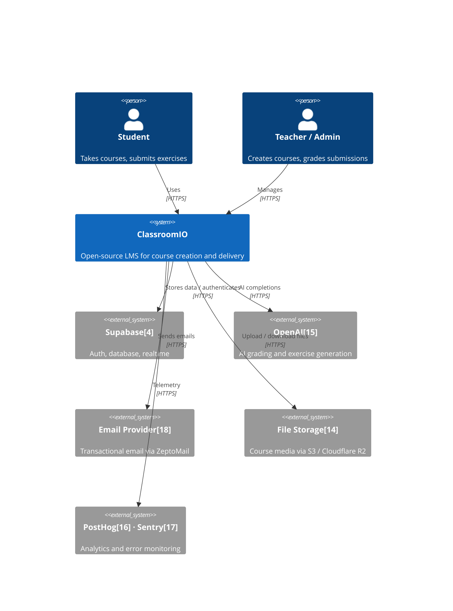
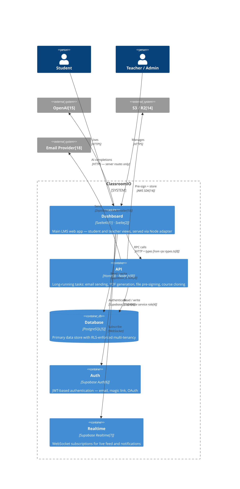

# C4 Model Generator — ClassroomIO

Generate or update C4 architecture diagrams (Layers 1–3) for ClassroomIO.
Output Mermaid diagrams to `docs/c4/`. Layer 3 components are derived from AST extraction — never hardcoded.

---

## What is AST?

An **Abstract Syntax Tree (AST)** is a tree-shaped data structure that represents source code structure without whitespace, comments, or syntactic sugar. Every construct in the language — an import statement, a function call, a class declaration — becomes a node in this tree, with children representing its sub-constructs.

This skill uses **ts-morph**, a wrapper around the TypeScript compiler's own AST API. When ts-morph parses `apps/api/src/routes/course/clone.ts`, it builds an AST where the top-level node is the source file, its children include import declarations, and each import declaration's child is the module specifier string. By walking every file's import declarations and resolving specifiers to their target files or npm packages, the extractor builds a directed dependency graph between directories — without executing any code or relying on runtime introspection.

**Why directory-level granularity?** The C4 Component level (Layer 3) represents a "grouping of related functionality behind a well-defined interface" — one level above individual classes or functions. Mapping each directory to a component is the right granularity: it matches how developers mentally partition the code, and it aligns with how TypeScript path aliases (`$lib`, `$src`) are organized.

**Why not parse `.svelte` files?** ts-morph understands TypeScript and JavaScript. Svelte files have a custom syntax (template + `<script>` block + `<style>`) that the TypeScript compiler cannot parse. The extractor handles this gracefully: it counts `.svelte` files per directory as metadata (visible in the JSON `svelteCount` field) and extracts relationships from the co-located `.ts`/`.js` files only. This means component relationships derived from Svelte `<script>` import tags are not captured — but the structural directory map is complete.

---

## Tech Stack Reference

Footnote numbers below are used in diagram labels (e.g., `"SvelteKit[1] · Svelte[2]"`). Copy this table into generated diagram files as a footnotes section.

| # | Technology | Description |
|---|-----------|-------------|
| 1 | **SvelteKit 1.x** | Full-stack web framework for Svelte with file-based routing, server-side rendering, and server actions. The Dashboard is deployed via the Node adapter. |
| 2 | **Svelte 4** | Reactive UI component compiler that outputs vanilla JavaScript with zero runtime framework overhead. Component state is tracked at compile time via reactivity declarations. |
| 3 | **Hono 4** | Lightweight, edge-first web framework for Node.js and Cloudflare Workers with a typed middleware chain, Zod validation, and built-in OpenAPI support. |
| 4 | **Supabase** | Open-source Firebase alternative providing a managed PostgreSQL database, Auth, Realtime subscriptions, and Storage in one platform. |
| 5 | **PostgreSQL** | Open-source relational database backing Supabase local and cloud instances. Row-Level Security (RLS) policies enforce multi-tenant data isolation. |
| 6 | **Supabase Auth** | JWT-based authentication service integrated with Supabase. Supports email/password, magic links, and OAuth providers; tokens are verified by the API middleware. |
| 7 | **Supabase Realtime** | WebSocket broadcast layer built on top of PostgreSQL logical replication. The Dashboard subscribes to row changes for live feed and notification updates. |
| 8 | **TypeScript** | Statically typed superset of JavaScript used across the entire monorepo. The Dashboard and API share types via `@cio/api/rpc-types` for end-to-end type safety. |
| 9 | **Turborepo** | Monorepo build orchestrator that caches task outputs and parallelises builds across the pnpm workspace. The Dashboard build depends on the API build for RPC types. |
| 10 | **pnpm** | Fast, disk-efficient Node.js package manager using a content-addressable store and symlinked `node_modules`. Workspaces link local packages (`@cio/api`, `shared`) without publishing. |
| 11 | **Zod** | TypeScript-first schema validation library used in both the API (environment config, request bodies) and the Dashboard (form validation). Zod schemas double as runtime type guards. |
| 12 | **Tailwind CSS** | Utility-first CSS framework configured with the Carbon Design System component tokens. All styling in the Dashboard is expressed as Tailwind class names. |
| 13 | **Redis (ioredis)** | In-memory key-value store used by the API for rate limiting and response caching. Accessed via `ioredis` client; key patterns are centralised in `utils/redis/key-generators.ts`. |
| 14 | **S3 / Cloudflare R2** | Object storage for uploaded files (course media, certificates). The API presigns upload URLs and proxies downloads; Cloudflare R2 is the preferred production backend. |
| 15 | **OpenAI** | GPT-4 completions used for AI grading, exercise generation, and custom prompts in the Dashboard. Requests are issued from SvelteKit server routes, never the browser. |
| 16 | **PostHog** | Product analytics SDK (`posthog-js`) embedded in the Dashboard for event tracking and feature flags. Captures user flows without PII by default. |
| 17 | **Sentry** | Error monitoring and performance tracing in both the Dashboard (browser SDK) and the API (`@sentry/node`). Breadcrumbs and stack traces are sent to the Sentry cloud. |
| 18 | **Nodemailer / ZeptoMail** | Email delivery libraries used by the API mail service. ZeptoMail is the production transactional provider; Nodemailer is used as a local development fallback. |
| 19 | **ts-morph** | TypeScript compiler API wrapper used exclusively by this skill's `extract.ts` script. It walks file ASTs to extract import relationships without executing any application code. |
| 20 | **Mermaid** | Diagram-as-code library that renders architecture diagrams from text markup inside Markdown fenced code blocks. Supported natively by GitHub and most documentation platforms. |

---

## How to Run

### Prerequisites — install ts-morph and tsx if absent

```bash
pnpm list -w ts-morph tsx 2>/dev/null | grep -qE "ts-morph|tsx" \
  || pnpm add -w -D ts-morph tsx
```

### Step 1 — AST extraction

Run from the monorepo root:

```bash
pnpm exec tsx .claude/skills/c4-model/extract.ts
```

This produces:
- `docs/c4/ast-api.json` — component map for `apps/api` (depth=2)
- `docs/c4/ast-dashboard.json` — component map for `apps/dashboard` (depth=3)

Both files are gitignored (AI context only). If depth warnings appear (`⚠`), consider increasing the depth for that app by editing `APPS` in `extract.ts`.

**JSON shape:**
```jsonc
{
  "app": "api",
  "depth": 2,
  "components": [
    {
      "key": "routes/course",      // directory path relative to src/
      "label": "course",           // last path segment
      "files": ["routes/course/clone.ts", ...],
      "svelteCount": 0,            // .svelte files in this directory tree
      "imports": ["services/course", "utils"],   // other component keys this imports
      "externalPackages": ["hono", "@supabase/supabase-js"]
    }
  ],
  "warnings": []
}
```

### Step 2 — Read the JSON

```bash
cat docs/c4/ast-api.json
cat docs/c4/ast-dashboard.json
```

### Step 3 — Generate diagrams

Follow the generation rules below. Write each diagram to its output file.

### Step 4 (optional) — Extract database schema

Requires `supabase start` to be running locally.

```bash
DB=$(docker ps --filter "name=supabase_db" --format "{{.Names}}" | head -1)

# Tables + columns
docker exec "$DB" psql -U postgres -d postgres -t -A -F'|' -c "
SELECT c.table_name, c.column_name, c.data_type, c.is_nullable
FROM information_schema.columns c
JOIN information_schema.tables t 
  ON t.table_name = c.table_name AND t.table_schema = c.table_schema
WHERE c.table_schema = 'public' AND t.table_type = 'BASE TABLE'
ORDER BY c.table_name, c.ordinal_position;"

# Foreign keys
docker exec "$DB" psql -U postgres -d postgres -t -A -F'|' -c "
SELECT kcu.table_name, kcu.column_name, ccu.table_name AS ref_table, ccu.column_name AS ref_col
FROM information_schema.table_constraints tc
JOIN information_schema.key_column_usage kcu 
  ON kcu.constraint_name = tc.constraint_name AND kcu.table_schema = tc.table_schema
JOIN information_schema.constraint_column_usage ccu 
  ON ccu.constraint_name = tc.constraint_name AND ccu.table_schema = tc.table_schema
WHERE tc.table_schema = 'public' AND tc.constraint_type = 'FOREIGN KEY'
ORDER BY kcu.table_name, kcu.column_name;"
```

Format the output as a compact Markdown table in `docs/c4/database.md`:
```
## Tables
| Table | Column | Type | Nullable | FK |
|-------|--------|------|----------|----|
| courses | id | uuid | NO | |
| courses | org_id | uuid | NO | → organisations.id |
```

---

## Diagram Generation Rules

### General

1. Use `C4Context`, `C4Container`, `C4Component` diagram types.
2. Wrap all diagrams in a Markdown fenced code block: ` ```mermaid … ``` `
3. After each diagram's code block, add a **Footnotes** section (see format below).
4. Keep descriptions short — these diagrams are for AI context consumption.
5. Mermaid C4 aliases must be alphanumeric + underscores only. Convert component keys: replace `/` and `-` with `_`, prepend `c_` to avoid reserved words. Example: `routes/course` → `c_routes_course`.

### Footnote convention

In each node's `techn` argument, append footnote markers for every tech stack item used:
```
Container(api, "API", "Hono[3] · Node.js", "Long-running tasks")
```

After the mermaid block, add a table:
```markdown
**Footnotes** — see [Tech Stack Reference](#tech-stack-reference) in SKILL.md  
| # | Technology |
|---|-----------|
| 3 | Hono 4 |
| 5 | PostgreSQL |
```

Only list footnotes that actually appear in that diagram.

### Layer 3 — mapping JSON to Mermaid

For **API** (`ast-api.json`):
- Use all components as `Component(alias, key, techn, descr)` nodes.
- `techn` = top external packages mapped to short tech names + footnote numbers (see mapping table below).
- `descr` = infer a one-sentence purpose from the key name and file list.
- Draw `Rel(from, to, "imports")` for every `imports[]` relationship.
- Wrap everything in `Container_Boundary(api_boundary, "API — @cio/api")`.

For **Dashboard** (`ast-dashboard.json`):
- The depth-3 JSON will have many components (~70+). For readability, **aggregate to depth-2** for the diagram: merge all `lib/components/*` into one `Component(c_lib_components, "lib/components", ...)` node, all `lib/utils/*` into `c_lib_utils`, etc.
- Exception: keep `lib/utils/services` and `lib/utils/store` as distinct nodes — they have architecturally significant outbound relationships.
- Show `routes/lms`, `routes/org`, `routes/api`, `routes/course`, `routes/courses`, `routes/home` as separate component nodes — these are the main user-facing areas.
- Draw relationships for: routes → lib/utils/services, routes → lib/components, lib/utils/services → (Supabase external), lib/utils/store → lib/utils/services.
- Mark Supabase, OpenAI, the API container, etc. as `Component_Ext` nodes.
- Wrap everything in `Container_Boundary(dash_boundary, "Dashboard — @cio/dashboard")`.

### Package → tech name mapping (for techn labels)

| Package prefix | Short name | Footnote |
|---------------|-----------|----------|
| `@supabase/supabase-js` | Supabase | [4] |
| `hono` | Hono | [3] |
| `ioredis` | Redis | [13] |
| `@aws-sdk/client-s3` | S3 | [14] |
| `nodemailer` | Nodemailer | [18] |
| `zeptomail` | ZeptoMail | [18] |
| `zod` | Zod | [11] |
| `openai` or `openai-edge` | OpenAI | [15] |
| `@sentry/node` or `posthog-js` | Sentry/PostHog | [17]/[16] |
| `axios` or `ky` | HTTP client | — |
| `@carbon/*` | Carbon Design | — |

---

## Output Files

| File | Layer | Content |
|------|-------|---------|
| `docs/c4/layer1-context.md` | 1 | System Context: ClassroomIO + users + external systems |
| `docs/c4/layer2-containers.md` | 2 | Containers: Dashboard, API, Supabase (DB/Auth/Realtime) |
| `docs/c4/layer3-api.md` | 3 | API components derived from `ast-api.json` |
| `docs/c4/layer3-dashboard.md` | 3 | Dashboard components derived from `ast-dashboard.json` |
| `docs/c4/database.md` | — | Compact DB schema (tables, columns, FKs) |
| `docs/c4/ast-api.json` | — | AST extraction output (gitignored) |
| `docs/c4/ast-dashboard.json` | — | AST extraction output (gitignored) |

---

## Layer 1 — System Context (reference template)

Write to `docs/c4/layer1-context.md`:


```mermaid
C4Context
  Person(student, "Student", "Takes courses, submits exercises")
  Person(teacher, "Teacher / Admin", "Creates courses, grades submissions")

  System(classroomio, "ClassroomIO", "Open-source LMS for course creation and delivery")

  System_Ext(supabase, "Supabase[4]", "Auth, database, realtime")
  System_Ext(openai, "OpenAI[15]", "AI grading and exercise generation")
  System_Ext(email, "Email Provider[18]", "Transactional email via ZeptoMail")
  System_Ext(storage, "File Storage[14]", "Course media via S3 / Cloudflare R2")
  System_Ext(analytics, "PostHog[16] · Sentry[17]", "Analytics and error monitoring")

  Rel(student, classroomio, "Uses", "HTTPS")
  Rel(teacher, classroomio, "Manages", "HTTPS")
  Rel(classroomio, supabase, "Stores data / authenticates", "HTTPS")
  Rel(classroomio, openai, "AI completions", "HTTPS")
  Rel(classroomio, email, "Sends emails", "HTTPS")
  Rel(classroomio, storage, "Upload / download files", "HTTPS")
  Rel(classroomio, analytics, "Telemetry", "HTTPS")
```

---

## Layer 2 — Containers (reference template)

Write to `docs/c4/layer2-containers.md`:


```mermaid
C4Container
  Person(student, "Student")
  Person(teacher, "Teacher / Admin")

  System_Boundary(cio, "ClassroomIO") {
    Container(dashboard, "Dashboard", "SvelteKit[1] · Svelte[2]", "Main LMS web app — student and teacher views, served via Node adapter")
    Container(api, "API", "Hono[3] · Node.js[8]", "Long-running tasks: email sending, PDF generation, file pre-signing, course cloning")
    ContainerDb(db, "Database", "PostgreSQL[5]", "Primary data store with RLS-enforced multi-tenancy")
    Container(auth, "Auth", "Supabase Auth[6]", "JWT-based authentication — email, magic link, OAuth")
    Container(realtime, "Realtime", "Supabase Realtime[7]", "WebSocket subscriptions for live feed and notifications")
  }

  System_Ext(openai, "OpenAI[15]")
  System_Ext(storage, "S3 / R2[14]")
  System_Ext(email_ext, "Email Provider[18]")

  Rel(student, dashboard, "Uses", "HTTPS")
  Rel(teacher, dashboard, "Manages", "HTTPS")
  Rel(dashboard, api, "RPC calls", "HTTP + types from rpc-types.ts[8]")
  Rel(dashboard, db, "Read / write", "Supabase JS SDK[4]")
  Rel(dashboard, auth, "Authenticate", "Supabase JS SDK[4]")
  Rel(dashboard, realtime, "Subscribe", "WebSocket")
  Rel(dashboard, openai, "AI completions", "HTTPS — server routes only")
  Rel(api, db, "Read / write", "Supabase service role[4]")
  Rel(api, storage, "Pre-sign + store", "AWS SDK[14]")
  Rel(api, email_ext, "Send", "ZeptoMail / Nodemailer[18]")
```
