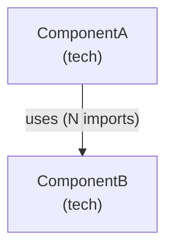

# C4 Model Conventions for ClassroomIO

## Layer Summary

| Layer | Scope | Audience |
|-------|-------|----------|
| L1 System Context | ClassroomIO as a black box + external actors | Anyone |
| L2 Container | Apps/services within ClassroomIO | Developers |
| L3 Component | Modules within a single container | Developers |

## Mermaid C4 Syntax Used

Use `graph TD` (top-down) for all diagrams. GitHub and most renderers support this natively.



Node format: `id["Label\n(tech or role)"]`
Edge label: `-->|"relationship description"|`

## Relationship Label Rules

- weight == 1: `uses`
- weight 2–5: `uses (N imports)`
- weight > 5: `heavily uses (N imports)`
- HTTP calls between containers: `calls (HTTP)`

## Component Label Format

When `svelteFileCount > 0`, append file counts to label:
```
Course (4 ts, 12 svelte)
```

When only `.ts` files:
```
services/course
```

## Known Static Analysis Limitations

1. **Svelte script blocks** — ts-morph cannot parse `.svelte` files. Imports within `<script>` blocks are invisible to the extractor. Svelte file counts are metadata only.

2. **Cross-app HTTP calls** — The Dashboard calls the API via `fetch('/api/...')` string literals. These are not captured as imports. Add cross-app relationships manually in L2 based on:
   - `apps/dashboard/src/lib/utils/services/` calling API endpoints
   - `apps/dashboard/src/routes/api/` (SvelteKit server-side endpoints that proxy to API)

3. **Dynamic imports** — `import()` calls are not analyzed, only `import` declarations.

4. **Type-only imports** — `import type` declarations are included in the analysis (conservative approach).

## External Systems (Canonical List)

See `classroomio-external-systems.md` for the authoritative list of external systems to include in L1 and L2.

## File Naming

| File | Content |
|------|---------|
| `docs/c4/l1-system-context.md` | L1 diagram + table of external systems |
| `docs/c4/l2-containers.md` | L2 diagram + container descriptions |
| `docs/c4/l3-dashboard.md` | L3 component diagram for Dashboard |
| `docs/c4/l3-api.md` | L3 component diagram for API |
| `docs/c4/database.md` | Database schema (token-efficient) |
| `docs/c4/extracted.json` | Raw AST output — gitignored, ephemeral |

## Database Schema Format

Use pipe tables, grouped by domain. One row per table:

```
| Table | Key Columns | Foreign Keys |
|-------|-------------|--------------|
| course | id uuid PK, title text, slug text, group_id uuid | group_id → group.id |
```

Abbreviate types: `uuid`, `text`, `bool`, `int`, `ts` (timestamp), `jsonb`.
Mark `PK` for primary keys. Omit `created_at`/`updated_at` unless they serve a business purpose.
