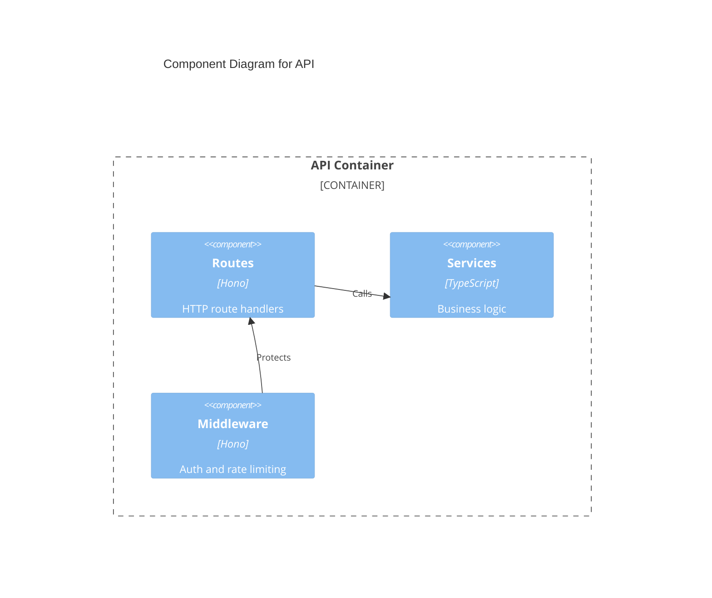

# C4 Mermaid Syntax Reference

## Diagram Types
- `C4Context` - Layer 1: System Context
- `C4Container` - Layer 2: Container
- `C4Component` - Layer 3: Component

## Node Types
```
Person(alias, label, ?descr)
Person_Ext(alias, label, ?descr)
System(alias, label, ?descr)
System_Ext(alias, label, ?descr)
SystemDb(alias, label, ?descr)
Container(alias, label, ?techn, ?descr)
ContainerDb(alias, label, ?techn, ?descr)
ContainerQueue(alias, label, ?techn, ?descr)
Container_Ext(alias, label, ?techn, ?descr)
Component(alias, label, ?techn, ?descr)
ComponentDb(alias, label, ?techn, ?descr)
ComponentQueue(alias, label, ?techn, ?descr)
Component_Ext(alias, label, ?techn, ?descr)
```

## Boundaries
```
Boundary(alias, label, ?type)
Enterprise_Boundary(alias, label)
System_Boundary(alias, label)
Container_Boundary(alias, label)
```

## Relationships
```
Rel(from, to, label, ?techn)
BiRel(from, to, label, ?techn)
Rel_U(from, to, label, ?techn)   %% upward
Rel_D(from, to, label, ?techn)   %% downward
Rel_L(from, to, label, ?techn)   %% left
Rel_R(from, to, label, ?techn)   %% right
Rel_Back(from, to, label, ?techn)
```

## Layout
```
UpdateLayoutConfig(?c4ShapeInRow, ?c4BoundaryInRow)
```
Default: 4 shapes/row, 2 boundaries/row.

## Example: Component Diagram


## C4 Component Guidelines
- A component = grouping of related functionality behind a well-defined interface
- Components are NOT separately deployable — they run in the same process as their container
- Group by functional cohesion, not by file type or framework artifact
- Omit low-level utilities, domain classes, and noise — show architecturally significant groupings
