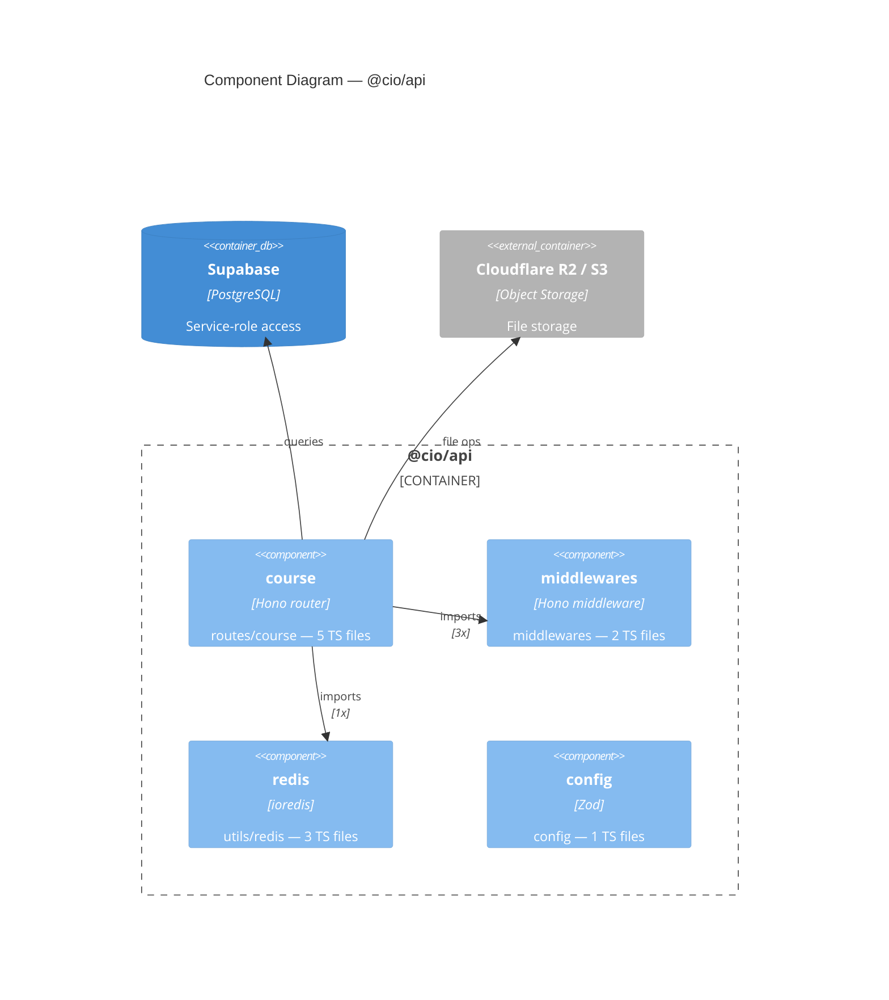

# C4 Model + Mermaid Reference

Quick reference for generating C4 diagrams with Mermaid syntax, tailored to ClassroomIO conventions.

## C4 Levels Used in This Project

| Level | File | Scope |
|-------|------|-------|
| 1 — System Context | L1-context.md | External actors + ClassroomIO boundary |
| 2 — Container | L2-containers.md | Dashboard, API, Supabase, Storage, Email |
| 3 — Component | L3-{app}.md | Internal modules per app (AST-derived) |

Level 4 (Code) is not generated; use IDE navigation instead.

## Mermaid C4 Syntax

```
C4Context      # Level 1
C4Container    # Level 2
C4Component    # Level 3
```

### Node types

```
Person(id, "label", "desc")           # human actor
Person_Ext(id, "label", "desc")       # external person

System(id, "label", "desc")           # internal system
System_Ext(id, "label", "desc")       # external system
SystemDb(id, "label", "desc")         # database / data store
SystemDb_Ext(...)

Container(id, "label", "tech", "desc")
ContainerDb(id, "label", "tech", "desc")
Container_Ext(...)

Component(id, "label", "tech", "desc")
ComponentDb(id, "label", "tech", "desc")
Component_Ext(...)
```

### Grouping

```
System_Boundary(id, "label") { ... }
Container_Boundary(id, "label") { ... }
```

### Relationships

```
Rel(from, to, "label")
Rel(from, to, "label", "technology")
Rel_Back(from, to, "label")          # arrow reversed
BiRel(from, to, "label")             # bidirectional
```

### Layout hints (optional)

```
UpdateLayoutConfig($c4ShapeInRow="4", $c4BoundaryInRow="2")
```

### Node ID rules
- Must be alphanumeric + underscore only (no `/`, `-`, `.`)
- Use `snake_case`; prefix with app name for L3 to avoid collisions: `dashboard_lib_utils_store`

## ClassroomIO Conventions

### External systems always referenced
| Alias | Type | Level |
|-------|------|-------|
| `supabase` | ContainerDb | L2+ |
| `r2` / `s3` | Container_Ext | L2+ |
| `smtp` | Container_Ext | L2+ |
| `openai` | Container_Ext | L2 |
| `polar` | Container_Ext | L2 |
| `redis` | Container_Ext | L2 |

### Technology labels (short, used in "tech" field)
| Code area | Label |
|-----------|-------|
| Svelte components | `Svelte` |
| SvelteKit page routes | `SvelteKit page` |
| SvelteKit server routes | `SvelteKit server` |
| Svelte stores | `Svelte store` |
| Hono route handlers | `Hono router` |
| Hono middleware | `Hono middleware` |
| Zod schema/env | `Zod` |
| Redis client | `ioredis` |
| Supabase client init | `Supabase client` |

### Component key depth
| App | Depth | Example keys |
|-----|-------|-------------|
| dashboard | 3 | `lib/components/Course`, `lib/utils/store`, `routes/api/courses` |
| api | 2 | `routes/course`, `services/course`, `utils/redis` |

If a component has >50 TS files, increase the depth by 1 and re-run extraction.

### Relationship labels
- `"imports"` — static import (from AST)
- `"HTTP calls"` — cross-service REST calls
- `"queries"` — database reads/writes
- `"file ops"` — object storage operations
- `"send email"` — email delivery
- `"initializes client"` — SDK setup

## Full example (L3 fragment)


