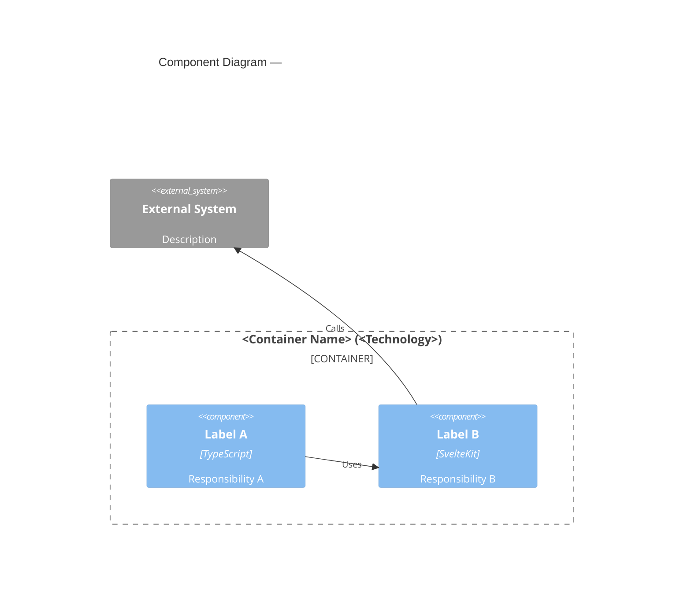

# Mermaid C4 Syntax (Quick Reference)

## Diagram types

```
C4Context     → Layer 1 (System Context)
C4Container   → Layer 2 (Containers)
C4Component   → Layer 3 (Components)
```

## Element declarations

```mermaid
C4Context
  title My Diagram

  Person(alias, "Label", "Description")
  Person_Ext(alias, "Label", "Description")       %% external person

  System(alias, "Label", "Description")
  System_Ext(alias, "Label", "Description")       %% external system
  SystemDb(alias, "Label", "Description")         %% database system

  Container(alias, "Label", "Technology", "Description")
  ContainerDb(alias, "Label", "Technology", "Description")

  Component(alias, "Label", "Technology", "Description")
  ComponentDb(alias, "Label", "Technology", "Description")
```

## Relationships

```mermaid
  Rel(from, to, "Label")
  Rel(from, to, "Label", "Technology")
  BiRel(from, to, "Label")
  Rel_U(from, to, "Label")   %% force upward
  Rel_D(from, to, "Label")   %% force downward
```

## Boundaries

```mermaid
  System_Boundary(alias, "Label") {
    Container(...)
    Container(...)
  }

  Container_Boundary(alias, "Label") {
    Component(...)
    Component(...)
  }
```

## Layout hint

Element order controls layout position (top-to-bottom, left-to-right by default).
Use `UpdateLayoutConfig($c4ShapeInRow, $c4BoundaryInRow)` to control density.

## Alias rules

- Aliases must be unique per diagram and contain only `[a-zA-Z0-9_]`.
- Convert component keys like `lib/utils/services` → `lib_utils_services`.

## Full Layer 3 skeleton


