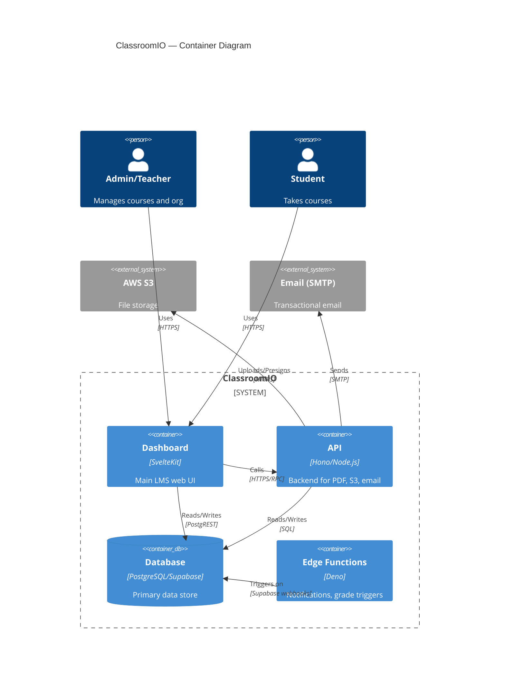

# Mermaid C4 Diagram Syntax

Source: https://mermaid.js.org/syntax/c4.html

## Diagram type declaration

```
C4Context       ← Layer 1: System Context
C4Container     ← Layer 2: Containers
C4Component     ← Layer 3: Components
C4Dynamic       ← Dynamic / sequence view
C4Deployment    ← Deployment view
```

## Element shapes

### Context (L1)
```
Person(alias, "Label", "Description")
Person_Ext(alias, "Label", "Description")         ← external actor
System(alias, "Label", "Description")
System_Ext(alias, "Label", "Description")         ← external system
SystemDb(alias, "Label", "Description")           ← database icon
SystemQueue(alias, "Label", "Description")        ← queue icon
```

### Container (L2)
```
Container(alias, "Label", "Tech", "Description")
ContainerDb(alias, "Label", "Tech", "Description")
ContainerQueue(alias, "Label", "Tech", "Description")
Container_Ext(alias, "Label", "Tech", "Description")
```

### Component (L3)
```
Component(alias, "Label", "Tech", "Description")
ComponentDb(alias, "Label", "Tech", "Description")
ComponentQueue(alias, "Label", "Tech", "Description")
```

## Relationships

```
Rel(from, to, "Label")
Rel(from, to, "Label", "Tech/Protocol")
BiRel(a, b, "Label")                    ← bidirectional
Rel_Back(from, to, "Label")             ← reverse arrow direction
Rel_U / Rel_D / Rel_L / Rel_R          ← directional hints (layout)
```

## Boundaries

```
Enterprise_Boundary(alias, "Label") {
  ...elements...
}
System_Boundary(alias, "Label") {
  ...elements...
}
Container_Boundary(alias, "Label") {
  ...elements...
}
```

## Styling

```
UpdateElementStyle(alias, $fontColor="white", $bgColor="#1168bd", $borderColor="#0e5ba0")
UpdateRelStyle(from, to, $textColor="grey", $lineColor="grey", $offsetX="5", $offsetY="-10")
UpdateLayoutConfig($shapePerRow="3", $externalPersonLayout="bottom")
```

## Full example — L2 Container diagram



## Notes for AI-context diagrams

- Keep aliases short (no spaces, no special chars) — e.g. `dashSvc` not `"Dashboard Service"`
- Descriptions should be ≤10 words — these diagrams are for AI context, not presentations
- Omit `UpdateElementStyle`/`UpdateRelStyle` unless visual clarity demands it
- For L3 component diagrams, only show relationships that cross component boundaries
- Skip leaf-level utilities (single-file helpers) if they clutter the diagram
