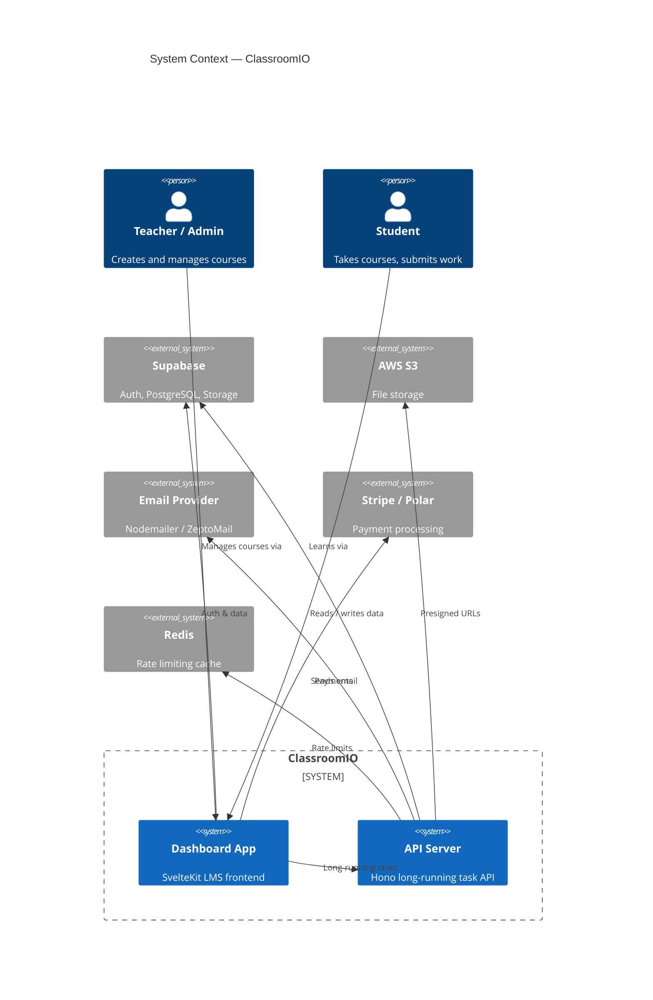
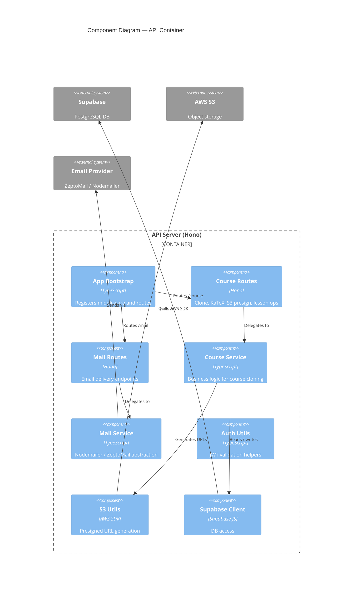

# Mermaid C4 Syntax — Quick Reference

Source: https://mermaid.js.org/syntax/c4.html

## Diagram types

```
C4Context      — Layer 1: system context
C4Container    — Layer 2: containers
C4Component    — Layer 3: components
C4Dynamic      — dynamic / sequence variant
C4Deployment   — deployment view
```

## Element shapes

```
Person(alias, "Label", "Description")
Person_Ext(alias, "Label", "Description")

System(alias, "Label", "Description")
System_Ext(alias, "Label", "Description")

Container(alias, "Label", "Technology", "Description")
Container_Ext(alias, "Label", "Technology", "Description")
ContainerDb(alias, "Label", "Technology", "Description")
ContainerQueue(alias, "Label", "Technology", "Description")

Component(alias, "Label", "Technology", "Description")
ComponentDb(alias, "Label", "Technology", "Description")
```

## Relationships

```
Rel(from, to, "Label")
Rel(from, to, "Label", "Technology")
Rel_Back(from, to, "Label")           -- dashed arrow reversed
Rel_Neighbor(from, to, "Label")       -- side-by-side layout hint
BiRel(from, to, "Label")              -- bidirectional
```

## Boundaries

```
System_Boundary(alias, "Name") {
  Container(...)
}

Container_Boundary(alias, "Name") {
  Component(...)
}

Enterprise_Boundary(alias, "Name") {
  System(...)
}
```

## Complete Layer 1 example



## Complete Layer 3 example (abbreviated)



## Rendering tips

- Keep aliases to `[a-zA-Z0-9_]` — no slashes, dashes, or dots
- Descriptions are optional but recommended (shown as tooltip in many renderers)
- `title` line is optional but helpful for documentation
- Mermaid C4 supports `UpdateLayoutConfig($c4ShapeInRow, $c4BoundaryInRow)` to control layout
- Aim for ≤ 25 elements per diagram for readability
