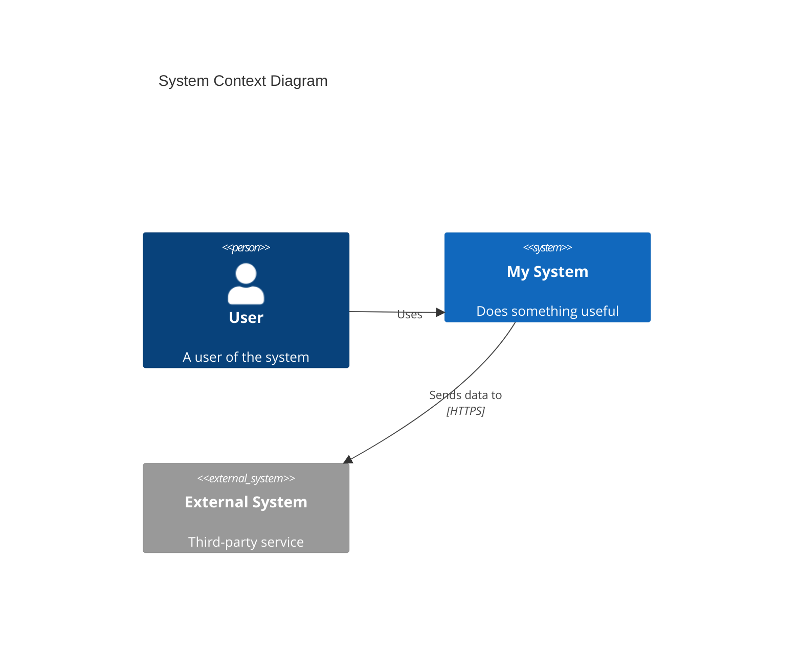
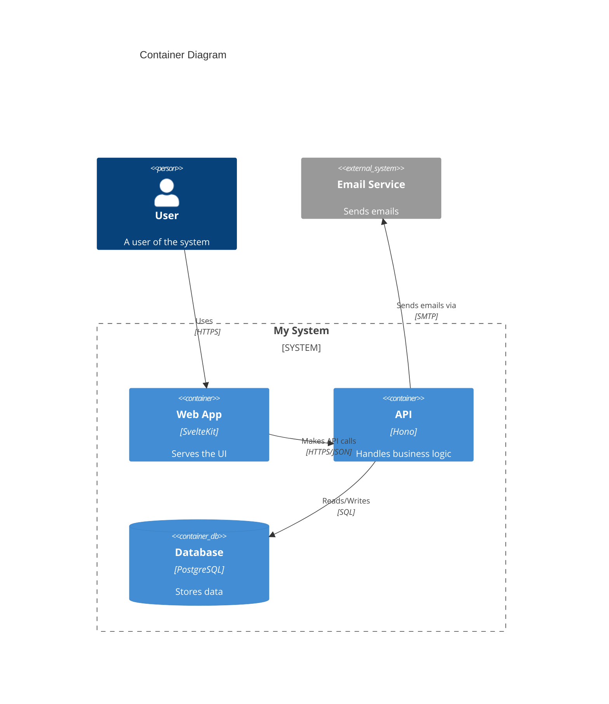
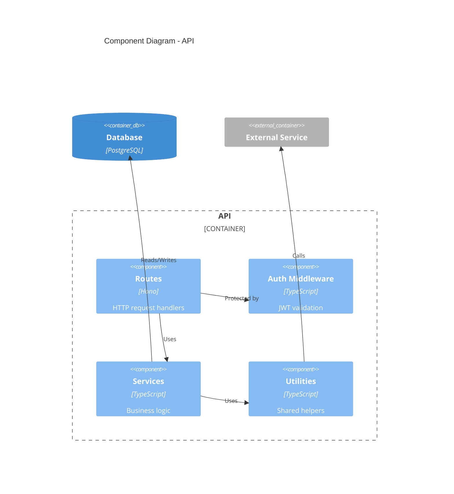

# Mermaid C4 Diagram Syntax Reference

## Diagram Types

```
C4Context       — Layer 1: System Context diagram
C4Container     — Layer 2: Container diagram
C4Component     — Layer 3: Component diagram
C4Dynamic       — Dynamic/sequence diagram
C4Deployment    — Deployment diagram
```

## Element Syntax

### People
```
Person(alias, "Label", "Description")
Person_Ext(alias, "Label", "Description")
```

### Systems
```
System(alias, "Label", "Description")
System_Ext(alias, "Label", "Description")
SystemDb(alias, "Label", "Description")
SystemDb_Ext(alias, "Label", "Description")
SystemQueue(alias, "Label", "Description")
SystemQueue_Ext(alias, "Label", "Description")
```

### Containers (Layer 2+)
```
Container(alias, "Label", "Technology", "Description")
ContainerDb(alias, "Label", "Technology", "Description")
ContainerQueue(alias, "Label", "Technology", "Description")
Container_Ext(alias, "Label", "Technology", "Description")
ContainerDb_Ext(alias, "Label", "Technology", "Description")
```

### Components (Layer 3)
```
Component(alias, "Label", "Technology", "Description")
ComponentDb(alias, "Label", "Technology", "Description")
ComponentQueue(alias, "Label", "Technology", "Description")
Component_Ext(alias, "Label", "Technology", "Description")
```

## Relationships

```
Rel(from, to, "label")
Rel(from, to, "label", "technology")
Rel_D(from, to, "label")          — downward direction
Rel_U(from, to, "label")          — upward direction
Rel_L(from, to, "label")          — leftward direction
Rel_R(from, to, "label")          — rightward direction
BiRel(from, to, "label")          — bidirectional
```

## Boundaries

```
Boundary(alias, "Label") {
    ... elements ...
}

Enterprise_Boundary(alias, "Label") {
    ... elements ...
}

System_Boundary(alias, "Label") {
    ... elements ...
}

Container_Boundary(alias, "Label") {
    ... elements ...
}
```

## Complete Examples

### Layer 1: System Context


### Layer 2: Container


### Layer 3: Component


## Tips

- Use aliases without spaces (camelCase or snake_case)
- Keep descriptions short (they appear in the box)
- Technology field is optional but recommended for containers/components
- Use `UpdateLayoutConfig()` to adjust layout if needed:
  ```
  UpdateLayoutConfig($c4ShapeInRow="3", $c4BoundaryInRow="1")
  ```
