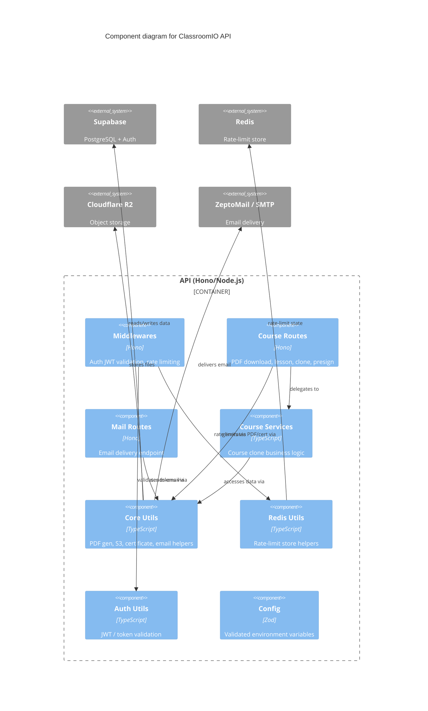

# Mermaid C4 Syntax Reference

## Diagram Types

```
C4Context      — Layer 1: System Context
C4Container    — Layer 2: Containers
C4Component    — Layer 3: Components (within a single container)
C4Dynamic      — Runtime interaction sequence
C4Deployment   — Infrastructure deployment
```

## Person / External Actors

```
Person(alias, "Label", "Optional description")
Person_Ext(alias, "Label", "Optional description")
```

## Systems

```
System(alias, "Label", "Description")
System_Ext(alias, "Label", "Description")
SystemDb(alias, "Label", "Description")        -- database shape
SystemQueue(alias, "Label", "Description")      -- queue shape
Enterprise_Boundary(alias, "Label") { ... }
System_Boundary(alias, "Label") { ... }
```

## Containers (inside System_Boundary)

```
Container(alias, "Label", "Technology", "Description")
ContainerDb(alias, "Label", "Technology", "Description")
ContainerQueue(alias, "Label", "Technology", "Description")
Container_Ext(alias, "Label", "Technology", "Description")
Container_Boundary(alias, "Label") { ... }
```

## Components (inside Container_Boundary)

```
Component(alias, "Label", "Technology", "Description")
ComponentDb(alias, "Label", "Technology", "Description")
ComponentQueue(alias, "Label", "Technology", "Description")
```

## Relationships

```
Rel(from, to, "label")
Rel(from, to, "label", "technology")
BiRel(from, to, "label")
Rel_U(from, to, "label")   -- up
Rel_D(from, to, "label")   -- down
Rel_L(from, to, "label")   -- left
Rel_R(from, to, "label")   -- right
Rel_Back(from, to, "label")
```

## Layout Hints

```
UpdateLayoutConfig($c4ShapeInRow="4", $c4BoundaryInRow="2")
```

## Alias Rules

- Aliases must be **unique per diagram** and contain only `[a-zA-Z0-9_]`.
- No `/`, `-`, `.`, or `[` characters in aliases.
- Convention used in this skill: `{app}_{key_underscore}` e.g. `api_routes_course`.

## Full Example — C4Component


```mermaid
C4Component
  title Component diagram for ClassroomIO API

  Container_Boundary(api, "API (Hono/Node.js)") {
    Component(api_middlewares, "Middlewares", "Hono", "Auth JWT validation, rate limiting")
    Component(api_routes_course, "Course Routes", "Hono", "PDF download, lesson, clone, presign")
    Component(api_routes_mail, "Mail Routes", "Hono", "Email delivery endpoint")
    Component(api_services_course, "Course Services", "TypeScript", "Course clone business logic")
    Component(api_utils, "Core Utils", "TypeScript", "PDF gen, S3, certificate, email helpers")
    Component(api_utils_redis, "Redis Utils", "TypeScript", "Rate-limit store helpers")
    Component(api_utils_auth, "Auth Utils", "TypeScript", "JWT / token validation")
    Component(api_config, "Config", "Zod", "Validated environment variables")
  }

  System_Ext(supabase, "Supabase", "PostgreSQL + Auth")
  System_Ext(redis_ext, "Redis", "Rate-limit store")
  System_Ext(r2_ext, "Cloudflare R2", "Object storage")
  System_Ext(email_ext, "ZeptoMail / SMTP", "Email delivery")

  Rel(api_middlewares, api_utils_auth, "validates tokens via")
  Rel(api_middlewares, api_utils_redis, "rate limits via")
  Rel(api_routes_course, api_services_course, "delegates to")
  Rel(api_routes_course, api_utils, "generates PDF/cert via")
  Rel(api_services_course, api_utils, "accesses data via")
  Rel(api_routes_mail, api_utils, "sends email via")
  Rel(api_utils, supabase, "reads/writes data")
  Rel(api_utils, r2_ext, "stores files")
  Rel(api_utils_redis, redis_ext, "rate-limit state")
  Rel(api_utils, email_ext, "delivers email")
```
