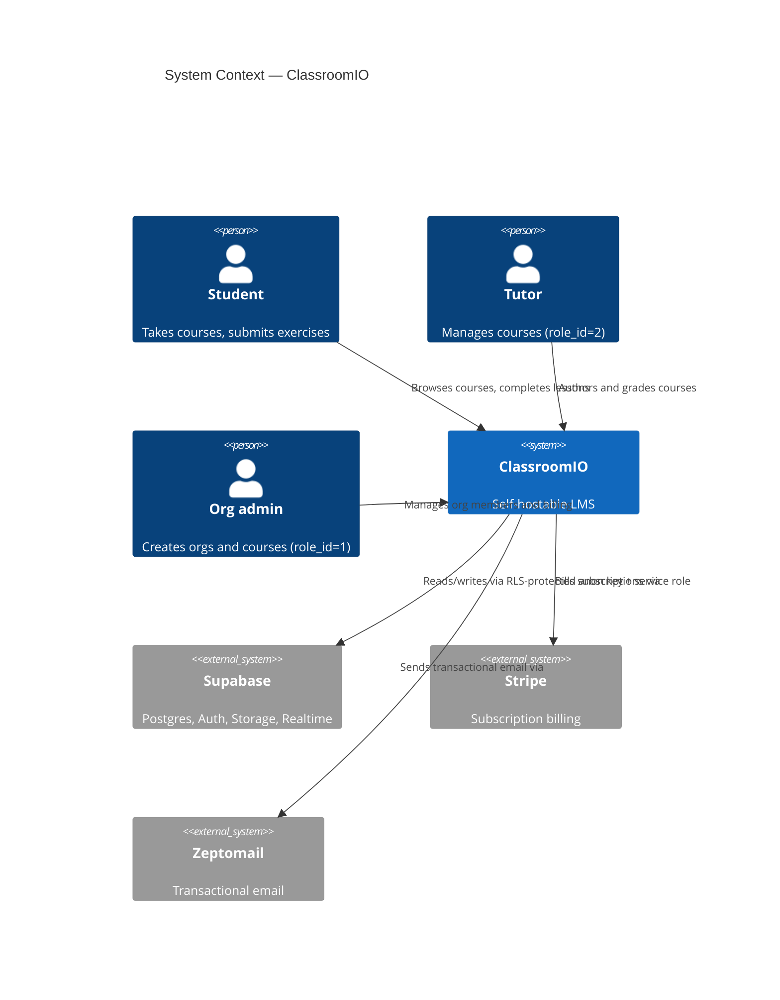
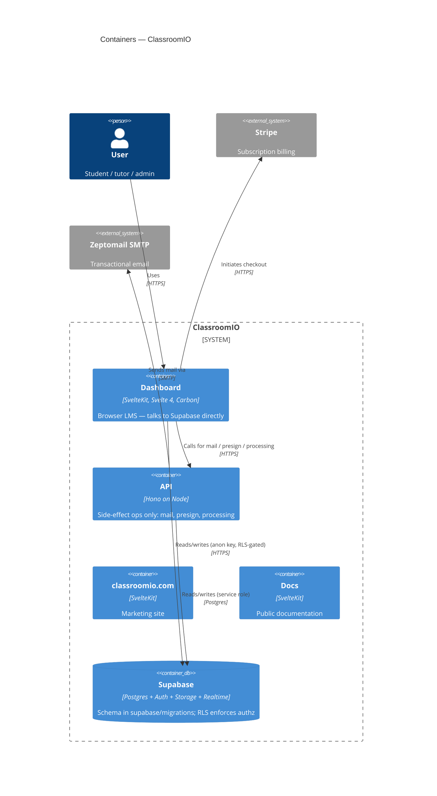
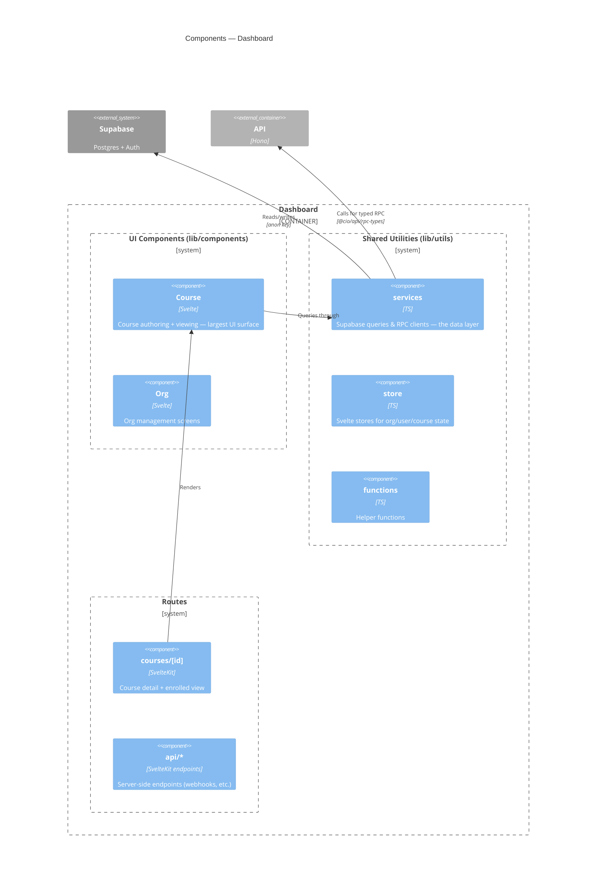

# Mermaid C4 syntax cheatsheet

Mermaid supports C4 via the `C4Context`, `C4Container`, `C4Component`, `C4Dynamic`, and `C4Deployment` diagram types. The C4 support is experimental in Mermaid — keep diagrams simple and avoid features that recent Mermaid releases have changed (theming, custom shapes). Reference: <https://mermaid.js.org/syntax/c4.html>.

## Common elements

| Macro | Use |
| --- | --- |
| `Person(alias, "Label", "Description")` | A human actor. |
| `Person_Ext(alias, "Label", "Description")` | External actor. |
| `System(alias, "Label", "Description")` | A software system (L1/L2). |
| `System_Ext(alias, "Label", "Description")` | External system. |
| `SystemDb(alias, "Label", "Description")` | A datastore-shaped system. |
| `Container(alias, "Label", "Technology", "Description")` | A deployable container (L2). |
| `ContainerDb(alias, "Label", "Technology", "Description")` | A datastore container. |
| `Component(alias, "Label", "Technology", "Description")` | A component inside a container (L3). |
| `Rel(from, to, "Label", "Technology")` | A directed relationship. Last arg optional. |
| `BiRel(a, b, "Label", "Technology")` | Bidirectional. |
| `Boundary(alias, "Label", "type")` | Generic grouping box. `type` is free text shown as a tag (e.g. `"namespace"`). |
| `System_Boundary(alias, "Label")` | Boundary for a system (L2 context). |
| `Container_Boundary(alias, "Label")` | Boundary for components within a container (L3 context). |

Element aliases must be unique across the whole diagram and match the regex `[A-Za-z_][A-Za-z0-9_]*`. Convert path-style component keys like `lib/components/Course` to aliases like `lib_components_Course` (replace `/`, `-`, `[`, `]` with `_`).

## Layer 1 template

```mermaid
C4Context
    title System Context — ClassroomIO

    Person(student, "Student", "Takes courses, submits exercises")
    Person(tutor, "Tutor", "Manages courses (role_id=2)")
    Person(admin, "Org admin", "Creates orgs and courses (role_id=1)")

    System(classroomio, "ClassroomIO", "Self-hostable LMS")

    System_Ext(supabase, "Supabase", "Postgres, Auth, Storage, Realtime")
    System_Ext(stripe, "Stripe", "Subscription billing")
    System_Ext(smtp, "Zeptomail", "Transactional email")

    Rel(student, classroomio, "Browses courses, completes lessons")
    Rel(tutor, classroomio, "Authors and grades courses")
    Rel(admin, classroomio, "Manages org members and billing")
    Rel(classroomio, supabase, "Reads/writes via RLS-protected anon key + service role")
    Rel(classroomio, stripe, "Bills subscriptions via")
    Rel(classroomio, smtp, "Sends transactional email via")
```

## Layer 2 template

```mermaid
C4Container
    title Containers — ClassroomIO

    Person(user, "User", "Student / tutor / admin")

    System_Boundary(cio, "ClassroomIO") {
        Container(dashboard, "Dashboard", "SvelteKit, Svelte 4, Carbon", "Browser LMS — talks to Supabase directly")
        Container(api, "API", "Hono on Node", "Side-effect ops only: mail, presign, processing")
        Container(www, "classroomio.com", "SvelteKit", "Marketing site")
        Container(docs, "Docs", "SvelteKit", "Public documentation")
        ContainerDb(supabase, "Supabase", "Postgres + Auth + Storage + Realtime", "Schema in supabase/migrations; RLS enforces authz")
    }

    System_Ext(stripe, "Stripe", "Subscription billing")
    System_Ext(smtp, "Zeptomail SMTP", "Transactional email")

    Rel(user, dashboard, "Uses", "HTTPS")
    Rel(dashboard, supabase, "Reads/writes (anon key, RLS-gated)", "HTTPS")
    Rel(dashboard, api, "Calls for mail / presign / processing", "HTTPS")
    Rel(api, supabase, "Reads/writes (service role)", "Postgres")
    Rel(api, smtp, "Sends mail via", "SMTP")
    Rel(dashboard, stripe, "Initiates checkout", "HTTPS")
```

## Layer 3 template

```mermaid
C4Component
    title Components — Dashboard

    Container_Boundary(dashboard, "Dashboard") {
        Boundary(ui, "UI Components (lib/components)") {
            Component(lib_components_Course, "Course", "Svelte", "Course authoring + viewing — largest UI surface")
            Component(lib_components_Org, "Org", "Svelte", "Org management screens")
        }
        Boundary(util, "Shared Utilities (lib/utils)") {
            Component(lib_utils_services, "services", "TS", "Supabase queries & RPC clients — the data layer")
            Component(lib_utils_store, "store", "TS", "Svelte stores for org/user/course state")
            Component(lib_utils_functions, "functions", "TS", "Helper functions")
        }
        Boundary(rt, "Routes") {
            Component(routes_courses, "courses/[id]", "SvelteKit", "Course detail + enrolled view")
            Component(routes_api, "api/*", "SvelteKit endpoints", "Server-side endpoints (webhooks, etc.)")
        }
    }

    System_Ext(supabase, "Supabase", "Postgres + Auth")
    Container_Ext(api, "API", "Hono")

    Rel(routes_courses, lib_components_Course, "Renders")
    Rel(lib_components_Course, lib_utils_services, "Queries through")
    Rel(lib_utils_services, supabase, "Reads/writes", "anon key")
    Rel(lib_utils_services, api, "Calls for typed RPC", "@cio/api/rpc-types")
```

## Gotchas

- Mermaid renders C4 best when the diagram is small; if you have >40 boxes, split into multiple diagrams instead of cramming.
- Don't put HTML or ` ` in labels — older Mermaid versions choke. Use plain text.
- `UpdateRelStyle`, `UpdateElementStyle`, and `UpdateLayoutConfig` exist but their support is patchy across Mermaid versions; prefer leaving styling default for portability (GitHub, the docs site, and the SvelteKit pages all render Mermaid differently).
- Component aliases must be unique **across the whole diagram**, including inside boundaries.
- Order of `Boundary` declarations matters for left-to-right layout; declare the most-depended-on boundary last (Mermaid lays out roughly in declaration order).
