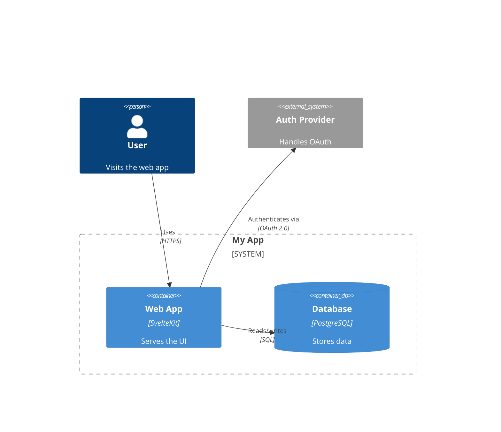

# Mermaid C4 Syntax Reference

Source: https://mermaid.js.org/syntax/c4.html  
Status: experimental — syntax may change in future Mermaid releases.

## Diagram types

```
C4Context      — Level 1: System Context
C4Container    — Level 2: Containers
C4Component    — Level 3: Components
C4Dynamic      — Sequence-style dynamic diagram
C4Deployment   — Deployment/infrastructure diagram
```

## Node types

### Context nodes (use in C4Context)
```
Person(alias, label, ?descr)
Person_Ext(alias, label, ?descr)
System(alias, label, ?descr)
SystemDb(alias, label, ?descr)
SystemQueue(alias, label, ?descr)
System_Ext(alias, label, ?descr)
SystemDb_Ext(alias, label, ?descr)
```

### Container nodes (use in C4Container)
```
Container(alias, label, ?techn, ?descr)
ContainerDb(alias, label, ?techn, ?descr)
ContainerQueue(alias, label, ?techn, ?descr)
Container_Ext(alias, label, ?techn, ?descr)
```

### Component nodes (use in C4Component)
```
Component(alias, label, ?techn, ?descr)
ComponentDb(alias, label, ?techn, ?descr)
ComponentQueue(alias, label, ?techn, ?descr)
Component_Ext(alias, label, ?techn, ?descr)
```

## Boundaries

```
Enterprise_Boundary(alias, label) { ... }
System_Boundary(alias, label) { ... }
Container_Boundary(alias, label) { ... }
Boundary(alias, label, ?type) { ... }
```

Boundaries group related nodes visually. Nest them by indenting the block.

## Relationships

```
Rel(from, to, label, ?techn)
BiRel(from, to, label, ?techn)
Rel_U(from, to, label)    — hint: render upward
Rel_D(from, to, label)    — hint: render downward
Rel_L(from, to, label)    — hint: render leftward
Rel_R(from, to, label)    — hint: render rightward
Rel_Back(from, to, label) — reverse arrow direction
```

Direction hints are advisory — Mermaid's auto-layout may ignore them.

## Styling

```
UpdateElementStyle(alias, ?bgColor, ?fontColor, ?borderColor)
UpdateRelStyle(from, to, ?textColor, ?lineColor, ?offsetX, ?offsetY)
UpdateLayoutConfig(?c4ShapeInRow, ?c4BoundaryInRow)
```

Named parameters: `UpdateRelStyle(a, b, $lineColor="red", $offsetX="-20")`

## Complete example


```mermaid
C4Container
  Person(user, "User", "Visits the web app")

  System_Boundary(app, "My App") {
    Container(web, "Web App", "SvelteKit", "Serves the UI")
    ContainerDb(db, "Database", "PostgreSQL", "Stores data")
  }

  System_Ext(auth, "Auth Provider", "Handles OAuth")

  Rel(user, web, "Uses", "HTTPS")
  Rel(web, db, "Reads/writes", "SQL")
  Rel(web, auth, "Authenticates via", "OAuth 2.0")
```

## Alias rules

- Aliases must be alphanumeric + underscores: `[a-zA-Z0-9_]`
- Do NOT use hyphens, dots, or slashes in aliases — they cause parse errors.
- Convention in this skill: prepend `c_` and replace `/` with `_`.
  - `routes/course` → `c_routes_course`
  - `lib/utils/services` → `c_lib_utils_services`

## Known limitations

- Sprites, tags, and legend customisation are not yet implemented.
- Layout direction commands (`Lay_U`, `Lay_D`, etc.) are not supported.
- Shape functions (`RoundedBoxShape`, `DashedLine`, etc.) are not supported.
- Node ordering in the source controls render order — put related nodes together.
- Deeply nested boundaries may render poorly; prefer flat or two-level nesting.
