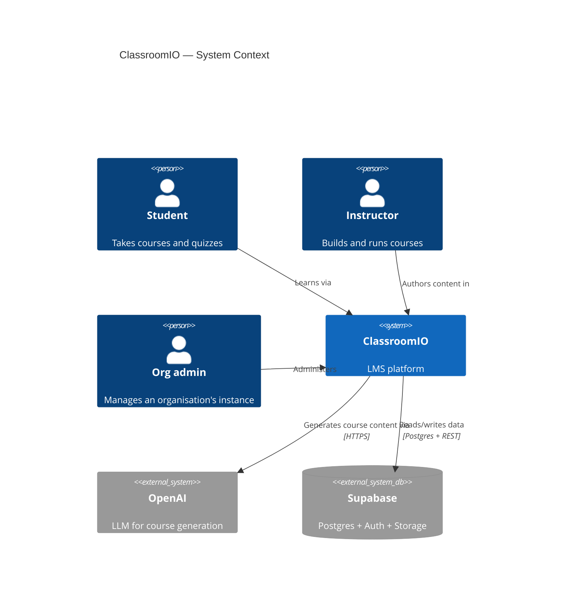
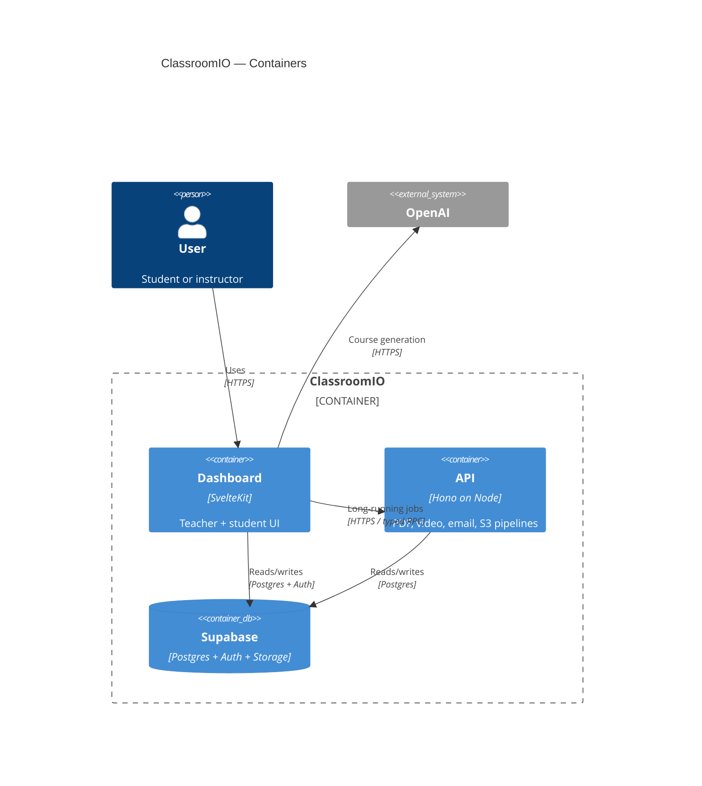
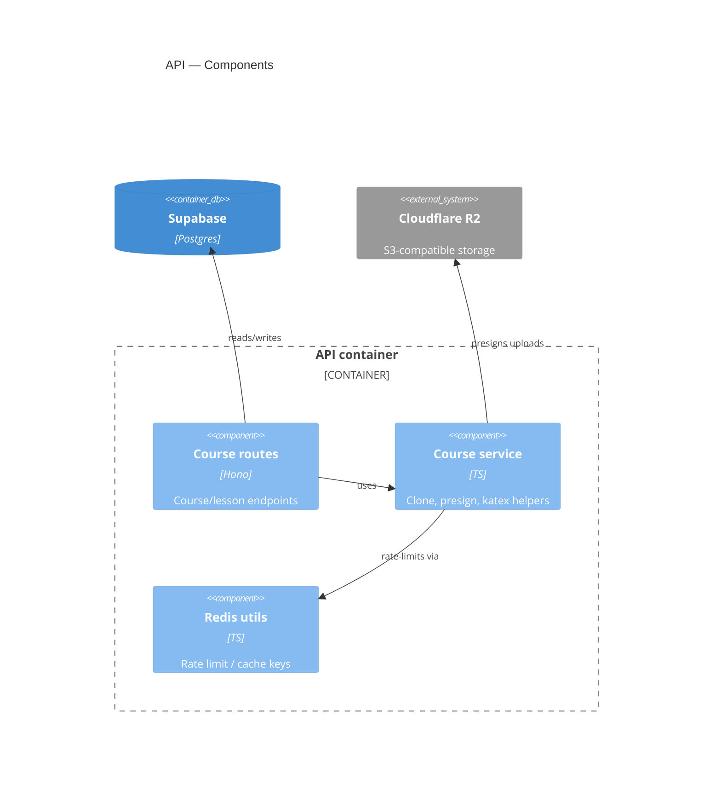

# Mermaid C4 syntax cheat sheet

Mermaid's C4 support is in beta — syntax can shift between Mermaid versions. The forms below work as of Mermaid 11. Always wrap diagrams in a fenced ```` ```mermaid ```` block.

## Diagram types

- `C4Context` — Layer 1
- `C4Container` — Layer 2
- `C4Component` — Layer 3
- `C4Dynamic` — sequence-style (we don't use it here)
- `C4Deployment` — deployment view (we don't use it here)

The first non-blank line of the diagram is the type. A `title <text>` line may follow.

## Elements

People:

- `Person(alias, "label", "?description")`
- `Person_Ext(alias, "label", "?description")` — outside our system boundary

Systems (Layer 1):

- `System(alias, "label", "?description")`
- `System_Ext(alias, "label", "?description")`
- `SystemDb(alias, "label", "?description")`
- `SystemDb_Ext(alias, "label", "?description")`
- `SystemQueue(alias, "label", "?description")`
- `SystemQueue_Ext(alias, "label", "?description")`

Containers (Layer 2):

- `Container(alias, "label", "?techn", "?description")`
- `ContainerDb(alias, "label", "?techn", "?description")`
- `ContainerQueue(alias, "label", "?techn", "?description")`
- The `_Ext` suffix variants exist for all of these.

Components (Layer 3):

- `Component(alias, "label", "?techn", "?description")`
- `ComponentDb(alias, "label", "?techn", "?description")`
- `ComponentQueue(alias, "label", "?techn", "?description")`

Boundaries:

- `System_Boundary(alias, "label") { ... }`
- `Container_Boundary(alias, "label") { ... }`
- `Enterprise_Boundary(alias, "label") { ... }`
- `Boundary(alias, "label", "?type") { ... }` — generic

A boundary nests element declarations inside `{ ... }`.

## Relationships

- `Rel(from, to, "label", "?techn")` — directed
- `BiRel(from, to, "label", "?techn")` — bidirectional
- Directional hints: `Rel_U`, `Rel_D`, `Rel_L`, `Rel_R` (or `Rel_Up` / `Rel_Down` / `Rel_Left` / `Rel_Right`)
- `Rel_Back(from, to, "label", "?techn")` — dashed back-arrow

The `from` and `to` parameters are alias strings declared earlier in the diagram. Mermaid will error if either alias is unknown.

## Layout

- `UpdateLayoutConfig($c4ShapeInRow="3", $c4BoundaryInRow="1")` — defaults are 4 / 2. Drop to 3 / 1 for diagrams that have too many shapes per row.
- `UpdateElementStyle(alias, $bgColor="...", $fontColor="...", $borderColor="...")`
- `UpdateRelStyle(from, to, $textColor="...", $lineColor="...", $offsetX="...", $offsetY="...")`

## Aliases — keep them legal

Mermaid aliases must be valid identifiers. The extractor's component keys contain `/`, `.`, and sometimes `-` — sanitise before emitting:

```
sanitise("src/lib/utils/services/courses") -> "src_lib_utils_services_courses"
```

Rule: replace any non-`[A-Za-z0-9_]` character with `_`.

## Examples

Layer 1:


```mermaid
C4Context
  title ClassroomIO — System Context

  Person(student, "Student", "Takes courses and quizzes")
  Person(instructor, "Instructor", "Builds and runs courses")
  Person(orgadmin, "Org admin", "Manages an organisation's instance")

  System(classroomio, "ClassroomIO", "LMS platform")

  System_Ext(openai, "OpenAI", "LLM for course generation")
  SystemDb_Ext(supabase, "Supabase", "Postgres + Auth + Storage")

  Rel(student, classroomio, "Learns via")
  Rel(instructor, classroomio, "Authors content in")
  Rel(orgadmin, classroomio, "Administers")
  Rel(classroomio, openai, "Generates course content via", "HTTPS")
  Rel(classroomio, supabase, "Reads/writes data", "Postgres + REST")
```

Layer 2:


```mermaid
C4Container
  title ClassroomIO — Containers

  Person(user, "User", "Student or instructor")

  Container_Boundary(c1, "ClassroomIO") {
    Container(dashboard, "Dashboard", "SvelteKit", "Teacher + student UI")
    Container(api, "API", "Hono on Node", "PDF, video, email, S3 pipelines")
    ContainerDb(db, "Supabase", "Postgres + Auth + Storage")
  }

  System_Ext(openai, "OpenAI")

  Rel(user, dashboard, "Uses", "HTTPS")
  Rel(dashboard, api, "Long-running jobs", "HTTPS / typed RPC")
  Rel(dashboard, db, "Reads/writes", "Postgres + Auth")
  Rel(api, db, "Reads/writes", "Postgres")
  Rel(dashboard, openai, "Course generation", "HTTPS")
```

Layer 3:


```mermaid
C4Component
  title API — Components

  Container_Boundary(api, "API container") {
    Component(routes_course, "Course routes", "Hono", "Course/lesson endpoints")
    Component(services_course, "Course service", "TS", "Clone, presign, katex helpers")
    Component(utils_redis, "Redis utils", "TS", "Rate limit / cache keys")
  }

  ContainerDb(db, "Supabase", "Postgres")
  System_Ext(s3, "Cloudflare R2", "S3-compatible storage")

  Rel(routes_course, services_course, "uses")
  Rel(services_course, utils_redis, "rate-limits via")
  Rel(routes_course, db, "reads/writes")
  Rel(services_course, s3, "presigns uploads")
```
