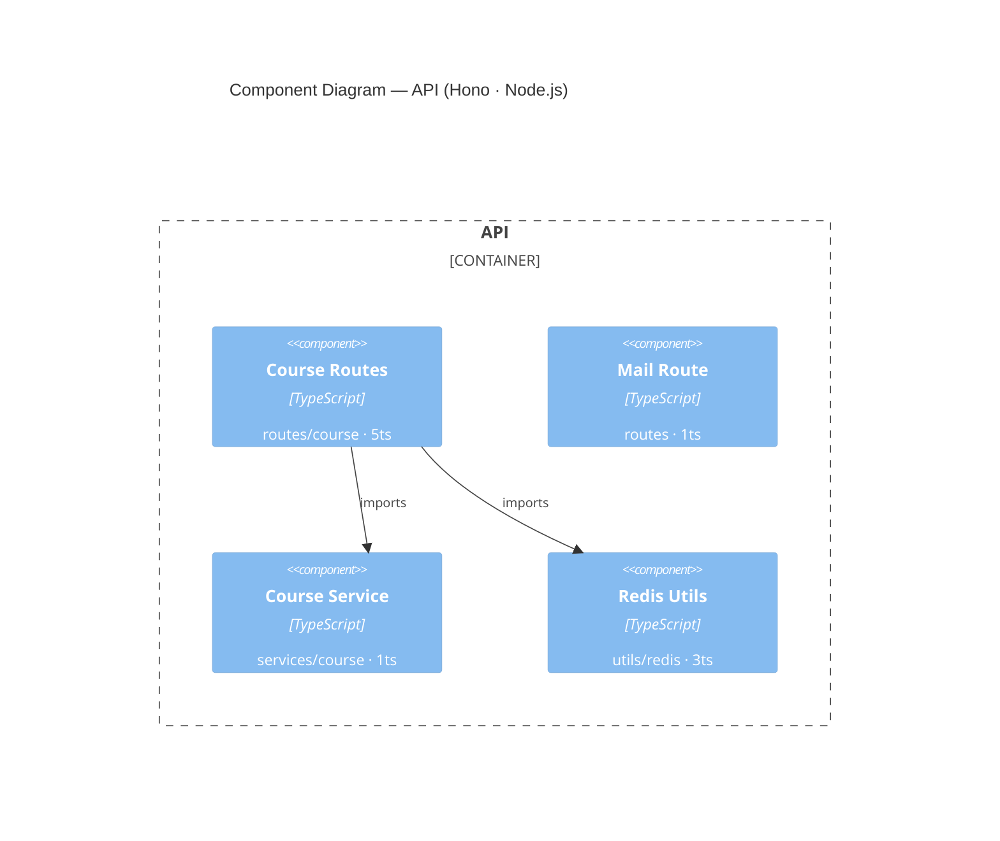

# Mermaid C4 Syntax Reference

> Status: experimental in Mermaid. Syntax may change across versions.

## Diagram types

```
C4Context     — Layer 1 System Context
C4Container   — Layer 2 Container
C4Component   — Layer 3 Component
C4Dynamic     — Dynamic / sequence
C4Deployment  — Deployment
```

## Element declarations

```
Person(alias, label, ?descr)
Person_Ext(alias, label, ?descr)            # external person

System(alias, label, ?descr)
System_Ext(alias, label, ?descr)            # external system
SystemDb(alias, label, ?descr)              # database variant

Container(alias, label, ?tech, ?descr)
ContainerDb(alias, label, ?tech, ?descr)
Container_Ext(alias, label, ?tech, ?descr)

Component(alias, label, ?tech, ?descr)
ComponentDb(alias, label, ?tech, ?descr)
```

## Boundaries

```
Enterprise_Boundary(alias, label) { ... }
System_Boundary(alias, label)     { ... }
Container_Boundary(alias, label)  { ... }
```

## Relationships

```
Rel(from, to, label, ?tech)         # directional
BiRel(from, to, label, ?tech)       # bidirectional
Rel_U(from, to, label)              # forced up
Rel_D(from, to, label)              # forced down
Rel_L(from, to, label)              # forced left
Rel_R(from, to, label)              # forced right
```

## Layout control

```
UpdateLayoutConfig($c4ShapeInRow="4", $c4BoundaryInRow="1")
```

## Styling

```
UpdateElementStyle(alias, $bgColor="grey", $fontColor="white", $borderColor="black")
UpdateRelStyle(from, to, $textColor="red", $lineColor="blue", $offsetX="5", $offsetY="-10")
```

## Full example


```mermaid
C4Component
title Component Diagram — API (Hono · Node.js)

Container_Boundary(api_b, "API") {
  Component(api_routes_course, "Course Routes", "TypeScript", "routes/course · 5ts")
  Component(api_routes, "Mail Route", "TypeScript", "routes · 1ts")
  Component(api_services_course, "Course Service", "TypeScript", "services/course · 1ts")
  Component(api_utils_redis, "Redis Utils", "TypeScript", "utils/redis · 3ts")
}

Rel(api_routes_course, api_services_course, "imports")
Rel(api_routes_course, api_utils_redis, "imports")
```

## Known limitations (Mermaid C4 experimental)

- Sprites, tags, and `$link` parameters not supported in all renderers
- `Lay_U/D/L/R` direction hints not supported
- Legend not supported
- Very large diagrams (100+ nodes) may render poorly; for AI context consumption this is acceptable
