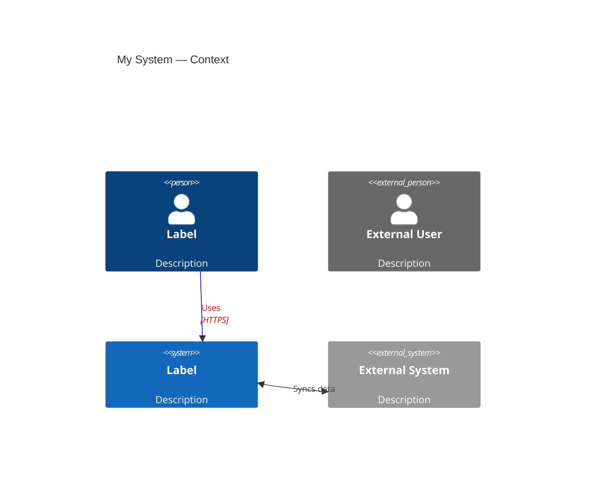
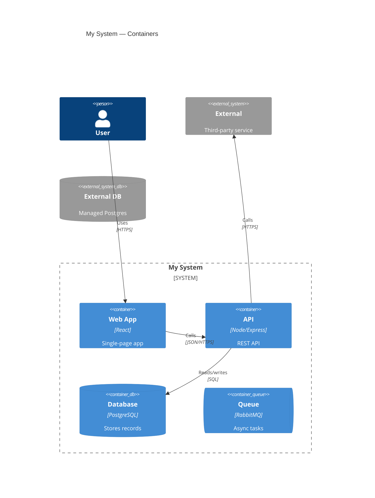
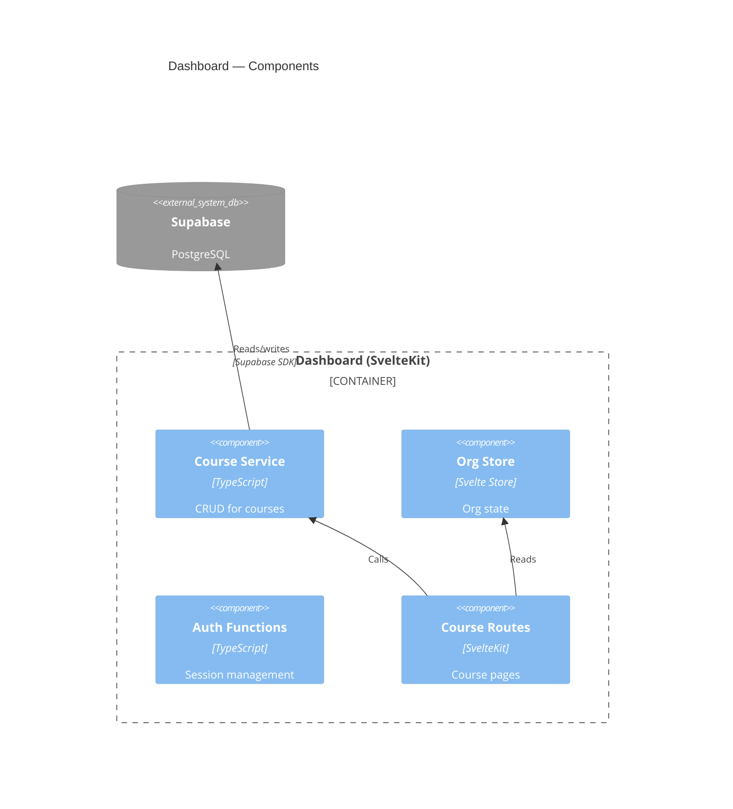

# Mermaid C4 Syntax

Reference: https://mermaid.js.org/syntax/c4.html

## L1 — C4Context

```mermaid
C4Context
    title My System — Context

    Person(userAlias, "Label", "Description")
    Person_Ext(extUser, "External User", "Description")

    System(sysAlias, "Label", "Description")
    System_Ext(extAlias, "External System", "Description")

    Rel(userAlias, sysAlias, "Uses", "HTTPS")
    BiRel(sysAlias, extAlias, "Syncs data")
    UpdateRelStyle(userAlias, sysAlias, $textColor="red", $lineColor="blue")
    UpdateLayoutConfig($c4ShapeInRow="3", $c4BoundaryInRow="1")
```

## L2 — C4Container

```mermaid
C4Container
    title My System — Containers

    Person(user, "User")

    System_Boundary(sys, "My System") {
        Container(webapp, "Web App", "React", "Single-page app")
        Container(api, "API", "Node/Express", "REST API")
        ContainerDb(db, "Database", "PostgreSQL", "Stores records")
        ContainerQueue(queue, "Queue", "RabbitMQ", "Async tasks")
    }

    System_Ext(extSys, "External", "Third-party service")
    SystemDb_Ext(extDb, "External DB", "Managed Postgres")

    Rel(user, webapp, "Uses", "HTTPS")
    Rel(webapp, api, "Calls", "JSON/HTTPS")
    Rel(api, db, "Reads/writes", "SQL")
    Rel(api, extSys, "Calls", "HTTPS")
```

## L3 — C4Component

```mermaid
C4Component
    title Dashboard — Components

    Container_Boundary(dashboard, "Dashboard (SvelteKit)") {
        Component(courseService, "Course Service", "TypeScript", "CRUD for courses")
        Component(orgStore, "Org Store", "Svelte Store", "Org state")
        Component(authFunctions, "Auth Functions", "TypeScript", "Session management")
        Component(courseRoutes, "Course Routes", "SvelteKit", "Course pages")
    }

    SystemDb_Ext(supabase, "Supabase", "PostgreSQL")

    Rel(courseService, supabase, "Reads/writes", "Supabase SDK")
    Rel(courseRoutes, courseService, "Calls")
    Rel(courseRoutes, orgStore, "Reads")
```

## Alias naming rules

- Must start with a letter or underscore.
- May contain letters, digits, and underscores only.
- Must be unique within the diagram.
- Mermaid is case-sensitive.

## Relationship labels

`Rel(from, to, "verb phrase")` or `Rel(from, to, "verb phrase", "technology")`

Keep labels short (≤ 5 words). Prefer present-tense verbs: "reads", "writes", "calls", "publishes".

## Boundary nesting

Only one level of boundary nesting is reliably rendered in Mermaid C4. Avoid nesting `System_Boundary` inside `System_Boundary`.
