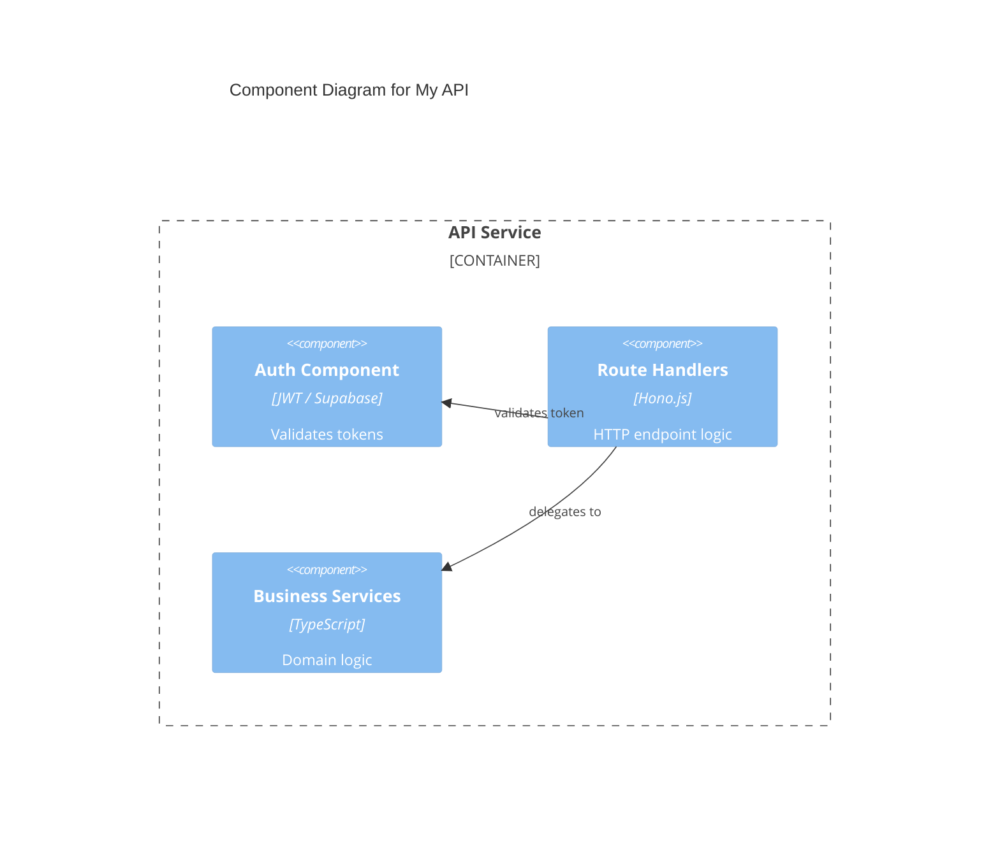

# Mermaid C4 Syntax Reference

Mermaid supports five C4 diagram types. All are experimental and use a flat
(non-nested) syntax with explicit boundary blocks.

## Diagram types

```
C4Context     — L1 System Context
C4Container   — L2 Containers
C4Component   — L3 Components
C4Dynamic     — Sequence-style interaction
C4Deployment  — Infrastructure
```

## Core shape primitives

```
Person(id, "label", "description")
Person_Ext(id, "label", "description")

System(id, "label", "description")
System_Ext(id, "label", "description")

Container(id, "label", "technology", "description")
ContainerDb(id, "label", "technology", "description")   ← cylinder icon
Container_Ext(id, "label", "technology", "description")

Component(id, "label", "technology", "description")
Component_Ext(id, "label", "technology", "description")
```

## Boundaries

```
System_Boundary(id, "label") {
  ...shapes...
}

Container_Boundary(id, "label") {
  ...shapes...
}

Enterprise_Boundary(id, "label") {
  ...shapes...
}
```

## Relationships

```
Rel(from_id, to_id, "label")
Rel(from_id, to_id, "label", "technology")
BiRel(id1, id2, "label")

Rel_U(from, to, "label")   ← up
Rel_D(from, to, "label")   ← down
Rel_L(from, to, "label")   ← left
Rel_R(from, to, "label")   ← right
```

## Styling (optional)

```
UpdateElementStyle(id, $fontColor="white", $bgColor="#1168bd")
UpdateRelStyle(from, to, $lineColor="blue", $offsetX="5")
UpdateLayoutConfig($c4ShapeInRow="4", $c4BoundaryInRow="2")
```

## Minimal C4Component example


```mermaid
C4Component
  title Component Diagram for My API

  Container_Boundary(api, "API Service") {
    Component(auth, "Auth Component", "JWT / Supabase", "Validates tokens")
    Component(routes, "Route Handlers", "Hono.js", "HTTP endpoint logic")
    Component(services, "Business Services", "TypeScript", "Domain logic")
  }

  Rel(routes, auth, "validates token")
  Rel(routes, services, "delegates to")
```

## ID rules

- Must start with a letter (not a digit or underscore).
- Only `[a-zA-Z0-9_]` — no hyphens, dots, or slashes.
- Keep unique within the diagram.

## Known limitations (as of Mermaid 11)

- No automatic layout; use `Rel_U/D/L/R` to nudge direction.
- `UpdateLayoutConfig` controls grid density.
- Nested boundaries render as grouped boxes but don't affect routing.
