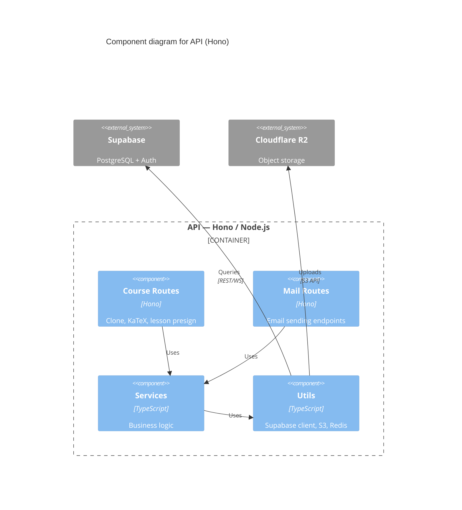

# Mermaid C4 Diagram Syntax

Source: https://mermaid.js.org/syntax/c4.html

## Diagram Types

```
C4Context     — Layer 1 (System Context)
C4Container   — Layer 2 (Containers)
C4Component   — Layer 3 (Components)
C4Dynamic     — Dynamic / sequence view
C4Deployment  — Deployment view
```

## Element Declarations

```
Person(alias, "Label", "Description")
Person_Ext(alias, "Label", "Description")

System(alias, "Label", "Description")
System_Ext(alias, "Label", "Description")
System_Db(alias, "Label", "Description")
System_Db_Ext(alias, "Label", "Description")

Container(alias, "Label", "Technology", "Description")
Container_Ext(alias, "Label", "Technology", "Description")
ContainerDb(alias, "Label", "Technology", "Description")

Component(alias, "Label", "Technology", "Description")
Component_Ext(alias, "Label", "Technology", "Description")
ComponentDb(alias, "Label", "Technology", "Description")
```

## Boundaries

```
System_Boundary(alias, "Label") {
  Container(...)
}

Container_Boundary(alias, "Label") {
  Component(...)
}

Enterprise_Boundary(alias, "Label") {
  System(...)
}
```

## Relationships

```
Rel(from, to, "Label")
Rel(from, to, "Label", "Technology")
Rel_Back(from, to, "Label")
Rel_Neighbor(from, to, "Label")
BiRel(from, to, "Label")

UpdateRelStyle(from, to, $textColor="blue", $lineColor="blue")
```

## Layout Hints

```
UpdateLayoutConfig($c4ShapeInRow="3", $c4BoundaryInRow="2")
UpdateElementStyle(alias, $bgColor="#1168bd", $borderColor="#0e5ba3", $fontColor="white")
```

## Full L3 Example



## Alias Naming Rules

- Use `snake_case` for aliases
- Aliases must be unique per diagram
- Aliases cannot start with a digit
- Keep aliases short (they appear in `Rel()` calls)
