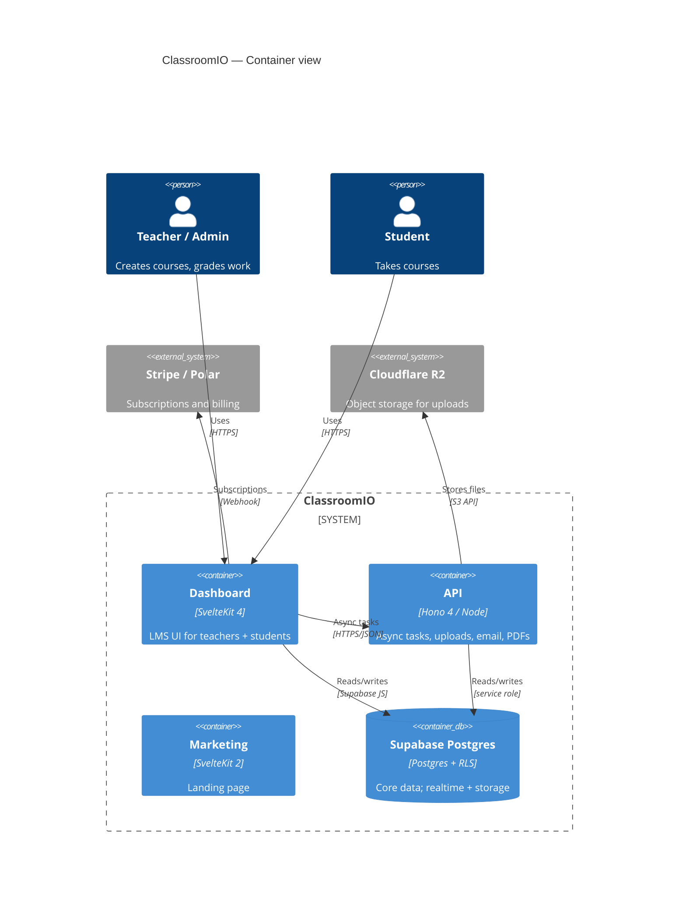

# Mermaid C4 syntax cheat sheet

Reference: https://mermaid.js.org/syntax/c4.html

Mermaid C4 is **experimental** but stable enough for static docs. Render in any Markdown that supports Mermaid (GitHub, VS Code preview, docs sites).

## Diagram types

```
C4Context      → Layer 1
C4Container    → Layer 2
C4Component    → Layer 3
C4Dynamic      → sequence-style runtime view (optional, not used here)
```

Each diagram starts with the type keyword on its own line, then optional `title`, then nodes/relations.

## Nodes

```
Person(alias, "label", "description")
Person_Ext(alias, "label", "description")

System(alias, "label", "description")
System_Ext(alias, "label", "description")
SystemDb(alias, "label", "description")
SystemQueue(alias, "label", "description")

Container(alias, "label", "tech", "description")
Container_Ext(alias, "label", "tech", "description")
ContainerDb(alias, "label", "tech", "description")
ContainerQueue(alias, "label", "tech", "description")

Component(alias, "label", "tech", "description")
ComponentDb(alias, "label", "tech", "description")
```

The `_Ext` variants render with a dashed border, signalling "outside our scope."

## Boundaries

```
Enterprise_Boundary(b1, "Company") {
  ...
}
System_Boundary(b2, "ClassroomIO") {
  ...
}
Container_Boundary(b3, "API") {
  ...
}
```

Boundaries can nest. For L2, wrap our containers in a `System_Boundary`. For L3, wrap our components in a `Container_Boundary`.

## Relationships

```
Rel(from, to, "label", "tech")
BiRel(from, to, "label", "tech")
Rel_U(from, to, "label", "tech")    %% directional hints: U, D, L, R
Rel_D(...)
Rel_L(...)
Rel_R(...)
```

`tech` is optional. Use it on cross-container/system edges to show the protocol (`HTTPS/REST`, `JDBC`, `gRPC`).

## Styling (optional)

```
UpdateElementStyle(alias, $fontColor="white", $bgColor="#1168bd", $borderColor="#0b4884")
UpdateRelStyle(from, to, $offsetX="10", $offsetY="20")
UpdateLayoutConfig($c4ShapeInRow="3", $c4BoundaryInRow="2")
```

Avoid unless layout is broken — keep diagrams plain.

## Minimal worked example (L2)

````markdown

```mermaid
C4Container
  title ClassroomIO — Container view

  Person(teacher, "Teacher / Admin", "Creates courses, grades work")
  Person(student, "Student", "Takes courses")

  System_Boundary(cio, "ClassroomIO") {
    Container(dashboard, "Dashboard", "SvelteKit 4", "LMS UI for teachers + students")
    Container(api, "API", "Hono 4 / Node", "Async tasks, uploads, email, PDFs")
    Container(marketing, "Marketing", "SvelteKit 2", "Landing page")
    ContainerDb(db, "Supabase Postgres", "Postgres + RLS", "Core data; realtime + storage")
  }

  System_Ext(stripe, "Stripe / Polar", "Subscriptions and billing")
  System_Ext(r2, "Cloudflare R2", "Object storage for uploads")

  Rel(teacher, dashboard, "Uses", "HTTPS")
  Rel(student, dashboard, "Uses", "HTTPS")
  Rel(dashboard, db, "Reads/writes", "Supabase JS")
  Rel(dashboard, api, "Async tasks", "HTTPS/JSON")
  Rel(api, db, "Reads/writes", "service role")
  Rel(api, r2, "Stores files", "S3 API")
  Rel(dashboard, stripe, "Subscriptions", "Webhook")
```
````

## Gotchas

- Aliases must be globally unique within a diagram (no two nodes with the same first arg).
- Keep alias names short and `snake_or_camel` — no spaces, no dots.
- Mermaid C4 ignores newlines inside the `Rel(...)` parentheses; keep the call on one line.
- Avoid commas inside the quoted strings — they confuse some renderers. Use semicolons or em-dashes.
