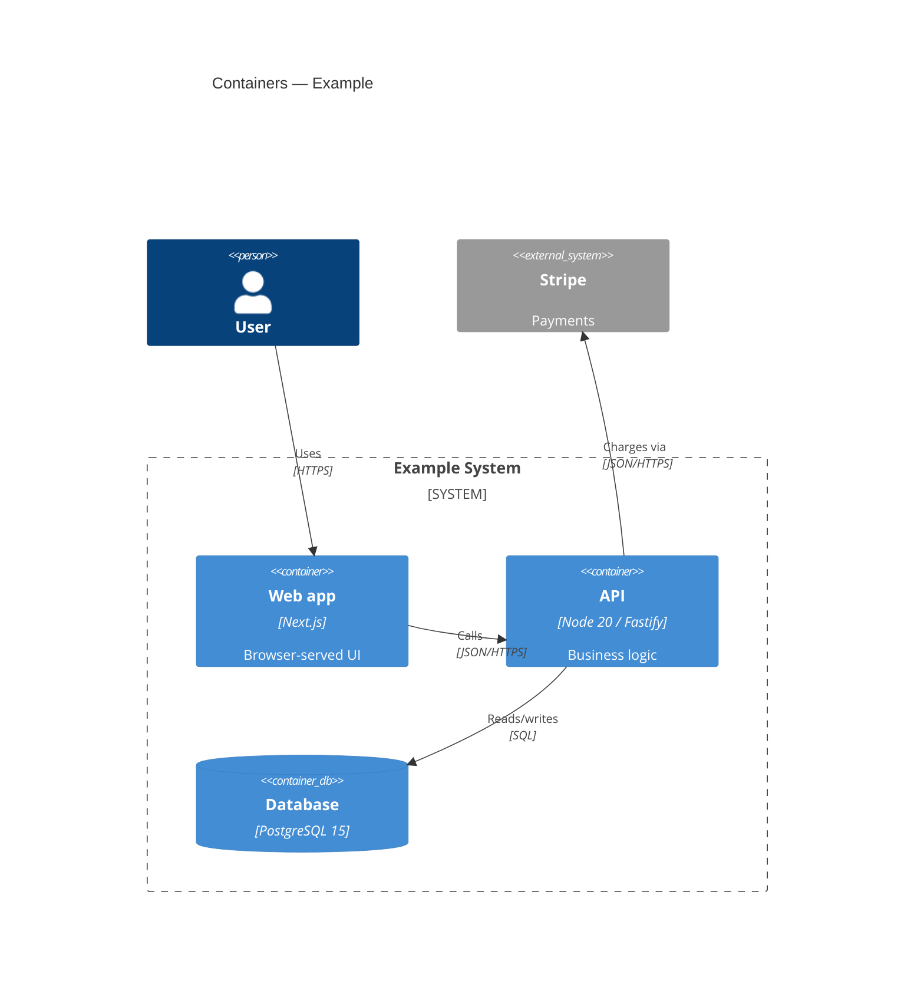

# Mermaid C4 syntax cheat sheet

Mermaid C4 (https://mermaid.js.org/syntax/c4.html) is officially **experimental** but stable enough for production docs. It renders natively on GitHub.

## Diagram types

```
C4Context     # Level 1
C4Container   # Level 2
C4Component   # Level 3
C4Dynamic     # sequence-flavored; out of scope for this skill
C4Deployment  # deployment; out of scope unless asked
```

Pick the right type for the level — it controls which shapes are legal.

## Elements

```
Person(alias, "label", "description?")
Person_Ext(alias, "label", "description?")

System(alias, "label", "description?")
System_Ext(alias, "label", "description?")
SystemDb(alias, "label", "description?")
SystemQueue(alias, "label", "description?")

Container(alias, "label", "tech", "description?")
ContainerDb(alias, "label", "tech", "description?")
ContainerQueue(alias, "label", "tech", "description?")
Container_Ext(alias, "label", "tech", "description?")

Component(alias, "label", "tech", "description?")
ComponentDb(alias, "label", "tech", "description?")
ComponentQueue(alias, "label", "tech", "description?")
```

The `tech` slot is the second arg for Containers/Components — don't skip it; it's what distinguishes "SvelteKit + Node" from "Postgres 15".

## Boundaries

```
System_Boundary(alias, "label") {
  Container(...)
  Container(...)
}

Container_Boundary(alias, "label") {
  Component(...)
  Component(...)
}

Enterprise_Boundary(alias, "label") { ... }
```

**Gotcha:** Boundaries close with `}` on its own line. Mismatched braces silently break rendering.

## Relationships

```
Rel(from, to, "label")
Rel(from, to, "label", "tech/protocol")
Rel_Back(from, to, "label")
Rel_Up / Rel_Down / Rel_Left / Rel_Right(from, to, "label", "tech?")
```

Directional `Rel_*` variants are hints to the layout engine, not different semantics. Use sparingly when default layout puts an edge in a confusing place.

`BiRel(...)` exists but is rarely worth it — two `Rel(...)` calls with distinct labels read better.

## Styling

```
UpdateElementStyle(alias, $bgColor="…", $fontColor="…", $borderColor="…", $shape="…")
UpdateRelStyle(from, to, $textColor="…", $lineColor="…", $offsetX="…", $offsetY="…")
UpdateLayoutConfig($c4ShapeInRow="3", $c4BoundaryInRow="2")
```

The `$offsetX` / `$offsetY` on `UpdateRelStyle` are how you nudge edge label positions. They expect quoted strings.

## Title

```
title Components — API container
```

One per diagram, top of the block. Mermaid C4 doesn't support multiline titles.

## Common gotchas

1. **Comments.** `%%` for line comments. Inline `%%` inside element args breaks the parser.
2. **Line breaks in labels.** Use `\n` inside the quoted string. Don't break the line in the source.
3. **Quotes inside labels.** Escape with `\"` or rephrase. Mermaid C4 is fussier than other diagram types.
4. **Aliases are global per diagram.** Each diagram is parsed independently — you can reuse the same alias across files (Level 2 + Level 3) without collision.
5. **Order is render order.** Mermaid C4 doesn't reorder for clarity. Group related elements / boundaries together in the source.
6. **No nested `Rel` inside boundaries.** `Rel(...)` lives at the top level of the diagram, outside any `Boundary { ... }` block.
7. **Empty descriptions.** If you don't have a description, omit the arg entirely rather than passing `""` — some renderers print "(undefined)".

## Minimal example


```mermaid
C4Container
    title Containers — Example

    Person(user, "User")
    System_Ext(stripe, "Stripe", "Payments")

    System_Boundary(sys, "Example System") {
        Container(web, "Web app", "Next.js", "Browser-served UI")
        Container(api, "API", "Node 20 / Fastify", "Business logic")
        ContainerDb(db, "Database", "PostgreSQL 15")
    }

    Rel(user, web, "Uses", "HTTPS")
    Rel(web, api, "Calls", "JSON/HTTPS")
    Rel(api, db, "Reads/writes", "SQL")
    Rel(api, stripe, "Charges via", "JSON/HTTPS")
```
