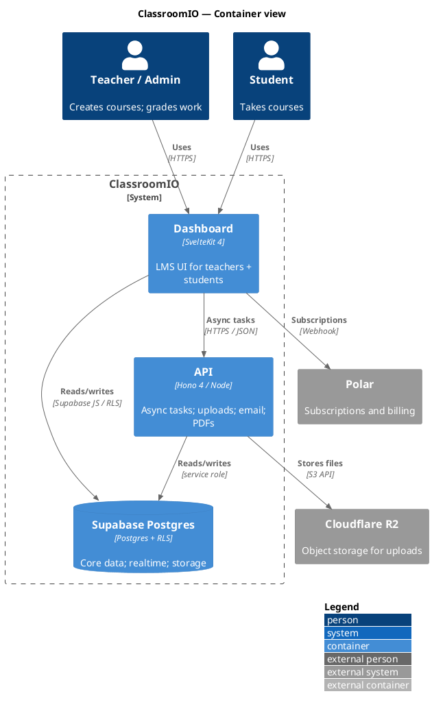

# C4-PlantUML syntax cheat sheet

Reference: https://github.com/plantuml-stdlib/C4-PlantUML

C4-PlantUML is a stdlib of macros on top of PlantUML that renders proper C4
diagrams. Mature, well-supported, integrates with the IntelliJ PlantUML plugin
(inline preview) and most other PlantUML tooling.

## File structure

Each diagram is a standalone `.puml` file:

```plantuml
@startuml ClassroomIO-L1-Context
!include <C4/C4_Context>

title ClassroomIO — System Context

' …nodes + relations…

@enduml
```



The `!include` lines pull in the C4 macros. Two options:

- **stdlib** (preferred, ships with PlantUML ≥ 1.2021.x):
  ```plantuml
  !include <C4/C4_Context>
  !include <C4/C4_Container>
  !include <C4/C4_Component>
  ```
- **remote** (works without recent stdlib but needs internet on first render):
  ```plantuml
  !include https://raw.githubusercontent.com/plantuml-stdlib/C4-PlantUML/master/C4_Context.puml
  ```

Use stdlib by default. Drop to remote `!include` only if you know the local
PlantUML is too old.

## Diagram types — which include to use

| Layer | Include | What it adds |
|---|---|---|
| L1 — context | `<C4/C4_Context>` | `Person`; `System`; `System_Ext` macros |
| L2 — containers | `<C4/C4_Container>` | adds `Container`; `ContainerDb`; `ContainerQueue`; `System_Boundary` |
| L3 — components | `<C4/C4_Component>` | adds `Component`; `ComponentDb`; `Container_Boundary` |

`C4_Component` transitively includes `C4_Container` which includes `C4_Context`,
so an L3 diagram only needs the single `<C4/C4_Component>` include.

## Nodes

```plantuml
Person(alias, "label", "description")
Person_Ext(alias, "label", "description")

System(alias, "label", "description")
System_Ext(alias, "label", "description")
SystemDb(alias, "label", "description")
SystemQueue(alias, "label", "description")

Container(alias, "label", "tech", "description")
Container_Ext(alias, "label", "tech", "description")
ContainerDb(alias, "label", "tech", "description")
ContainerQueue(alias, "label", "tech", "description")

Component(alias, "label", "tech", "description")
ComponentDb(alias, "label", "tech", "description")
```

`_Ext` variants render with a different fill, signalling "outside our scope".

## Boundaries

```plantuml
Enterprise_Boundary(b1, "Company") {
  ' …
}
System_Boundary(b2, "ClassroomIO") {
  ' …
}
Container_Boundary(b3, "API") {
  ' …
}
```

Boundaries can nest. Wrap our containers in `System_Boundary` for L2, our
components in `Container_Boundary` for L3.

## Relationships

```plantuml
Rel(from, to, "label", "tech")
BiRel(from, to, "label", "tech")
Rel_U(from, to, "label", "tech")   ' directional hints: U / D / L / R
Rel_D(...)
Rel_L(...)
Rel_R(...)

Rel_Back(from, to, "label", "tech")
Rel_Neighbor(from, to, "label", "tech")   ' forces same rank when possible
```

`tech` is optional. Use it on cross-container/system edges to show the
protocol (`HTTPS/REST`; `S3 API`; `RESP`).

## Layout helpers

```plantuml
LAYOUT_LEFT_RIGHT()
LAYOUT_TOP_DOWN()
LAYOUT_LANDSCAPE()
LAYOUT_AS_SKETCH()       ' hand-drawn style
LAYOUT_WITH_LEGEND()     ' adds a colour legend in the corner
SHOW_PERSON_OUTLINE()    ' uses outline icons for Person()
HIDE_STEREOTYPE()
```

Drop these between the `!include` and the first node. Use one — usually
`LAYOUT_WITH_LEGEND()` — and stop. Avoid stacking layout hints.

## Styling (rare; use sparingly)

```plantuml
UpdateElementStyle("person", $bgColor="#08427b", $fontColor="#ffffff")
UpdateRelStyle(from, to, $textColor="#444", $lineColor="#444")
```

Only when default colours genuinely hurt readability. Default theme is fine
for most repos.

## Minimal worked example (L2)



## Gotchas

- Aliases must be globally unique within an `@startuml … @enduml` block.
- Keep alias names short and `snake_or_camel` — no spaces; no dots.
- Strings in macro args are positional; do **not** add a trailing comma.
- Avoid commas inside the quoted strings — they confuse the parser. Use
  semicolons or em-dashes.
- A relation arrow needs both endpoints already declared (or declared inside
  a boundary block above the `Rel(...)` call).
- IntelliJ's PlantUML plugin renders the file on save; if a diagram looks
  blank, the include path is usually the culprit — switch to the remote
  `!include` URL to confirm.
- `!theme` and `skinparam` can fight C4-PlantUML; if you must tweak visuals,
  prefer `UpdateElementStyle` / `UpdateRelStyle`.
