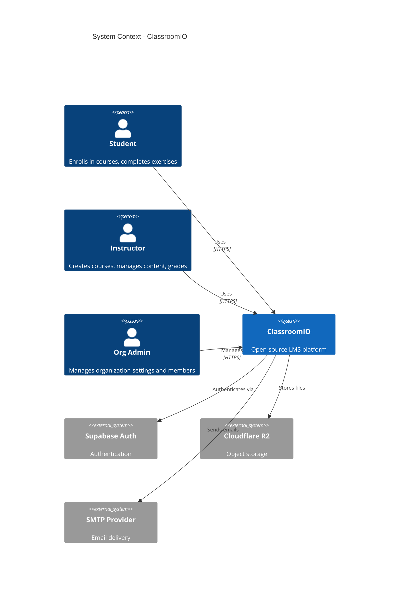
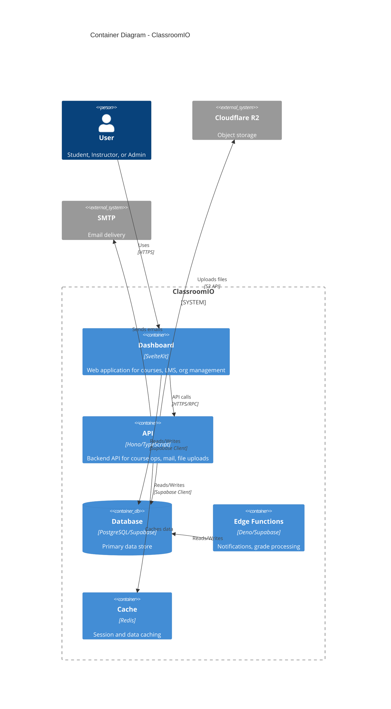

# C4 Architecture Model

Generate C4 model diagrams (Layers 1-3) for ClassroomIO using Mermaid syntax. Layer 3 components are derived from AST extraction, not hardcoded. Output goes to `docs/c4/`.

## Usage

`/c4` — generate all layers (1-3)
`/c4 context` — Level 1 only (System Context)
`/c4 container` — Level 2 only (Container)
`/c4 component` — Level 3 for Dashboard and API
`/c4 component dashboard` — Level 3 for Dashboard only
`/c4 component api` — Level 3 for API only
`/c4 db` — Extract database schema only

## Instructions

### Step 1: Parse Arguments

Extract the requested level from arguments:
- No args or `all` → generate Levels 1-3 + database schema
- `context` → Level 1
- `container` → Level 2
- `component [name]` → Level 3 (optionally for a specific container)
- `db` → Database schema extraction only

### Step 2: Run AST Extraction (for Level 3)

If generating Level 3, run the component extraction script:

```bash
npx tsx .claude/skills/c4/extract-components.ts --depth-dashboard 3 --depth-api 2 > docs/c4/components.json
```

Read and analyze the resulting JSON. It contains:
- **components**: grouped by directory key, with file counts (ts/js/svelte) and exports
- **relationships**: cross-component import mappings with counts
- **warnings**: flags if any component has >50 files (depth may be too shallow)

If warnings appear about components with >50 files, re-run with increased depth:
```bash
npx tsx .claude/skills/c4/extract-components.ts --depth-dashboard 4 --depth-api 2 > docs/c4/components.json
```

### Step 3: Extract Database Schema (for `db` or `all`)

Extract the database structure from the running local Supabase instance:

```bash
docker exec -i supabase-db psql -U postgres -d postgres -c "
SELECT
  t.table_name,
  string_agg(
    c.column_name || ' ' || c.data_type ||
    CASE WHEN c.is_nullable = 'NO' THEN ' NOT NULL' ELSE '' END,
    ', ' ORDER BY c.ordinal_position
  ) AS columns
FROM information_schema.tables t
JOIN information_schema.columns c
  ON t.table_name = c.table_name AND t.table_schema = c.table_schema
WHERE t.table_schema = 'public' AND t.table_type = 'BASE TABLE'
GROUP BY t.table_name
ORDER BY t.table_name;
"
```

Then extract foreign keys:

```bash
docker exec -i supabase-db psql -U postgres -d postgres -c "
SELECT
  tc.table_name AS from_table,
  kcu.column_name AS from_column,
  ccu.table_name AS to_table,
  ccu.column_name AS to_column
FROM information_schema.table_constraints tc
JOIN information_schema.key_column_usage kcu
  ON tc.constraint_name = kcu.constraint_name
JOIN information_schema.constraint_column_usage ccu
  ON tc.constraint_name = ccu.constraint_name
WHERE tc.constraint_type = 'FOREIGN KEY'
  AND tc.table_schema = 'public'
ORDER BY tc.table_name, kcu.column_name;
"
```

Write the output to `docs/c4/database.md` using a token-efficient format:

```markdown
# Database Schema

## Tables

### table_name
col1 type NOT NULL, col2 type, col3 type

### another_table
...

## Foreign Keys

from_table.from_col → to_table.to_col
...
```

If the Supabase container is not running, inform the user to run `supabase start` first.

### Step 4: Generate Mermaid C4 Diagrams

Read `.claude/skills/c4/references/c4-conventions.md` for syntax reference and project context.

#### Level 1 — System Context (`docs/c4/context.md`)

Show ClassroomIO as a system with personas and external systems:



#### Level 2 — Container (`docs/c4/container.md`)

Zoom into ClassroomIO to show its containers:



#### Level 3 — Component (`docs/c4/component-dashboard.md`, `docs/c4/component-api.md`)

**This layer MUST be generated from the AST extraction JSON**, not hardcoded.

For each app in the extraction results:

1. Read `docs/c4/components.json`
2. Filter components for the target app
3. Group components into logical boundaries (e.g., `routes/*`, `lib/components/*`, `lib/utils/*`)
4. Use the top relationships (by import count) to draw `Rel()` lines between components
5. Generate a `C4Component` diagram with `Container_Boundary` wrappers

Rules for generating Level 3:
- **Alias**: sanitize the component key to a valid Mermaid alias (replace `/` with `_`, remove special chars)
- **Label**: use the component key as the human-readable label
- **Technology**: "Svelte" if svelteFileCount > 0, otherwise "TypeScript"
- **Description**: summarize based on exports and file count (e.g., "12 files, 5 Svelte components")
- **Relationships**: include the top 30 relationships (by importCount) to keep diagrams readable
- Skip components with 0 files (empty groupings)

### Step 5: Write Output

Write each level to its own file in `docs/c4/`:
- `docs/c4/context.md` — Level 1
- `docs/c4/container.md` — Level 2
- `docs/c4/component-dashboard.md` — Level 3 Dashboard
- `docs/c4/component-api.md` — Level 3 API
- `docs/c4/database.md` — Database schema
- `docs/c4/components.json` — Raw extraction data (gitignored)

Each Markdown file should contain only the Mermaid diagram block and a brief title. Keep output concise — it's for AI context consumption.

### Step 6: Summary

Tell the user:
- Which levels were generated
- The output file paths
- Component/relationship counts from the extraction
- Any warnings about component granularity

## Flags

### --help, -h

Show usage information.

### --plan

Describe what would be generated without creating files. Run the extraction and report:
- Component counts per app
- Top relationships
- Any depth warnings

### --list

Run extraction and list discovered components per app.

## Important

- Layer 3 components MUST come from AST extraction — never hardcode them
- The extraction script resolves path aliases from tsconfig.json dynamically
- If a component has >50 files, the depth is too shallow — increase and re-extract
- Keep Mermaid diagrams under ~40 elements per diagram for readability
- Output is optimized for AI context consumption — be concise
- Database extraction requires `supabase start` (local Supabase running in Docker)
- The `components.json` file is gitignored — it's a build artifact
