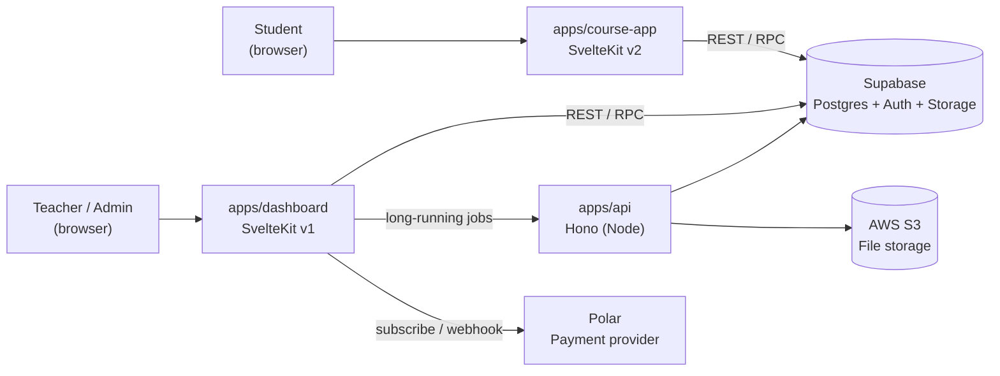
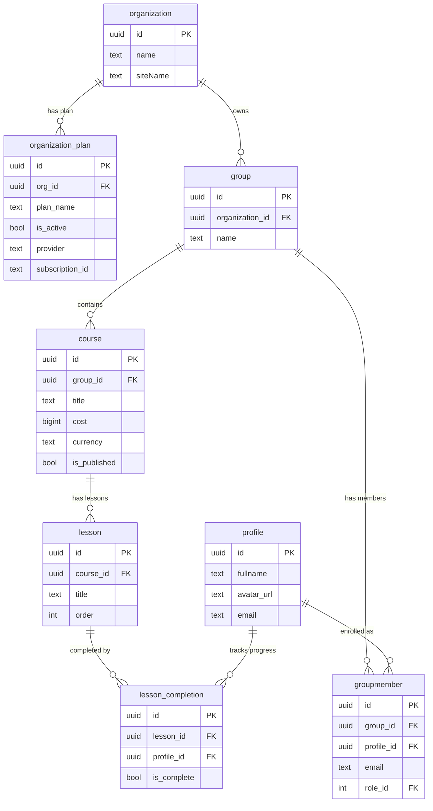
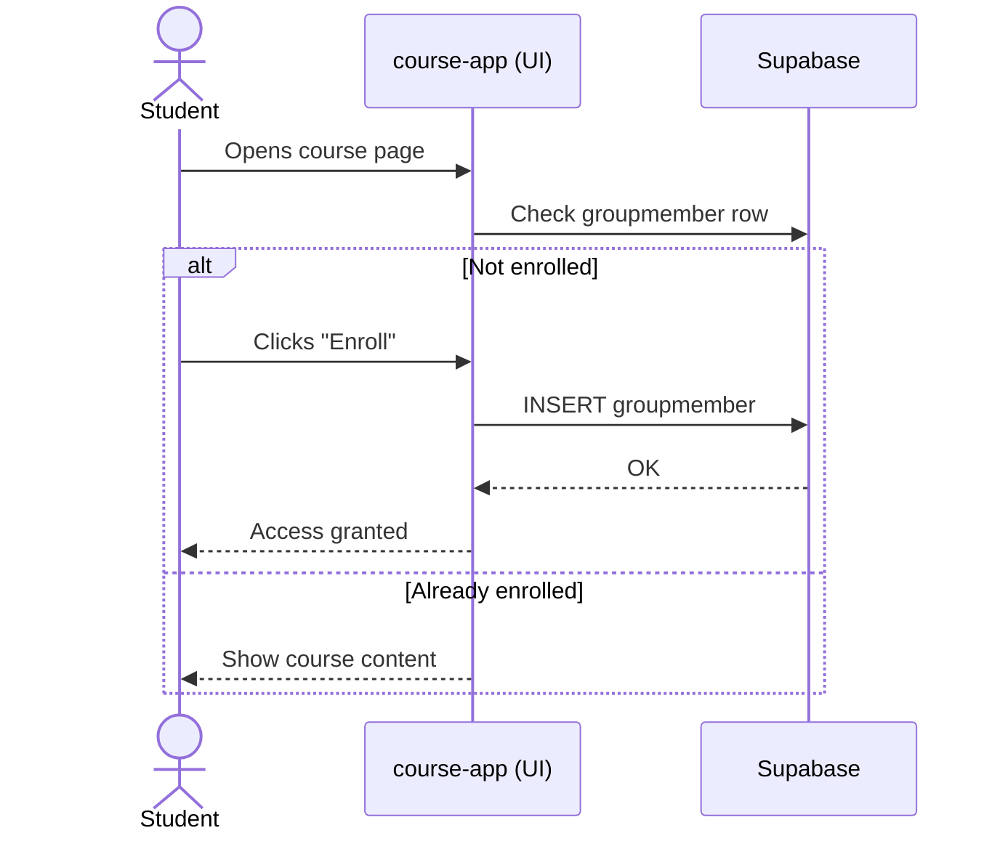
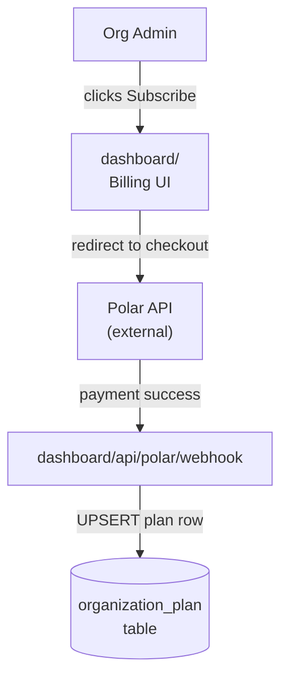
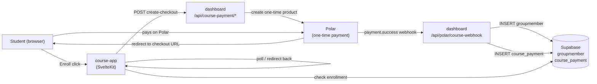
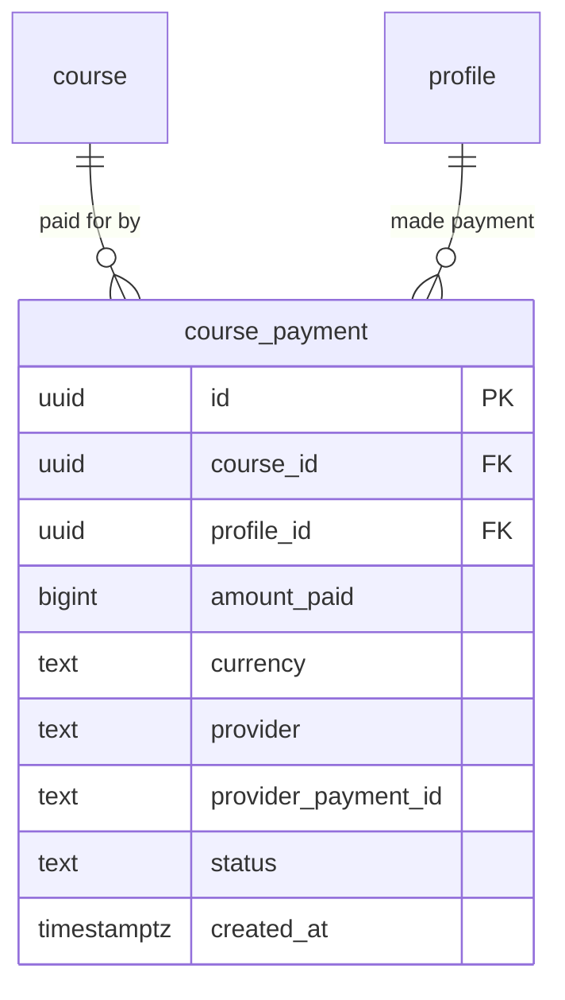
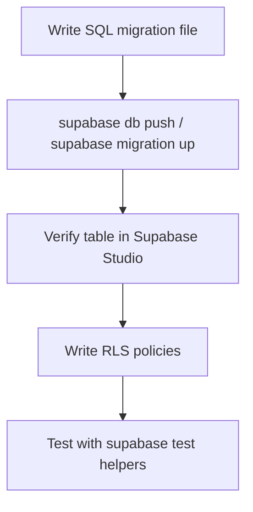
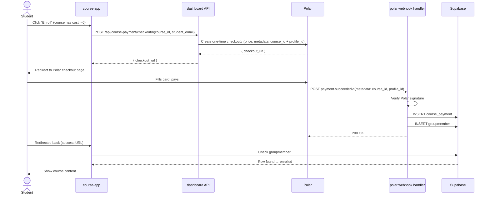
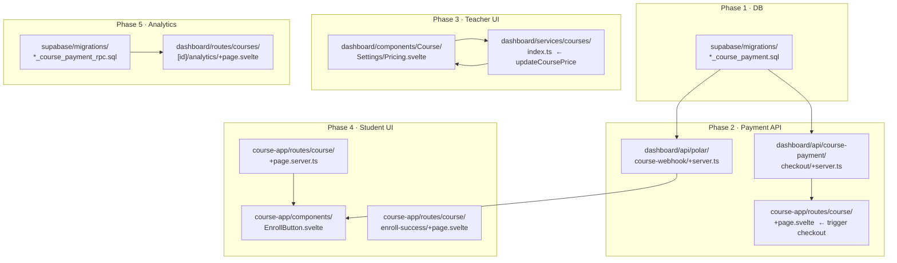
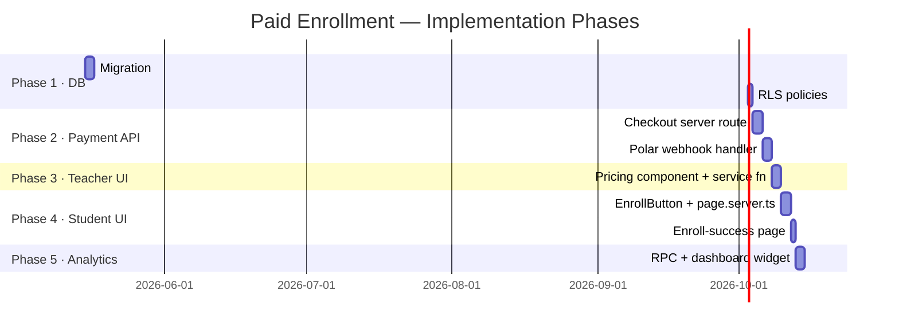

# ClassroomIO — Project Overview & Paid Enrollment Development Plan

> For a developer new to the stack. Covers architecture, tech choices, data model, and a step-by-step plan for adding charge-on-enroll functionality for students.

---

## 1. What Is ClassroomIO?

ClassroomIO is an open-source Learning Management System (LMS). It lets organisations create courses, enroll students, track progress, run quizzes, issue certificates, and manage subscriptions. It can be deployed to the cloud or self-hosted.

---

## 2. Monorepo Layout

The project is a **pnpm + Turborepo monorepo** — one Git repo that holds multiple independent apps and shared libraries that can depend on each other.

```
classroomio/
├── apps/
│   ├── dashboard/        ← Teacher / admin UI  (SvelteKit v1)
│   ├── course-app/       ← Student learning UI (SvelteKit v2)
│   ├── api/              ← Background API      (Hono / Node)
│   ├── classroomio-com/  ← Marketing website   (SvelteKit)
│   └── docs/             ← Documentation site  (React / Fumadocs)
├── packages/
│   ├── shared/           ← Plan constants, shared types
│   ├── course-app/       ← CLI for generating course sites
│   └── tsconfig/         ← Shared TypeScript configs
├── supabase/             ← DB migrations, seed data
├── ai/                   ← AI prompt templates
└── cypress/ / tests/     ← E2E test suites
```

### How the apps relate



---

## 3. Technology Stack — Quick Reference

| What | Tool | Why it's used |
|------|------|---------------|
| Frontend framework | **SvelteKit** | Full-stack framework (routing, SSR, API routes) built on Svelte — a compile-time UI framework with no virtual DOM |
| Styling | **TailwindCSS** | Utility-first CSS — write classes directly in HTML |
| UI components | **Carbon Components / bits-ui** | Pre-built accessible components |
| Database | **Supabase (PostgreSQL)** | Postgres with a built-in REST API, Auth, Storage, and Row-Level Security |
| Auth | **Supabase Auth** | Email/password + Google OAuth, session tokens handled automatically |
| Background API | **Hono** | Lightweight Node HTTP framework, similar to Express but faster and TypeScript-first |
| Monorepo tooling | **pnpm workspaces + Turborepo** | pnpm links packages together; Turbo parallelises builds and caches outputs |
| Payments (org plans) | **Polar** | Subscription billing for org-level plans (BASIC / EARLY_ADOPTER / ENTERPRISE) |
| Payments (legacy) | **Lemon Squeezy** | Being phased out |
| Email | **Nodemailer / ZeptoMail** | Transactional email |
| Analytics | **PostHog** | Product analytics (page views, events) |
| Error tracking | **Sentry** | Runtime error capture |
| File uploads | **AWS S3** (presigned URLs) | Teachers upload videos/slides directly from browser to S3 |
| Testing | **Playwright + Cypress** | End-to-end browser tests |
| CI | **GitHub Actions** | Automated test & deploy pipelines |

---

## 4. Database Model (Simplified)

Below are the core tables relevant to courses and enrollment.



**Key insight for paid enrollment:**
- A student is enrolled by adding a row to `groupmember` (linking their `profile_id` to the course's `group_id`).
- The `course` table already has `cost` (bigint) and `currency` columns — the price data is already there.
- Right now there is no payment verification gate before inserting a `groupmember` row.

---

## 5. Existing Enrollment Flow (Free)



---

## 6. Existing Payment Infrastructure (Org Plans)

ClassroomIO already bills **organisations** for platform subscriptions via Polar:



This is **organisation-level billing** (who can use the platform). The new feature is **course-level billing** (students paying per course).

---

## 7. Proposed Feature: Charge Students on Enroll

### 7.1 Goal

When a course has `cost > 0`, a student must successfully pay before a `groupmember` row is created and they gain access to lessons.

### 7.2 High-Level Architecture



### 7.3 New Database Table

A new migration will add a `course_payment` table to record what was paid, by whom, and when.



---

## 8. Development Plan

### Phase 1 — Database Migration

**Goal:** Add `course_payment` table and tighten the `groupmember` insert RLS policy for paid courses.

| Step | File to create / edit | What to do |
|------|-----------------------|------------|
| 1.1 | `supabase/migrations/<timestamp>_course_payment.sql` | Create `course_payment` table with columns above |
| 1.2 | Same migration | Add RLS: only the paying user or org admins can read their own payment rows |
| 1.3 | `supabase/migrations/<timestamp>_course_payment.sql` | Tighten `groupmember` insert policy: block direct inserts for paid courses (enrollment must go through webhook) |



---

### Phase 2 — Polar One-Time Payment Integration

**Goal:** Allow a teacher to set a price on a course and generate a Polar one-time checkout for students.

| Step | File to create / edit | What to do |
|------|-----------------------|------------|
| 2.1 | `apps/dashboard/src/routes/api/course-payment/checkout/+server.ts` | New SvelteKit server route. Accepts `course_id` + `student_email`. Calls Polar API to create a one-time product/checkout. Returns `checkout_url`. |
| 2.2 | `apps/course-app/src/routes/[course]/+page.svelte` | On "Enroll" click for paid courses, POST to the checkout route, then redirect student to `checkout_url`. |
| 2.3 | `apps/dashboard/src/routes/api/polar/course-webhook/+server.ts` | New webhook handler. Validates Polar signature. On `payment.succeeded`: insert `course_payment` row, then insert `groupmember` row to enroll the student. |



---

### Phase 3 — Teacher UI (Course Pricing)

**Goal:** Let teachers set a price on a course from the dashboard.

| Step | File to create / edit | What to do |
|------|-----------------------|------------|
| 3.1 | `apps/dashboard/src/lib/components/Course/Settings/Pricing.svelte` | New component: currency dropdown + price input. Validates non-negative integer. |
| 3.2 | `apps/dashboard/src/routes/courses/[courseId]/settings/+page.svelte` | Add the Pricing component to the settings page. |
| 3.3 | `apps/dashboard/src/lib/utils/services/courses/index.ts` | Add `updateCoursePrice(courseId, cost, currency)` service function that does a Supabase `update` on the `course` table. |

---

### Phase 4 — Student UI (Enroll Gate)

**Goal:** Show price to student and gate access behind payment.

| Step | File to create / edit | What to do |
|------|-----------------------|------------|
| 4.1 | `apps/course-app/src/lib/components/EnrollButton.svelte` | New component. If `course.cost === 0` → free enroll (existing flow). If `cost > 0` → show price + "Buy & Enroll" button that triggers checkout. |
| 4.2 | `apps/course-app/src/routes/[course]/+page.server.ts` | Load `course.cost` and check `course_payment` status for the current user; pass to page. |
| 4.3 | `apps/course-app/src/routes/[course]/enroll-success/+page.svelte` | Landing page after Polar redirects back. Shows "Enrollment confirmed" and links to first lesson. |

---

### Phase 5 — Teacher Earnings Dashboard

**Goal:** Show teachers how much revenue each course has generated.

| Step | File to create / edit | What to do |
|------|-----------------------|------------|
| 5.1 | `supabase/migrations/<timestamp>_course_payment_rpc.sql` | Add Postgres RPC function `get_course_revenue(org_id)` that returns aggregated totals per course. |
| 5.2 | `apps/dashboard/src/routes/courses/[courseId]/analytics/+page.svelte` | Add a "Revenue" section that calls the RPC and renders a summary table. |

---

## 9. Files to Touch — Summary



---

## 10. Recommended Implementation Order



---

## 11. Key Things to Know Before You Start

1. **SvelteKit routing** — files named `+page.svelte` are UI pages; `+page.server.ts` runs only on the server (safe for DB calls); `+server.ts` files are REST API endpoints.
2. **Supabase RLS** — Row-Level Security policies run inside Postgres. Always test that a student can't bypass payment by calling the Supabase client directly.
3. **Polar webhooks** — Polar sends signed HTTP POSTs to your webhook URL. You must verify the `polar-signature` header before trusting the payload. The existing `/api/polar/webhook` handler shows how to do this.
4. **Environment variables** — Polar API keys and webhook secrets live in `.env` files (never commit these). Look at existing `/api/polar/*` routes for the variable names already in use.
5. **`course.cost`** — stored as a **bigint in minor currency units** (cents, not dollars). A course priced at $29.99 is stored as `2999`.
