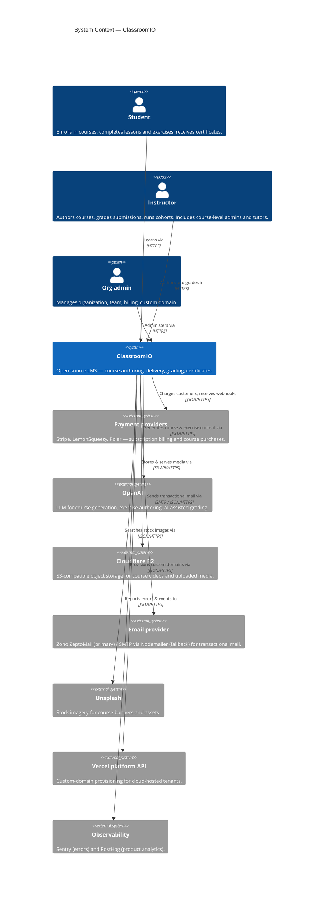

## Level 1 — System Context

ClassroomIO is an open-source learning management system (LMS) that lets organizations create courses, enroll students, grade work, and issue certificates. End users reach it through a single web product; the system delegates payments, AI generation, media storage, mail, and observability to managed third parties.

### Notes

- **Roles distinguished.** ClassroomIO has explicit course-level roles (admin / tutor / student, stored in the `role` table) and org-level roles. At Level 1 we collapse "course admin" and "tutor" into a single **Instructor** persona — they share the authoring/grading surface in the UI. **Org admin** is split out because its responsibilities (team, billing, custom domain) sit on a different surface.
- **Anonymous visitors.** The marketing site and public course landing pages are reachable without an account. We don't model anonymous browsers as a person at Level 1 — they're implicit.
- **Supabase is not at Level 1.** Although Supabase is a managed service in cloud deployments, ClassroomIO treats Postgres, Auth, and Edge Functions as a first-class part of the stack (the self-hosted build runs Supabase locally too). They appear as **containers** at Level 2, not external systems here.
- **Payment providers are grouped.** Stripe, LemonSqueezy, and Polar are alternative integrations covering the same conceptual role (billing). They get separate components if you zoom into the dashboard's `/api/*` routes, but at Level 1 they are one external dependency.
