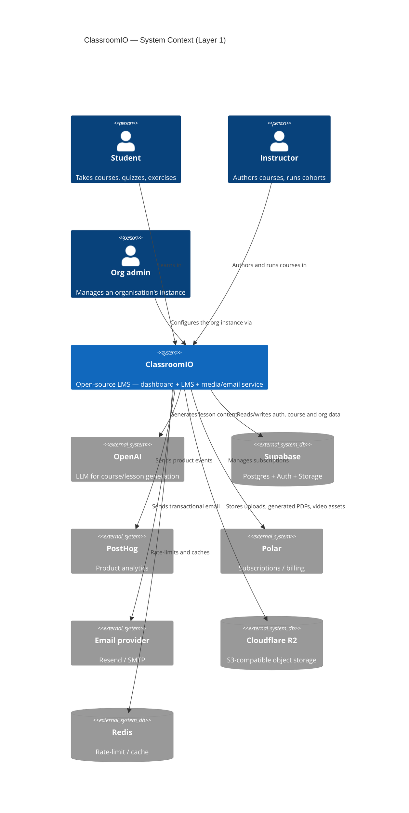

# ClassroomIO — Layer 1: System Context

<!-- generated by .claude/skills/c4-model from docs/c4/.cache/*.json -->

ClassroomIO is a learning-management platform. The same SvelteKit app serves
both the teacher / org dashboard and the student LMS; a separate Hono service
handles long-running media and email work. External integrations are limited
to a few well-defined boundaries: Supabase (database, auth, storage), OpenAI
(course-content generation), PostHog (analytics), Polar (payments), Resend /
SMTP (email), and S3-compatible object storage (Cloudflare R2). Redis backs
rate-limiting inside the API.

