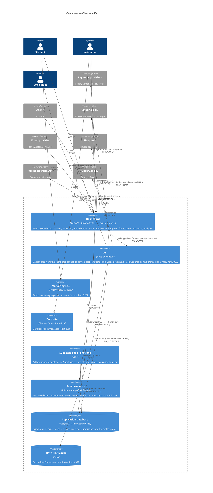

## Level 2 — Containers

ClassroomIO is a pnpm + Turborepo monorepo with four user-facing apps and a Supabase backend. The **dashboard** is the main product; it talks to **Supabase** directly for CRUD (RLS-protected) and to the **API** for work the edge can't handle (PDFs, video presigning, mail, course cloning). A separate marketing site and docs site round out the public surface.

### Notes

- **Dashboard split personality.** The dashboard hosts SvelteKit server endpoints under `/api/*` for things that *would* be in the API service but happen to live on the edge — AI streaming (OpenAI), payment webhooks (Polar, LemonSqueezy), analytics, custom-domain provisioning, transactional-email orchestration. The Hono API in `apps/api` is reserved for work that genuinely can't run on the edge (binary PDFs, R2 SDK, KaTeX). See Level 3 for the split.
- **Typed RPC, not REST.** Dashboard → API is end-to-end typed: the API exports its Hono app type via `@cio/api/rpc-types`, and the dashboard imports it with `hcWithType`. `turbo.json` declares `@cio/dashboard#build` depends on `@cio/api#build` so the types resolve at build time. Don't break the chained `.route()` calls in `apps/api/src/app.ts` — splitting them across statements drops the inferred type.
- **Two Supabase clients.** Dashboard uses the **anon key** (RLS enforced — users see only their own rows). The API uses the **service role key** (bypasses RLS for admin operations like cloning a course or batch grading).
- **Build / deploy variants.** `PUBLIC_IS_SELFHOSTED=true` switches the dashboard to `adapter-node` (single `node build` binary). Default is `adapter-vercel` (serverless functions on Vercel). The API is always Node. Edges in the diagram are identical either way; only the deploy target changes.
- **Edge Functions are minimal.** `supabase/functions/` contains only a `grades-tmp` helper and a stub `notify`. They exist but are not load-bearing in the current architecture.
- **Marketing & Docs are leaf nodes.** They render static-ish content and don't talk to Supabase or the API at runtime, so they have no outgoing edges in the diagram.
