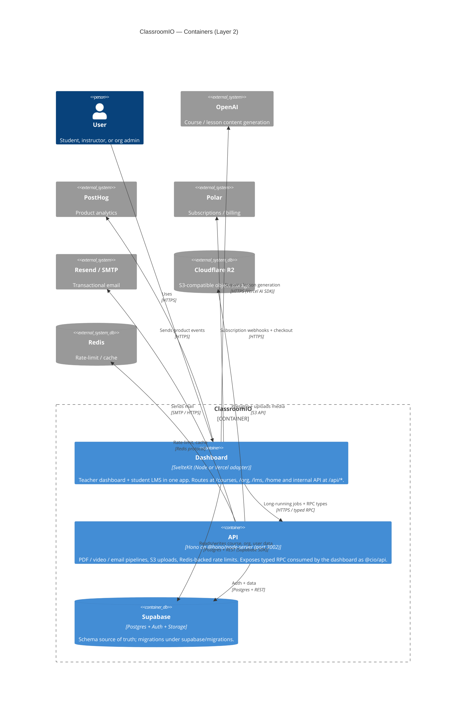

# ClassroomIO — Layer 2: Containers

<!-- generated by .claude/skills/c4-model from docs/c4/.cache/*.json -->

ClassroomIO ships as two long-running processes plus a managed Postgres. The
**Dashboard** is a single SvelteKit application that hosts both the teacher /
org UI (`/courses`, `/org`, `/home`, ...) and the student LMS (`/lms/*`) — they
share routing, layouts, and `src/lib`. Its `src/routes/api/*` endpoints run
inside the SvelteKit server. The **API** is a Hono service on Node that
handles work that doesn't belong in a request lifecycle: PDF certificates,
video processing, transactional email, S3 / Cloudflare R2 uploads, Redis-backed
rate limits, and the typed-RPC types the dashboard consumes. **Supabase** is
the single source of truth for auth, Postgres data, and user-uploaded files.
The flag `PUBLIC_IS_SELFHOSTED` switches the dashboard between the Vercel and
Node adapters; everything else is environment-agnostic.

