<!-- generated by .claude/skills/c4-model on 2026-05-15 — re-run with /c4-model -->
<!-- source: docs/c4/.cache/api.json. 22 components, 42 internal edges, 11 external refs from the AST. Trivial edges into src/types and src/constants were pruned to count >= 2; all other edges are shown verbatim. -->

# API — Layer 3 (Components)

The API is a small Hono service. Two route groups handle traffic — `/course/*` (course clone, lesson, presigned uploads, certificate generation, katex) and `/mail` (transactional mail). Each delegates to a service module, which calls util adapters for the external systems: Supabase for data, Cloudflare R2 (via the S3 SDK) for object storage, Redis for rate-limiting + caches, nodemailer for SMTP. `src` is the entry / wiring component (`index.ts`, `app.ts`, `rpc-types.ts`).

```mermaid
C4Component
  title API — Components (Layer 3)

  Container_Boundary(api, "API container") {

    Component(entry, "Entry / wiring", "Hono", "src/index.ts, app.ts, rpc-types.ts — server bootstrap + RPC type export")

    Boundary(b_routes, "Routes") {
      Component(routes_course, "Course routes", "Hono", "5 handlers — clone, lesson, presign, katex, course")
      Component(routes_mail,   "Mail route",    "Hono", "1 handler")
    }

    Boundary(b_services, "Services") {
      Component(svc_course, "Course service", "TS", "Clone, course-data orchestration")
      Component(svc_mail,   "Mail service",   "TS", "Compose + dispatch mail")
    }

    Boundary(b_mw, "Middlewares") {
      Component(mw, "Auth + rate-limit", "Hono middleware", "auth gate + ioredis-backed limiter")
    }

    Boundary(b_utils, "Utils") {
      Component(u_auth,        "Auth helpers",       "TS", "Validate Supabase JWT")
      Component(u_supabase,    "Supabase client",    "TS", "Server-side supabase-js")
      Component(u_s3,          "S3 client",          "TS", "Cloudflare R2 via @aws-sdk")
      Component(u_redis,       "Redis client",       "TS", "ioredis connection + keys")
      Component(u_certificate, "Certificate utils",  "TS", "PDF certificate rendering")
      Component(u_cloudflare,  "Cloudflare utils",   "TS", "Image CDN helpers")
      Component(u_email,       "Email helpers",      "TS", "Nodemailer wrapper")
      Component(u_mail,        "Mail composer",      "TS", "Templating glue")
      Component(u_upload,      "Upload utils",       "TS")
      Component(u_course,      "Course utils",       "TS")
      Component(u_lesson,      "Lesson utils",       "TS")
      Component(u_openapi,     "OpenAPI wiring",     "TS", "Scalar + zod-openapi")
    }

    Boundary(b_misc, "Config / types / constants") {
      Component(cfg,   "Config",    "TS", "Env parsing")
      Component(types, "Types",     "TS", "5 TS files")
      Component(consts,"Constants", "TS", "3 TS files")
    }
  }

  ContainerDb(supabase, "Supabase", "Postgres + Auth")
  System_Ext(s3, "Cloudflare R2", "S3-compatible storage")
  System_Ext(smtp, "SMTP", "nodemailer")
  SystemQueue_Ext(redis, "Redis", "ioredis")

  Rel(entry, routes_course, "mounts")
  Rel(entry, routes_mail,   "mounts")
  Rel(entry, mw,            "applies")
  Rel(entry, u_openapi,     "wires")
  Rel(entry, cfg,           "loads")

  Rel(routes_course, svc_course,     "delegates to")
  Rel(routes_course, mw,             "guarded by")
  Rel(routes_course, u_s3,           "presigns via")
  Rel(routes_course, u_certificate,  "generates certificates via")
  Rel(routes_course, u_course,       "uses")
  Rel(routes_course, u_lesson,       "uses")
  Rel(routes_course, u_upload,       "uses")
  Rel(routes_course, types,          "uses")
  Rel(routes_course, consts,         "uses")

  Rel(routes_mail, svc_mail, "delegates to")

  Rel(svc_course, u_supabase, "reads/writes via")
  Rel(svc_mail, u_mail,   "composes via")
  Rel(svc_mail, u_email,  "sends via")

  Rel(mw, u_redis, "rate-limits via")
  Rel(mw, u_auth,  "authenticates via")

  Rel(u_auth, u_supabase, "validates JWT via")
  Rel(u_certificate, u_cloudflare, "uploads to")
  Rel(u_course, u_cloudflare, "uploads to")
  Rel(u_redis, u_supabase, "reads keys from")

  Rel(svc_course, supabase, "reads/writes", "Postgres")
  Rel(u_auth, supabase, "validates JWT against", "Supabase Auth")
  Rel(u_supabase, supabase, "connects to", "Postgres + REST")
  Rel(routes_course, s3, "uploads / presigns", "S3 API")
  Rel(u_s3, s3, "puts / presigns", "S3 API")
  Rel(svc_mail, smtp, "delivers via", "SMTP")
  Rel(u_email, smtp, "sends via", "SMTP")
  Rel(u_redis, redis, "stores rate-limit keys", "Redis protocol")
```

