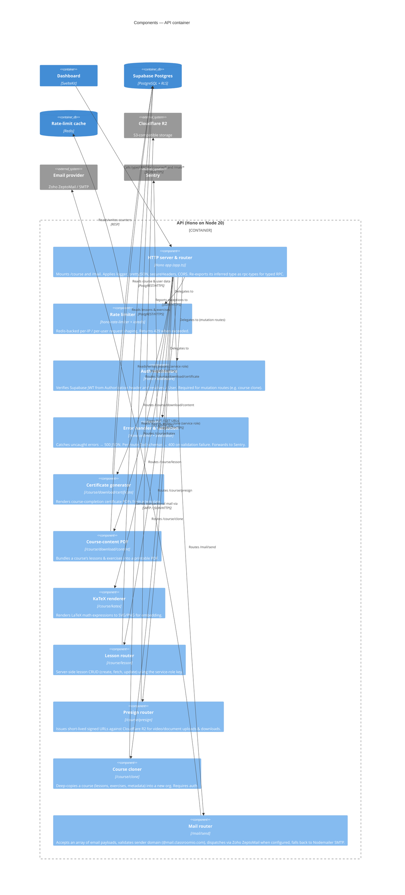

## Level 3 — Components: API

The API (`apps/api`, `@cio/api`) is a small Hono server on Node 20 that owns the work the dashboard can't do at the edge: binary PDF generation, AWS S3-SDK presigning against Cloudflare R2, KaTeX rendering, course cloning with service-role DB writes, and transactional mail. The entrypoint `apps/api/src/app.ts` mounts a single `courseRouter` at `/course` and a `mailRouter` at `/mail`, behind a global middleware stack. Routes are declared with chained `.route()` so the inferred type can be re-exported as `Client` for the dashboard.

### Notes

- **Type-export discipline.** `apps/api/src/app.ts` chains `.route()` calls so Hono can infer the full app type. The dashboard imports that type via `@cio/api/rpc-types` (`hcWithType`, `Client`). Splitting the `app` declaration across statements drops the inference and breaks the dashboard build — this is the single most fragile contract in the repo. `turbo.json` enforces the build order (`@cio/dashboard#build` depends on `@cio/api#build`) so the types resolve.
- **Service role inside the boundary.** API routes use the Supabase service-role key, which bypasses RLS. That's intentional — course cloning and certificate generation need to read rows the calling user doesn't own. The auth middleware on mutation routes (e.g. `/course/clone`) is the compensating control: the JWT identifies *who* is allowed to ask, then the service role does the work.
- **Mail has a dual provider strategy.** Zoho ZeptoMail is preferred when `ZOHO_TOKEN` is set; Nodemailer SMTP is the fallback. Sender domain is hard-validated against `@mail.classroomio.com` regardless of provider, so the API can't be used as an arbitrary SMTP relay.
- **OpenAPI is wired but minimal.** `hono-openapi` is in the dependency tree and `presign.ts` declares routes with `describeRoute` — there's a Scalar reference UI implied but no general policy that every route documents itself yet.
- **What's not in here.** The API does not call OpenAI, payment providers, Unsplash, or PostHog — those all live in dashboard `/api/*` endpoints (see [`03-component-dashboard.md`](./03-component-dashboard.md)). The split is: anything that wants binary output, the AWS SDK, or a long-running Node runtime goes here; everything else stays on the edge.
