<!-- generated by .claude/skills/c4-model on 2026-05-15 — re-run with /c4-model -->
<!-- source: docs/c4/.cache/dashboard.json. 112 total components extracted from AST; this diagram shows ~28 of architectural significance. Internal edges pruned to count >= 2; external edges consolidated by system. -->

# Dashboard — Layer 3 (Components)

The dashboard is one SvelteKit app split into three logical zones — **routes** (URL surface: teacher dashboard, student LMS, and an internal `/api/*` surface), **components** (Svelte UI under `src/lib/components`), and **utils** (TS-only business / data layer under `src/lib/utils`). `src/lib/utils/functions` is the central shared-logic hub (28 TS + 16 JS files, ~50 incoming imports); `src/lib/utils/types` is the type hub. Course and Lesson are the most code-heavy UI domains. The dashboard talks directly to Supabase (via supabase-js), to OpenAI (Vercel AI SDK from `/api/completion`), to Polar (subscription webhooks from `/api/polar`), and to the API container for long-running jobs.

```mermaid
C4Component
  title Dashboard — Components (Layer 3)

  Container_Boundary(dashboard, "Dashboard container") {

    Boundary(b_routes, "Routes — SvelteKit") {
      Component(r_courses,    "Teacher courses",  "Svelte routes", "/courses/*  4 TS + 14 Svelte")
      Component(r_org,        "Org dashboard",    "Svelte routes", "/org/*      3 TS + 15 Svelte")
      Component(r_lms,        "Student LMS",      "Svelte routes", "/lms/*      9 Svelte")
      Component(r_invite,     "Invite flow",      "Svelte routes", "/invite     2 TS + 2 Svelte")
    }

    Boundary(b_api, "Internal /api endpoints — SvelteKit server") {
      Component(api_courses,    "Courses API",    "TS",  "/api/courses    11 endpoints")
      Component(api_email,      "Email API",      "TS",  "/api/email      11 endpoints")
      Component(api_completion, "Completion API", "TS",  "/api/completion AI streaming")
      Component(api_polar,      "Polar API",      "TS",  "/api/polar      subscriptions")
      Component(api_analytics,  "Analytics API",  "TS",  "/api/analytics")
      Component(api_admin,      "Admin API",      "TS",  "/api/admin")
      Component(api_org,        "Org API",        "TS",  "/api/org")
    }

    Boundary(b_ui, "UI components") {
      Component(ui_lesson,   "Lesson UI",   "Svelte", "9 TS + 34 Svelte — lesson player/editor")
      Component(ui_org,      "Org UI",      "Svelte", "44 Svelte — org settings, audience, members")
      Component(ui_question, "Question UI", "Svelte", "6 Svelte — quiz/exercise rendering")
    }

    Boundary(b_svc, "Services — src/lib/utils/services") {
      Component(svc_api,      "API client",       "TS", "Wrapper around @cio/api typed RPC")
      Component(svc_courses,  "Course service",   "TS", "Course/lesson CRUD against Supabase")
      Component(svc_org,      "Org service",      "TS", "Org members, settings, invites")
      Component(svc_lms,      "LMS service",      "TS", "Student-side queries")
      Component(svc_newsfeed, "Newsfeed service", "TS")
      Component(svc_posthog,  "PostHog wrapper",  "TS")
    }

    Boundary(b_util, "Shared utilities — src/lib/utils") {
      Component(utils_functions,    "Shared functions",  "TS", "Central business-logic hub  44 TS + JS")
      Component(utils_types,        "Types",             "TS", "9 TS files — referenced by ~everyone")
      Component(utils_constants,    "Constants",         "TS")
      Component(utils_store,        "Stores",            "TS", "Svelte stores")
      Component(utils_translations, "Translations",      "TS")
    }

    Boundary(b_mail, "Email templates") {
      Component(mail, "Mail templates", "TS", "src/mail — Email subject/body builders")
    }
  }

  Container(api, "API container", "Hono", "Long-running jobs + typed RPC")
  ContainerDb(supabase, "Supabase", "Postgres + Auth")
  System_Ext(openai,  "OpenAI",  "Vercel AI SDK")
  System_Ext(polar,   "Polar",   "Subscriptions")
  System_Ext(posthog, "PostHog", "Analytics")

  Rel(r_courses, svc_courses, "lists / edits courses via")
  Rel(r_org, svc_org, "manages org via")
  Rel(r_org, ui_org, "renders")
  Rel(r_lms, svc_lms, "loads student data via")
  Rel(r_invite, svc_org, "accepts invites via")
  Rel(r_invite, utils_functions, "uses")

  Rel(api_courses, utils_functions, "uses")
  Rel(api_courses, utils_types, "uses")
  Rel(api_email, mail, "renders templates via")
  Rel(api_email, utils_functions, "uses")
  Rel(api_admin, utils_functions, "uses")
  Rel(api_analytics, utils_functions, "uses")
  Rel(api_analytics, utils_types, "uses")
  Rel(api_org, utils_functions, "uses")

  Rel(ui_lesson, utils_types, "uses")
  Rel(ui_lesson, utils_functions, "uses")
  Rel(ui_lesson, ui_question, "embeds")

  Rel(svc_courses, utils_functions, "uses")
  Rel(svc_courses, utils_types, "uses")
  Rel(svc_org, utils_store, "writes to")
  Rel(svc_org, utils_types, "uses")
  Rel(svc_newsfeed, utils_types, "uses")

  Rel(utils_functions, utils_translations, "i18n via")
  Rel(utils_functions, utils_constants, "uses")
  Rel(utils_functions, utils_store, "reads/writes")
  Rel(utils_functions, utils_types, "uses")
  Rel(utils_functions, svc_posthog, "emits events via")
  Rel(utils_store, utils_types, "uses")
  Rel(utils_store, utils_constants, "uses")

  Rel(api_completion, openai, "Streams completions", "HTTPS")
  Rel(api_polar, polar, "Subscription ops + webhooks", "HTTPS")
  Rel(utils_functions, supabase, "reads/writes", "Postgres + REST")
  Rel(svc_courses, supabase, "reads/writes")
  Rel(svc_lms, supabase, "reads")
  Rel(svc_org, supabase, "reads/writes")
  Rel(utils_store, supabase, "reads/writes")
  Rel(ui_lesson, supabase, "reads/writes")
  Rel(svc_posthog, posthog, "captures events", "HTTPS")
  Rel(svc_api, api, "calls", "typed RPC")
```

