## Level 3 — Components: Dashboard

The dashboard (`apps/dashboard`, `@cio/dashboard`) is a SvelteKit app. Its surface decomposes into three clusters: **user-facing pages** (auth, student LMS, instructor course management, public landing pages), **`/api/*` server endpoints** that orchestrate third-party services from the edge, and **shared service modules** under `src/lib/utils/services/` that talk to Supabase and the Hono API.

```mermaid
C4Component
    title Components — Dashboard container

    Person(student, "Student")
    Person(instructor, "Instructor")
    Person(org_admin, "Org admin")

    Container(api, "API", "Hono")
    ContainerDb(sb_db, "Supabase Postgres", "PostgreSQL + RLS")
    Container(sb_auth, "Supabase Auth", "GoTrue")
    System_Ext(openai, "OpenAI")
    System_Ext(payments, "Payment providers", "Stripe / LemonSqueezy / Polar")
    System_Ext(unsplash, "Unsplash")
    System_Ext(vercel, "Vercel platform API")
    System_Ext(observability, "Sentry + PostHog")

    Container_Boundary(dashboard, "Dashboard (SvelteKit)") {
        Component(hooks, "Server hooks & auth guard", "hooks.server.ts", "Validates Authorization header for /api/* (skipping PUBLIC_API_ROUTES allowlist), injects user_id into downstream requests, emits CSP & security headers.")

        Component(auth_pages, "Auth pages", "Svelte routes", "/login, /signup, /forgot, /reset, /logout, /verify-email-error. Calls Supabase Auth directly.")
        Component(onboarding_org, "Onboarding & org", "Svelte routes", "/onboarding, /org, /upgrade, /profile. First-time setup, team management, plan selection.")
        Component(lms_ui, "Student LMS UI", "Svelte routes", "/lms/* — mylearning, explore, exercises, community, settings. Read-side learner surface.")
        Component(course_mgmt_ui, "Course management UI", "Svelte routes", "/courses/[id]/* — lessons, attendance, marks, submissions, people, certificates, analytics, landingpage, settings.")
        Component(public_pages, "Public pages & invite flows", "Svelte routes", "/home, /course/[slug] (public preview), invite acceptance.")

        Component(ai_endpoints, "AI completion endpoints", "/api/completion/*", "Streams OpenAI completions for course generation, custom prompts, exercise prompts, AI grading.")
        Component(payment_endpoints, "Payment endpoints", "/api/polar/*, /api/lmz", "Polar checkout/portal/webhook; LemonSqueezy webhook. Stripe checkout invoked inline from org service.")
        Component(email_endpoints, "Email orchestration endpoints", "/api/email/*", "Composes course, invite, verify-email, welcome messages. Delegates send to API /mail/send.")
        Component(course_data_endpoints, "Course/org data endpoints", "/api/courses/*, /api/org/*, /api/analytics/*", "Server-side aggregations for course data, team, audience, analytics dashboards.")
        Component(integration_endpoints, "Integration endpoints", "/api/unsplash, /api/domain, /api/verify, /api/admin/*, /csp-report", "Unsplash proxy, Vercel custom-domain ops, generic verification, admin maintenance, CSP report sink.")

        Component(services, "Service modules", "src/lib/utils/services/*", "Shared TypeScript modules for courses, lessons, marks, submissions, attendance, newsfeed, notifications, org/payments, posthog, sentry. Used by both pages and /api/* endpoints.")
        Component(api_rpc_client, "API RPC client", "hcWithType from @cio/api/rpc-types", "End-to-end typed Hono RPC client. Wraps fetch with Authorization header.")
        Component(supabase_client, "Supabase client", "@supabase/supabase-js", "Anon-key client (browser & SSR). Most CRUD goes through here; RLS enforces access.")
    }

    Rel(student, lms_ui, "Uses", "HTTPS")
    Rel(student, public_pages, "Browses", "HTTPS")
    Rel(instructor, course_mgmt_ui, "Authors / grades in", "HTTPS")
    Rel(instructor, lms_ui, "Uses", "HTTPS")
    Rel(org_admin, onboarding_org, "Administers via", "HTTPS")

    Rel(auth_pages, sb_auth, "Sign-in / sign-up / reset", "JSON/HTTPS")
    Rel(lms_ui, services, "Reads/writes via")
    Rel(course_mgmt_ui, services, "Reads/writes via")
    Rel(onboarding_org, services, "Reads/writes via")
    Rel(public_pages, supabase_client, "Reads public rows", "PostgREST/HTTPS")

    Rel(hooks, auth_pages, "Passes through")
    Rel(hooks, ai_endpoints, "Authenticates")
    Rel(hooks, course_data_endpoints, "Authenticates")
    Rel(hooks, email_endpoints, "Authenticates")
    Rel(hooks, payment_endpoints, "Allowlisted (webhooks)")
    Rel(hooks, integration_endpoints, "Authenticates / allowlists")

    Rel(services, supabase_client, "CRUD")
    Rel(services, api_rpc_client, "Calls API")
    Rel(services, observability, "Captures events")

    Rel(supabase_client, sb_db, "Reads/writes (RLS-scoped)", "PostgREST/HTTPS")
    Rel(api_rpc_client, api, "Typed RPC", "JSON/HTTPS")

    Rel(ai_endpoints, openai, "Streams completions from", "JSON/HTTPS")
    Rel(payment_endpoints, payments, "Checkout & webhooks", "JSON/HTTPS")
    Rel(email_endpoints, api_rpc_client, "Delegates send to API")
    Rel(course_data_endpoints, supabase_client, "Aggregates from")
    Rel(integration_endpoints, unsplash, "Proxies image search", "JSON/HTTPS")
    Rel(integration_endpoints, vercel, "Manages domains via", "JSON/HTTPS")
```

### Notes

- **Two `/api` namespaces, one in each container.** Dashboard `/api/*` (SvelteKit server endpoints) handles edge-friendly work — AI streaming, payment webhooks, mail orchestration, analytics aggregations, custom domains. API service `/course/*` and `/mail/*` (Hono, port 3002) handles edge-hostile work — PDF binaries, R2 SDK, KaTeX. The dashboard's email endpoints orchestrate; the actual SMTP send happens in the Hono API.
- **Auth boundary lives in `hooks.server.ts`.** Only requests whose path contains `/api` are validated. A `PUBLIC_API_ROUTES` allowlist (`/api/completion`, `/api/polar`, `/api/lmz`, `/api/verify`, plus a couple of hardcoded slugs) bypasses auth — typically for third-party webhooks that can't carry a user JWT. When adding a new public-or-unauth `/api` route, add it to that list.
- **Most CRUD skips the server.** The dashboard talks to Supabase directly from the browser using the anon key; RLS in Postgres is the actual access control. The `/api/courses/*` and `/api/org/*` endpoints exist for aggregations / cross-table queries that are awkward in PostgREST, not because there's a missing trust boundary.
- **Service modules are the integration seam.** Components under `src/lib/utils/services/` are imported by both Svelte pages and `/api/*` endpoints. If you're adding a new feature, put the data access there rather than scattering Supabase calls across routes.
- **Stripe is invoked inline.** Unlike Polar/LemonSqueezy, Stripe doesn't have a dedicated `/api/stripe` route group — checkout sessions are created from the org service module directly. Webhooks are not modelled here; verify what's set up in Stripe before assuming server-side webhook handling exists.
- **Component-to-route mapping is approximate.** A single Svelte route group often contains both a page and a sibling `+server.ts`; this diagram clusters by responsibility, not by file layout.
