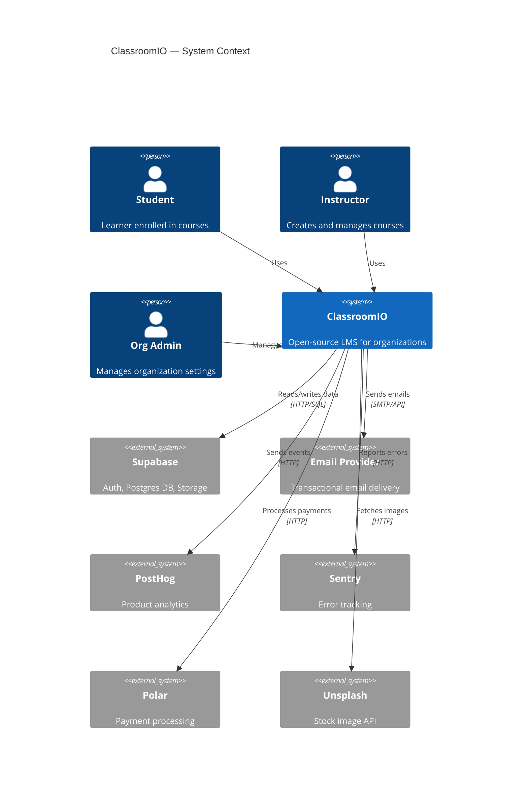

# L1 — System Context

```mermaid
C4Context
  title ClassroomIO — System Context

  Person(student, "Student", "Learner enrolled in courses")
  Person(instructor, "Instructor", "Creates and manages courses")
  Person(admin, "Org Admin", "Manages organization settings")

  System(classroomio, "ClassroomIO", "Open-source LMS for organizations")

  System_Ext(supabase, "Supabase", "Auth, Postgres DB, Storage")
  System_Ext(email, "Email Provider", "Transactional email delivery")
  System_Ext(posthog, "PostHog", "Product analytics")
  System_Ext(sentry, "Sentry", "Error tracking")
  System_Ext(polar, "Polar", "Payment processing")
  System_Ext(unsplash, "Unsplash", "Stock image API")

  Rel(student, classroomio, "Uses")
  Rel(instructor, classroomio, "Uses")
  Rel(admin, classroomio, "Manages")
  Rel(classroomio, supabase, "Reads/writes data", "HTTP/SQL")
  Rel(classroomio, email, "Sends emails", "SMTP/API")
  Rel(classroomio, posthog, "Sends events", "HTTP")
  Rel(classroomio, sentry, "Reports errors", "HTTP")
  Rel(classroomio, polar, "Processes payments", "HTTP")
  Rel(classroomio, unsplash, "Fetches images", "HTTP")
```
