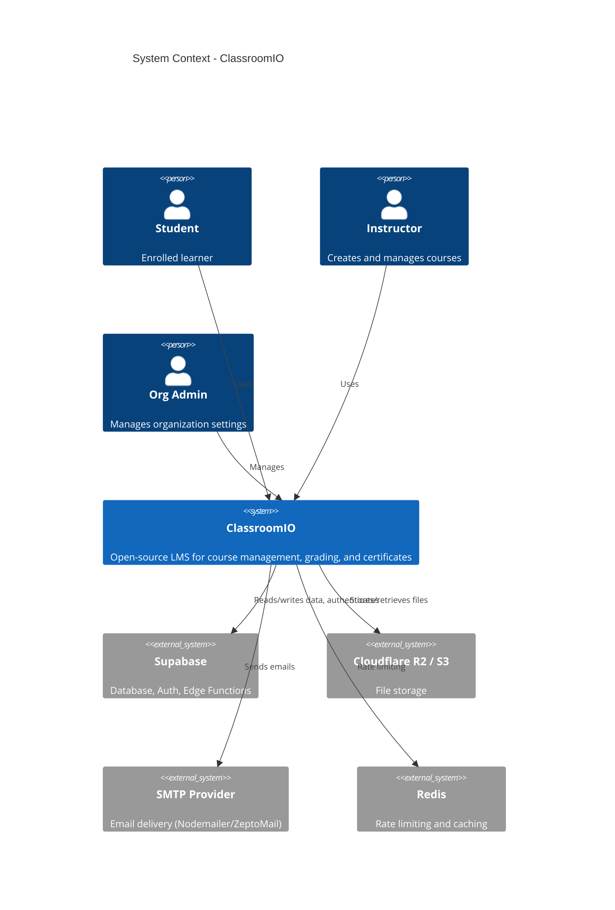

# Layer 1: System Context — ClassroomIO

```mermaid
C4Context
    title System Context - ClassroomIO

    Person(student, "Student", "Enrolled learner")
    Person(instructor, "Instructor", "Creates and manages courses")
    Person(admin, "Org Admin", "Manages organization settings")

    System(cio, "ClassroomIO", "Open-source LMS for course management, grading, and certificates")

    System_Ext(supabase, "Supabase", "Database, Auth, Edge Functions")
    System_Ext(r2, "Cloudflare R2 / S3", "File storage")
    System_Ext(smtp, "SMTP Provider", "Email delivery (Nodemailer/ZeptoMail)")
    System_Ext(redis, "Redis", "Rate limiting and caching")

    Rel(student, cio, "Uses")
    Rel(instructor, cio, "Uses")
    Rel(admin, cio, "Manages")
    Rel(cio, supabase, "Reads/writes data, authenticates")
    Rel(cio, r2, "Stores/retrieves files")
    Rel(cio, smtp, "Sends emails")
    Rel(cio, redis, "Rate limiting")
```
