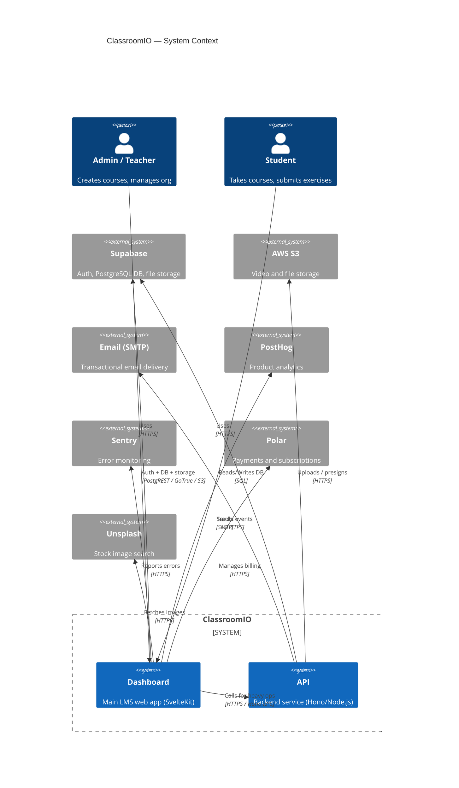

# L1: System Context

```mermaid
C4Context
  title ClassroomIO — System Context

  Person(admin, "Admin / Teacher", "Creates courses, manages org")
  Person(student, "Student", "Takes courses, submits exercises")

  System_Boundary(cio, "ClassroomIO") {
    System(dashboard, "Dashboard", "Main LMS web app (SvelteKit)")
    System(api, "API", "Backend service (Hono/Node.js)")
  }

  System_Ext(supabase, "Supabase", "Auth, PostgreSQL DB, file storage")
  System_Ext(s3, "AWS S3", "Video and file storage")
  System_Ext(email, "Email (SMTP)", "Transactional email delivery")
  System_Ext(posthog, "PostHog", "Product analytics")
  System_Ext(sentry, "Sentry", "Error monitoring")
  System_Ext(polar, "Polar", "Payments and subscriptions")
  System_Ext(unsplash, "Unsplash", "Stock image search")

  Rel(admin, dashboard, "Uses", "HTTPS")
  Rel(student, dashboard, "Uses", "HTTPS")
  Rel(dashboard, api, "Calls for heavy ops", "HTTPS / Hono RPC")
  Rel(dashboard, supabase, "Auth + DB + storage", "PostgREST / GoTrue / S3")
  Rel(api, supabase, "Reads/Writes DB", "SQL")
  Rel(api, s3, "Uploads / presigns", "HTTPS")
  Rel(api, email, "Sends", "SMTP")
  Rel(dashboard, posthog, "Tracks events", "HTTPS")
  Rel(dashboard, sentry, "Reports errors", "HTTPS")
  Rel(dashboard, polar, "Manages billing", "HTTPS")
  Rel(dashboard, unsplash, "Fetches images", "HTTPS")
```
