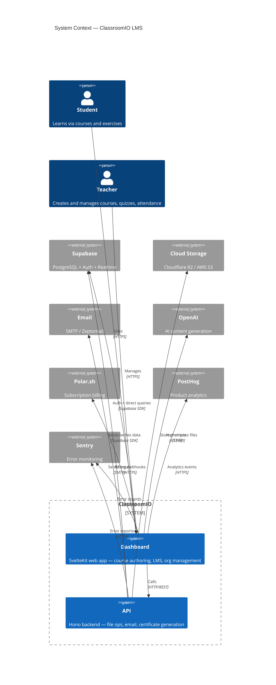

# Layer 1: System Context

```mermaid
C4Context
  title System Context — ClassroomIO LMS

  Person(student, "Student", "Learns via courses and exercises")
  Person(teacher, "Teacher", "Creates and manages courses, quizzes, attendance")

  System_Boundary(cio, "ClassroomIO") {
    System(dashboard, "Dashboard", "SvelteKit web app — course authoring, LMS, org management")
    System(api, "API", "Hono backend — file ops, email, certificate generation")
  }

  System_Ext(supabase, "Supabase", "PostgreSQL + Auth + Realtime")
  System_Ext(storage, "Cloud Storage", "Cloudflare R2 / AWS S3")
  System_Ext(email, "Email", "SMTP / Zeptomail")
  System_Ext(openai, "OpenAI", "AI content generation")
  System_Ext(polar, "Polar.sh", "Subscription billing")
  System_Ext(posthog, "PostHog", "Product analytics")
  System_Ext(sentry, "Sentry", "Error monitoring")

  Rel(student, dashboard, "Uses", "HTTPS")
  Rel(teacher, dashboard, "Manages", "HTTPS")
  Rel(dashboard, api, "Calls", "HTTP/REST")
  Rel(dashboard, supabase, "Auth + direct queries", "Supabase SDK")
  Rel(api, supabase, "Reads/writes data", "Supabase SDK")
  Rel(api, storage, "Stores/retrieves files", "S3 API")
  Rel(api, email, "Sends email", "SMTP")
  Rel(dashboard, openai, "AI prompts", "HTTPS")
  Rel(dashboard, polar, "Billing webhooks", "HTTPS")
  Rel(dashboard, posthog, "Analytics events", "HTTPS")
  Rel(dashboard, sentry, "Error reports", "HTTPS")
  Rel(api, sentry, "Error reports", "HTTPS")
```
