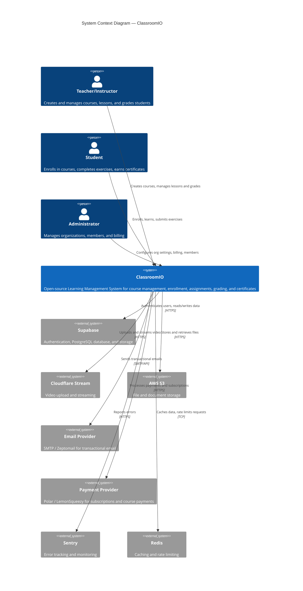

# Layer 1: System Context

High-level view of ClassroomIO showing external actors and systems it interacts with.

```mermaid
C4Context
    title System Context Diagram — ClassroomIO

    Person(teacher, "Teacher/Instructor", "Creates and manages courses, lessons, and grades students")
    Person(student, "Student", "Enrolls in courses, completes exercises, earns certificates")
    Person(admin, "Administrator", "Manages organizations, members, and billing")

    System(classroomio, "ClassroomIO", "Open-source Learning Management System for course management, enrollment, assignments, grading, and certificates")

    System_Ext(supabase, "Supabase", "Authentication, PostgreSQL database, and storage")
    System_Ext(cloudflare, "Cloudflare Stream", "Video upload and streaming")
    System_Ext(s3, "AWS S3", "File and document storage")
    System_Ext(email, "Email Provider", "SMTP / Zeptomail for transactional email")
    System_Ext(payment, "Payment Provider", "Polar / LemonSqueezy for subscriptions and course payments")
    System_Ext(sentry, "Sentry", "Error tracking and monitoring")
    System_Ext(redis, "Redis", "Caching and rate limiting")

    Rel(teacher, classroomio, "Creates courses, manages lessons and grades")
    Rel(student, classroomio, "Enrolls, learns, submits exercises")
    Rel(admin, classroomio, "Configures org settings, billing, members")

    Rel(classroomio, supabase, "Authenticates users, reads/writes data", "HTTPS")
    Rel(classroomio, cloudflare, "Uploads and streams video", "HTTPS")
    Rel(classroomio, s3, "Stores and retrieves files", "HTTPS")
    Rel(classroomio, email, "Sends transactional emails", "SMTP/API")
    Rel(classroomio, payment, "Processes payments and subscriptions", "HTTPS")
    Rel(classroomio, sentry, "Reports errors", "HTTPS")
    Rel(classroomio, redis, "Caches data, rate limits requests", "TCP")
```
