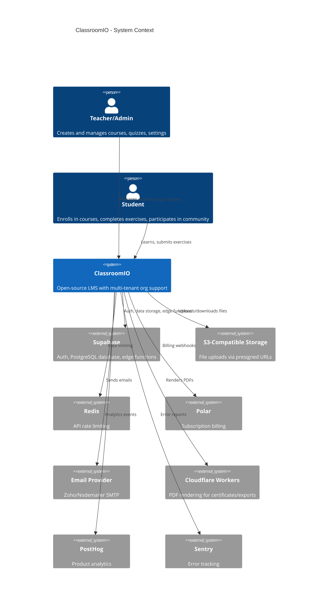

# ClassroomIO - Layer 1: System Context

```mermaid
C4Context
  title ClassroomIO - System Context

  UpdateLayoutConfig($c4ShapeInRow="4", $c4BoundaryInRow="1")

  Person(teacher, "Teacher/Admin", "Creates and manages courses, quizzes, settings")
  Person(student, "Student", "Enrolls in courses, completes exercises, participates in community")

  System(classroomio, "ClassroomIO", "Open-source LMS with multi-tenant org support")

  %% Data & auth
  System_Ext(supabase, "Supabase", "Auth, PostgreSQL database, edge functions")
  System_Ext(s3, "S3-Compatible Storage", "File uploads via presigned URLs")
  System_Ext(redis, "Redis", "API rate limiting")
  System_Ext(polar, "Polar", "Subscription billing")

  %% Comms & observability
  System_Ext(email, "Email Provider", "Zoho/Nodemailer SMTP")
  System_Ext(cloudflare, "Cloudflare Workers", "PDF rendering for certificates/exports")
  System_Ext(posthog, "PostHog", "Product analytics")
  System_Ext(sentry, "Sentry", "Error tracking")

  Rel_D(teacher, classroomio, "Manages courses, orgs, quizzes")
  Rel_D(student, classroomio, "Learns, submits exercises")
  Rel_D(classroomio, supabase, "Auth, data storage, edge functions")
  Rel_D(classroomio, email, "Sends emails")
  Rel_D(classroomio, s3, "Uploads/downloads files")
  Rel_D(classroomio, cloudflare, "Renders PDFs")
  Rel_D(classroomio, redis, "Rate limiting")
  Rel_D(classroomio, polar, "Billing webhooks")
  Rel_D(classroomio, posthog, "Analytics events")
  Rel_D(classroomio, sentry, "Error reports")
```
