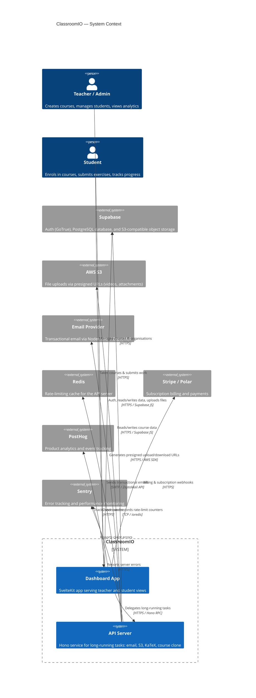

# L1 — System Context

> Generated: 2026-03-13

```mermaid
C4Context
  title ClassroomIO — System Context

  Person(teacher, "Teacher / Admin", "Creates courses, manages students, views analytics")
  Person(student, "Student", "Enrols in courses, submits exercises, tracks progress")

  System_Boundary(cio, "ClassroomIO") {
    System(dashboard, "Dashboard App", "SvelteKit app serving teacher and student views")
    System(api, "API Server", "Hono service for long-running tasks: email, S3, KaTeX, course clone")
  }

  System_Ext(supabase, "Supabase", "Auth (GoTrue), PostgreSQL database, and S3-compatible object storage")
  System_Ext(awss3, "AWS S3", "File uploads via presigned URLs (videos, attachments)")
  System_Ext(email, "Email Provider", "Transactional email via Nodemailer / ZeptoMail")
  System_Ext(redis, "Redis", "Rate-limiting cache for the API server")
  System_Ext(payments, "Stripe / Polar", "Subscription billing and payments")
  System_Ext(posthog, "PostHog", "Product analytics and event tracking")
  System_Ext(sentry, "Sentry", "Error tracking and performance monitoring")

  Rel(teacher, dashboard, "Manages courses & organisations", "HTTPS")
  Rel(student, dashboard, "Takes courses & submits work", "HTTPS")

  Rel(dashboard, supabase, "Auth, reads/writes data, uploads files", "HTTPS / Supabase JS")
  Rel(dashboard, api, "Delegates long-running tasks", "HTTPS / Hono RPC")
  Rel(dashboard, payments, "Billing & subscription webhooks", "HTTPS")
  Rel(dashboard, posthog, "Tracks user events", "HTTPS")
  Rel(dashboard, sentry, "Reports client errors", "HTTPS")

  Rel(api, supabase, "Reads/writes course data", "HTTPS / Supabase JS")
  Rel(api, awss3, "Generates presigned upload/download URLs", "HTTPS / AWS SDK")
  Rel(api, email, "Sends transactional emails", "SMTP / ZeptoMail API")
  Rel(api, redis, "Checks and records rate-limit counters", "TCP / ioredis")
  Rel(api, sentry, "Reports server errors", "HTTPS")

  UpdateLayoutConfig($c4ShapeInRow="4", $c4BoundaryInRow="1")
```
