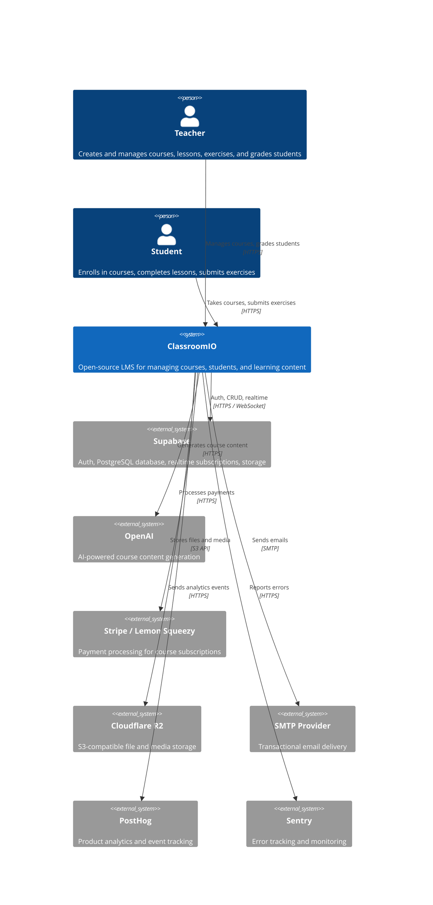

# Layer 1 — System Context

Shows ClassroomIO as a single system with its users and external dependencies.

```mermaid
C4Context
  Person(teacher, "Teacher", "Creates and manages courses, lessons, exercises, and grades students")
  Person(student, "Student", "Enrolls in courses, completes lessons, submits exercises")

  System(classroomio, "ClassroomIO", "Open-source LMS for managing courses, students, and learning content")

  System_Ext(supabase, "Supabase", "Auth, PostgreSQL database, realtime subscriptions, storage")
  System_Ext(openai, "OpenAI", "AI-powered course content generation")
  System_Ext(stripe, "Stripe / Lemon Squeezy", "Payment processing for course subscriptions")
  System_Ext(r2, "Cloudflare R2", "S3-compatible file and media storage")
  System_Ext(smtp, "SMTP Provider", "Transactional email delivery")
  System_Ext(posthog, "PostHog", "Product analytics and event tracking")
  System_Ext(sentry, "Sentry", "Error tracking and monitoring")

  Rel(teacher, classroomio, "Manages courses, grades students", "HTTPS")
  Rel(student, classroomio, "Takes courses, submits exercises", "HTTPS")
  Rel(classroomio, supabase, "Auth, CRUD, realtime", "HTTPS / WebSocket")
  Rel(classroomio, openai, "Generates course content", "HTTPS")
  Rel(classroomio, stripe, "Processes payments", "HTTPS")
  Rel(classroomio, r2, "Stores files and media", "S3 API")
  Rel(classroomio, smtp, "Sends emails", "SMTP")
  Rel(classroomio, posthog, "Sends analytics events", "HTTPS")
  Rel(classroomio, sentry, "Reports errors", "HTTPS")
```

<!-- Generated 2026-03-13 -->
