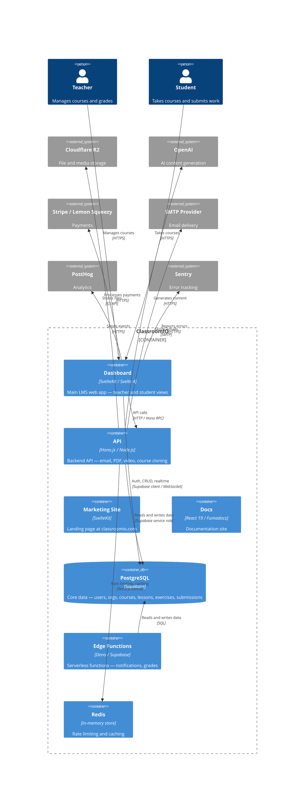

# Layer 2 — Container

Decomposes ClassroomIO into its deployable containers and their interactions.

```mermaid
C4Container
  Person(teacher, "Teacher", "Manages courses and grades")
  Person(student, "Student", "Takes courses and submits work")

  Container_Boundary(cio, "ClassroomIO") {
    Container(dashboard, "Dashboard", "SvelteKit / Svelte 4", "Main LMS web app — teacher and student views")
    Container(api, "API", "Hono.js / Node.js", "Backend API — email, PDF, video, course cloning")
    Container(marketing, "Marketing Site", "SvelteKit", "Landing page at classroomio.com")
    Container(docs, "Docs", "React 19 / Fumadocs", "Documentation site")
    ContainerDb(postgres, "PostgreSQL", "Supabase", "Core data — users, orgs, courses, lessons, exercises, submissions")
    Container(edge_functions, "Edge Functions", "Deno / Supabase", "Serverless functions — notifications, grades")
    Container(redis, "Redis", "In-memory store", "Rate limiting and caching")
  }

  System_Ext(r2, "Cloudflare R2", "File and media storage")
  System_Ext(openai, "OpenAI", "AI content generation")
  System_Ext(stripe, "Stripe / Lemon Squeezy", "Payments")
  System_Ext(smtp, "SMTP Provider", "Email delivery")
  System_Ext(posthog, "PostHog", "Analytics")
  System_Ext(sentry, "Sentry", "Error tracking")

  Rel(teacher, dashboard, "Manages courses", "HTTPS")
  Rel(student, dashboard, "Takes courses", "HTTPS")
  Rel(dashboard, api, "API calls", "HTTP / Hono RPC")
  Rel(dashboard, postgres, "Auth, CRUD, realtime", "Supabase client / WebSocket")
  Rel(api, postgres, "Reads and writes data", "Supabase service role")
  Rel(api, redis, "Rate limiting, caching", "Redis protocol")
  Rel(api, r2, "Stores files", "S3 API")
  Rel(api, smtp, "Sends emails", "SMTP")
  Rel(api, openai, "Generates content", "HTTPS")
  Rel(dashboard, posthog, "Sends events", "HTTPS")
  Rel(dashboard, sentry, "Reports errors", "HTTPS")
  Rel(edge_functions, postgres, "Reads and writes data", "SQL")
  Rel(dashboard, stripe, "Processes payments", "HTTPS")
```

<!-- Generated 2026-03-13 -->
