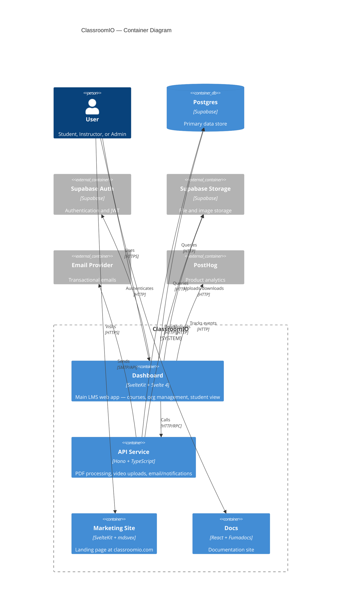

# L2 — Containers

```mermaid
C4Container
  title ClassroomIO — Container Diagram

  Person(user, "User", "Student, Instructor, or Admin")

  System_Boundary(cio, "ClassroomIO") {
    Container(dashboard, "Dashboard", "SvelteKit + Svelte 4", "Main LMS web app — courses, org management, student view")
    Container(api, "API Service", "Hono + TypeScript", "PDF processing, video uploads, email/notifications")
    Container(website, "Marketing Site", "SvelteKit + mdsvex", "Landing page at classroomio.com")
    Container(docs, "Docs", "React + Fumadocs", "Documentation site")
  }

  ContainerDb(db, "Postgres", "Supabase", "Primary data store")
  Container_Ext(auth, "Supabase Auth", "Supabase", "Authentication and JWT")
  Container_Ext(storage, "Supabase Storage", "Supabase", "File and image storage")
  Container_Ext(email, "Email Provider", "", "Transactional emails")
  Container_Ext(posthog, "PostHog", "", "Product analytics")

  Rel(user, dashboard, "Uses", "HTTPS")
  Rel(user, website, "Visits", "HTTPS")
  Rel(user, docs, "Reads", "HTTPS")
  Rel(dashboard, api, "Calls", "HTTP/RPC")
  Rel(dashboard, db, "Queries", "HTTP")
  Rel(dashboard, auth, "Authenticates", "HTTP")
  Rel(dashboard, storage, "Uploads/downloads", "HTTP")
  Rel(dashboard, posthog, "Tracks events", "HTTP")
  Rel(api, db, "Queries", "HTTP")
  Rel(api, email, "Sends", "SMTP/API")
  Rel(api, storage, "Uploads", "HTTP")
```
