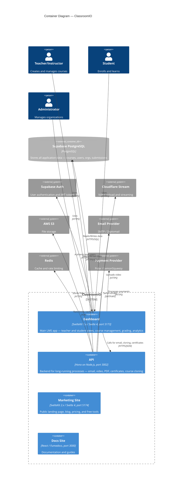

# Layer 2: Container

Shows the deployable units within ClassroomIO and how they communicate.

```mermaid
C4Container
    title Container Diagram — ClassroomIO

    Person(teacher, "Teacher/Instructor", "Creates and manages courses")
    Person(student, "Student", "Enrolls and learns")
    Person(admin, "Administrator", "Manages organizations")

    System_Boundary(classroomio, "ClassroomIO") {
        Container(dashboard, "Dashboard", "SvelteKit 1.x / Svelte 4, port 5173", "Main LMS app — teacher and student views, course management, grading, analytics")
        Container(api, "API", "Hono on Node.js, port 3002", "Backend for long-running processes — email, video, PDF, certificates, course cloning")
        Container(marketing, "Marketing Site", "SvelteKit 2.x / Svelte 4, port 5174", "Public landing page, blog, pricing, and free tools")
        Container(docs, "Docs Site", "React / Fumadocs, port 3000", "Documentation and guides")
    }

    ContainerDb_Ext(supabaseDb, "Supabase PostgreSQL", "PostgreSQL", "Stores all application data — courses, users, orgs, submissions")
    System_Ext(supabaseAuth, "Supabase Auth", "User authentication and JWT tokens")
    System_Ext(cloudflare, "Cloudflare Stream", "Video upload and streaming")
    System_Ext(s3, "AWS S3", "File storage")
    System_Ext(email, "Email Provider", "SMTP / Zeptomail")
    System_Ext(redis, "Redis", "Cache and rate limiting")
    System_Ext(payment, "Payment Provider", "Polar / LemonSqueezy")

    Rel(teacher, dashboard, "Uses", "HTTPS")
    Rel(student, dashboard, "Uses", "HTTPS")
    Rel(admin, dashboard, "Uses", "HTTPS")

    Rel(dashboard, supabaseDb, "Reads/Writes data", "HTTPS/SQL")
    Rel(dashboard, supabaseAuth, "Authenticates users", "HTTPS")
    Rel(dashboard, api, "Calls for email, cloning, certificates", "HTTPS/JSON")
    Rel(dashboard, payment, "Processes payments", "HTTPS")

    Rel(api, supabaseDb, "Reads/Writes data", "HTTPS/SQL")
    Rel(api, cloudflare, "Uploads video", "HTTPS")
    Rel(api, s3, "Stores files", "HTTPS")
    Rel(api, email, "Sends emails", "SMTP/API")
    Rel(api, redis, "Rate limits, caching", "TCP")
```
