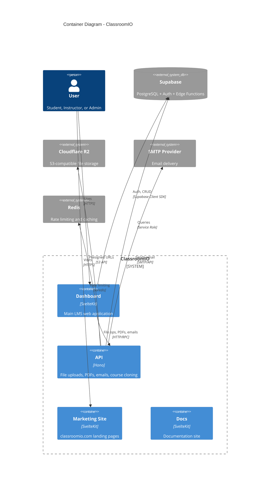

# Layer 2: Container Diagram — ClassroomIO

```mermaid
C4Container
    title Container Diagram - ClassroomIO

    Person(user, "User", "Student, Instructor, or Admin")

    System_Boundary(cio, "ClassroomIO") {
        Container(dashboard, "Dashboard", "SvelteKit", "Main LMS web application")
        Container(api, "API", "Hono", "File uploads, PDFs, emails, course cloning")
        Container(marketing, "Marketing Site", "SvelteKit", "classroomio.com landing pages")
        Container(docs, "Docs", "SvelteKit", "Documentation site")
    }

    SystemDb_Ext(supabase, "Supabase", "PostgreSQL + Auth + Edge Functions")
    System_Ext(r2, "Cloudflare R2", "S3-compatible file storage")
    System_Ext(smtp, "SMTP Provider", "Email delivery")
    System_Ext(redis, "Redis", "Rate limiting and caching")

    Rel(user, dashboard, "Uses", "HTTPS")
    Rel(user, marketing, "Visits", "HTTPS")
    Rel(dashboard, supabase, "Auth, CRUD", "Supabase Client SDK")
    Rel(dashboard, api, "File ops, PDFs, emails", "HTTP/RPC")
    Rel(api, supabase, "Queries", "Service Role")
    Rel(api, r2, "Presigned URLs", "S3 API")
    Rel(api, smtp, "Sends email", "SMTP/API")
    Rel(api, redis, "Rate limiting", "ioredis")
```
