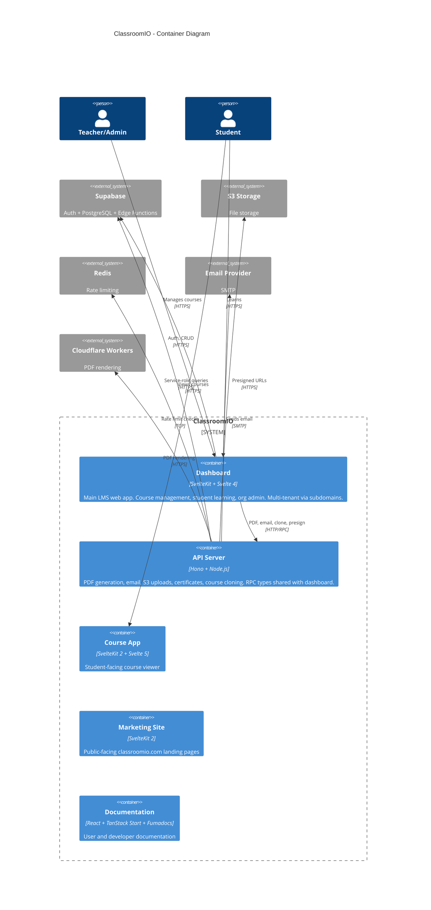

# ClassroomIO - Layer 2: Container Diagram

```mermaid
C4Container
  title ClassroomIO - Container Diagram

  UpdateLayoutConfig($c4ShapeInRow="3", $c4BoundaryInRow="1")

  Person(teacher, "Teacher/Admin", "")
  Person(student, "Student", "")

  System_Boundary(cio, "ClassroomIO") {
    %% Primary containers first (most connections)
    Container(dashboard, "Dashboard", "SvelteKit + Svelte 4", "Main LMS web app. Course management, student learning, org admin. Multi-tenant via subdomains.")
    Container(api, "API Server", "Hono + Node.js", "PDF generation, email, S3 uploads, certificates, course cloning. RPC types shared with dashboard.")
    Container(course_app, "Course App", "SvelteKit 2 + Svelte 5", "Student-facing course viewer")
    %% Secondary containers
    Container(marketing, "Marketing Site", "SvelteKit 2", "Public-facing classroomio.com landing pages")
    Container(docs, "Documentation", "React + TanStack Start + Fumadocs", "User and developer documentation")
  }

  %% External systems grouped by concern
  System_Ext(supabase, "Supabase", "Auth + PostgreSQL + Edge Functions")
  System_Ext(s3, "S3 Storage", "File storage")
  System_Ext(redis, "Redis", "Rate limiting")
  System_Ext(email, "Email Provider", "SMTP")
  System_Ext(cloudflare, "Cloudflare Workers", "PDF rendering")

  %% Top-down: actors to containers
  Rel_D(teacher, dashboard, "Manages courses", "HTTPS")
  Rel_D(student, dashboard, "Learns", "HTTPS")
  Rel_D(student, course_app, "Views courses", "HTTPS")

  %% Lateral: container to container
  Rel_R(dashboard, api, "PDF, email, clone, presign", "HTTP/RPC")

  %% Down: containers to external systems
  Rel_D(dashboard, supabase, "Auth, CRUD", "HTTPS")
  Rel_D(api, supabase, "Service-role queries", "HTTPS")
  Rel_D(api, email, "Sends email", "SMTP")
  Rel_D(api, s3, "Presigned URLs", "HTTPS")
  Rel_D(api, cloudflare, "PDF rendering", "HTTPS")
  Rel_D(api, redis, "Rate limit checks", "TCP")
```
