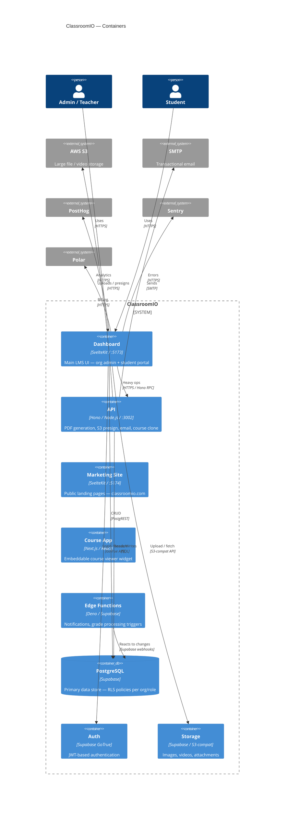

# L2: Container Diagram

```mermaid
C4Container
  title ClassroomIO — Containers

  Person(admin, "Admin / Teacher")
  Person(student, "Student")

  System_Boundary(cio, "ClassroomIO") {
    Container(dashboard, "Dashboard", "SvelteKit / :5173", "Main LMS UI — org admin + student portal")
    Container(api, "API", "Hono / Node.js / :3002", "PDF generation, S3 presign, email, course clone")
    Container(mktg, "Marketing Site", "SvelteKit / :5174", "Public landing pages — classroomio.com")
    Container(courseApp, "Course App", "Next.js / React", "Embeddable course viewer widget")
    Container(edge, "Edge Functions", "Deno / Supabase", "Notifications, grade processing triggers")
    ContainerDb(db, "PostgreSQL", "Supabase", "Primary data store — RLS policies per org/role")
    Container(auth, "Auth", "Supabase GoTrue", "JWT-based authentication")
    Container(storage, "Storage", "Supabase / S3-compat", "Images, videos, attachments")
  }

  System_Ext(s3, "AWS S3", "Large file / video storage")
  System_Ext(email, "SMTP", "Transactional email")
  System_Ext(posthog, "PostHog")
  System_Ext(sentry, "Sentry")
  System_Ext(polar, "Polar")

  Rel(admin, dashboard, "Uses", "HTTPS")
  Rel(student, dashboard, "Uses", "HTTPS")
  Rel(dashboard, api, "Heavy ops", "HTTPS / Hono RPC")
  Rel(dashboard, db, "CRUD", "PostgREST")
  Rel(dashboard, auth, "Login / session", "GoTrue API")
  Rel(dashboard, storage, "Upload / fetch", "S3-compat API")
  Rel(api, db, "Reads/Writes", "SQL")
  Rel(api, s3, "Uploads / presigns", "HTTPS")
  Rel(api, email, "Sends", "SMTP")
  Rel(edge, db, "Reacts to changes", "Supabase webhooks")
  Rel(dashboard, posthog, "Analytics", "HTTPS")
  Rel(dashboard, sentry, "Errors", "HTTPS")
  Rel(dashboard, polar, "Billing", "HTTPS")
```
