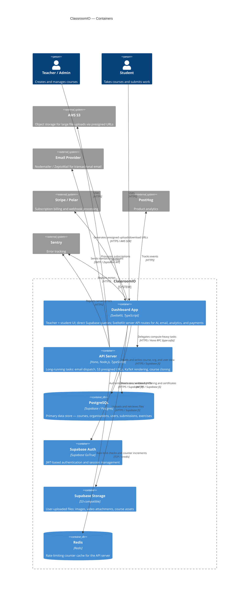

# L2 — Containers

> Generated: 2026-03-13

```mermaid
C4Container
  title ClassroomIO — Containers

  Person(teacher, "Teacher / Admin", "Creates and manages courses")
  Person(student, "Student", "Takes courses and submits work")

  System_Boundary(cio, "ClassroomIO") {
    Container(dashboard, "Dashboard App", "SvelteKit, TypeScript", "Teacher + student UI; direct Supabase queries; SvelteKit server API routes for AI, email, analytics, and payments")
    Container(apiserver, "API Server", "Hono, Node.js, TypeScript", "Long-running tasks: email dispatch, S3 presigned URLs, KaTeX rendering, course cloning")

    ContainerDb(postgres, "PostgreSQL", "Supabase / Postgres", "Primary data store — courses, organisations, users, submissions, exercises")
    Container(auth, "Supabase Auth", "Supabase GoTrue", "JWT-based authentication and session management")
    Container(storage, "Supabase Storage", "S3-compatible", "User-uploaded files: images, video attachments, course assets")
    ContainerDb(redis, "Redis", "Redis", "Rate-limiting counter cache for the API server")
  }

  System_Ext(awss3, "AWS S3", "Object storage for large file uploads via presigned URLs")
  System_Ext(email, "Email Provider", "Nodemailer / ZeptoMail for transactional email")
  System_Ext(payments, "Stripe / Polar", "Subscription billing and webhook processing")
  System_Ext(posthog, "PostHog", "Product analytics")
  System_Ext(sentry, "Sentry", "Error tracking")

  Rel(teacher, dashboard, "Uses", "HTTPS")
  Rel(student, dashboard, "Uses", "HTTPS")

  Rel(dashboard, auth, "Authenticates users, validates JWTs", "HTTPS / Supabase JS")
  Rel(dashboard, postgres, "Reads and writes course, org, and user data", "HTTPS / Supabase JS")
  Rel(dashboard, storage, "Uploads and retrieves files", "HTTPS / Supabase JS")
  Rel(dashboard, apiserver, "Delegates compute-heavy tasks", "HTTPS / Hono RPC (type-safe)")
  Rel(dashboard, payments, "Processes subscriptions", "HTTPS")
  Rel(dashboard, posthog, "Tracks events", "HTTPS")
  Rel(dashboard, sentry, "Reports errors", "HTTPS")

  Rel(apiserver, postgres, "Reads course data for cloning and certificates", "HTTPS / Supabase JS")
  Rel(apiserver, awss3, "Generates presigned upload/download URLs", "HTTPS / AWS SDK")
  Rel(apiserver, email, "Sends transactional emails", "SMTP / ZeptoMail API")
  Rel(apiserver, redis, "Rate-limit checks and counter increments", "TCP / ioredis")
  Rel(apiserver, sentry, "Reports server errors", "HTTPS")

  UpdateLayoutConfig($c4ShapeInRow="3", $c4BoundaryInRow="1")
```
